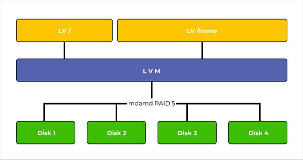

.. _lvmraid_vs_mdadm:

====================
lvmraid vs. mdadm
====================

我在改进 :ref:`gluster_underlay_filesystem` ，对原有 :ref:`deploy_centos7_gluster11` 改进为 LVM on Software RAID，以实现清晰的GlusterFS ``brick`` ，支持GlusterFS的Scale out。

这里有一个 :ref:`linux_software_raid` 方案的选择问题: 究竟应该直接选择 :ref:`lvmraid` 来完成一个软件层包含RAID+LVM ，还是采用 :ref:`mdadm` 构建稳定的 :ref:`linux_software_raid` 再在其上构建LVM ？

一句话概括
=============

- :ref:`lvmraid` 是近年来逐渐在 :ref:`linux_lvm` 完善的新功能(特别是RAID5/6)，RAID功能没有 ``mdadm`` 这样经历过长期的生产验证，并且也有反馈性能较差。
- :ref:`arch_linux` 社区文档同时提供了 :ref:`lvmraid` 以及 `archlinux: LVM on software RAID <https://wiki.archlinux.org/title/LVM_on_software_RAID>`_ 文档，采用 :ref:`mdadm` 实现软RAID方案更为常见

.. note::

   我在生产环境采用 :ref:`mdadm` 构建稳定的 :ref:`mdadm_raid10` ，然后在软RAID之上使用 :ref:`linux_lvm` 构建卷管理，最终部署 :ref:`deploy_centos7_gluster11_lvm_mdadm_raid10`

   个人的实验室环境，我将模拟测试 :ref:`lvmraid` 进行对比和学习

LVM和mdadm差异
================

LVM和 :ref:`mdadm` 都是操作系统级别提供的存储管理软件:

- LVM是磁盘控制器和操作系统之间的抽象层: 将多个磁盘空间合并为一个卷，然后划分为多个逻辑磁盘
- LVM可以提供动态添加磁盘容量功能，但是LVM自身不提供任何数据冗余

  - LVM使用DM (Device Mapper)驱动程序来实现RAID，
  - LVM也支持绕过DM来创建RAID，但是通常性能较差
  - 虽然LVM通过 :ref:`striped_lvm` 可以实现类似 ``RAID 0`` 的条代化性能优化(数据直接分发到多个磁盘)，但是也带来了限制: 不得不使用正在使用磁盘数量的倍数来扩展磁盘，并且添加新磁盘组是，条代化不会同时在所有磁盘上进行，而是在每个磁盘组内部进行
  - 不过 :ref:`lvmraid` 提供了统一的命令行接口，使用较为方便

- :ref:`mdadm` 主要就是提供冗余，直接和磁盘通信并且在物理层面上在磁盘之间分发数据

  - 多个磁盘组成 :ref:`mdadm` RAID阵列在操作系统中显示为单独的磁盘驱动器
  - 可以按照常规磁盘驱动器相同方式进行操作
  - ``mdadm`` 在内核级别添加了RAID支持(而LVM是使用MD驱动程序来处理磁盘)
  - :ref:`mdadm` 构建的软RAID具有最高的性能，因为它们没有任何其他驱动程序和实用程序形式的“中间人”来向驱动器发送命令
  - 通常应该使用 ``mdadm`` 来构建软件RAID，更快，更可靠

结合LVM和mdadm
=================

推荐方案是采用 ``LVM on software RAID`` :

- 物理磁盘首先通过 :ref:`mdadm` 构建出 :ref:`linux_software_raid`
- 在软RAID之上，采用 :ref:`linux_lvm` 实现逻辑卷的划分和调整，可以充分使用磁盘空间并实现quota
- 注意: 当结合 **软RAID + LVM** ，必须将软RAID建立在底层，在软RAID之上构建LVM卷，否则会导致性能问题，并且非常难以维护(磁盘替换困难)

参考
=======

- `Comparison and difference between RAID lvm and mdadm <https://recoverhdd.com/blog/comparison-and-difference-between-raid-lvm-and-mdadm.html>`_
- `LVM vs mdadm software raid <https://www.reddit.com/r/linuxadmin/comments/fhoinz/lvm_vs_mdadm_software_raid/>`_
