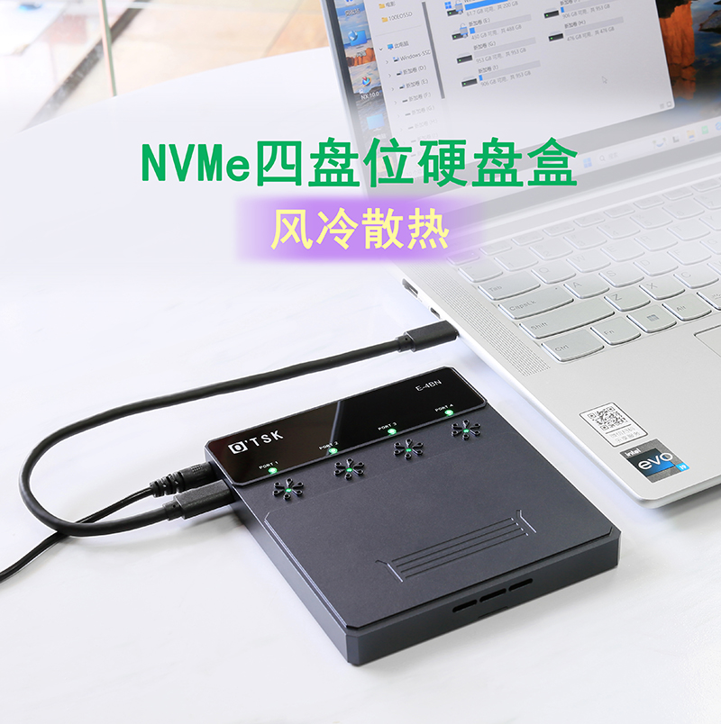
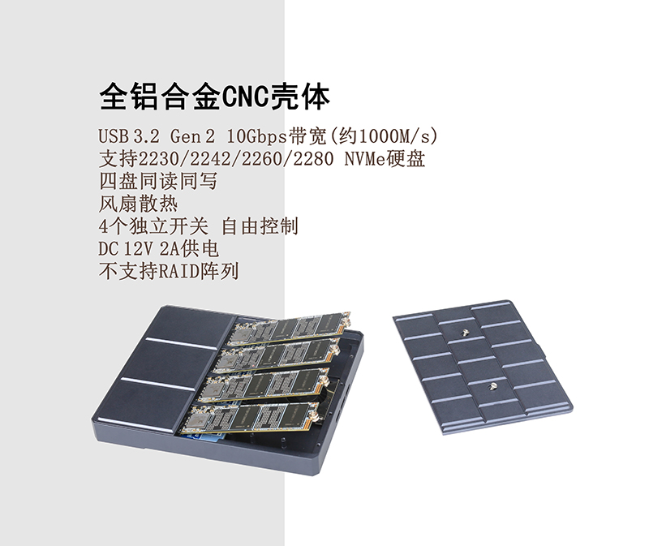
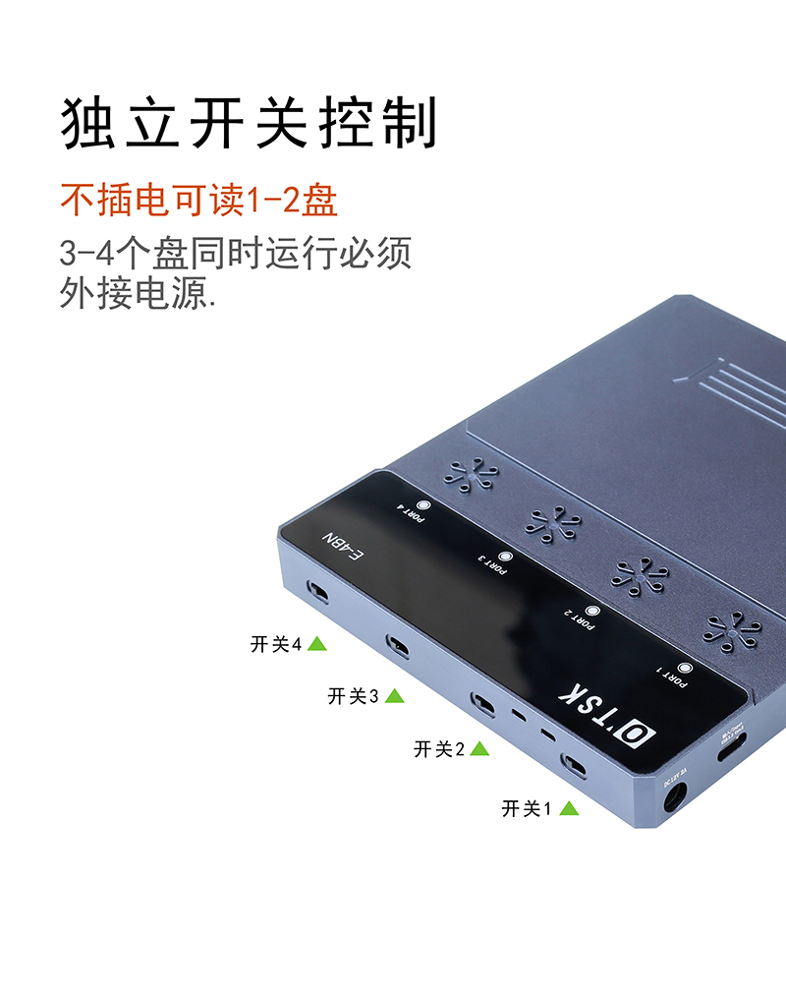

.. _4_nvme_usb_disk:

========================
四盘位NVMe转USB3.2硬盘盒
========================

由于苹果 :ref:`macos` 设备非常昂贵，特别是基础版本之上任何组件升级选购都需要比PC通用设备昂贵很多，所以很多时候我们不得不选择 "丐中丐" 的基础规格。当然，现代Mac设备已经无法替换升级内存和硬盘，但是由于 :ref:`thunderbolt` 和 USB接口 的速度不断进步，所以依然可以通过扩容移动设备来增强容量。

我最初是调研 :ref:`mac_mini_2024` 如何扩展存储，由于 Mac mini 的 :ref:`thunderbolt` 接口较多(3个)，所以考虑可以购买多个 :ref:`thunderbolt` 外接盘来构建扩展存储:

- 优点: 性能相对较高，每一个 :ref:`nvme` 存储都有独立I/O通道，尽可能发挥存储性能
- 缺点:

  - 每个 :ref:`thunderbolt` 外接硬盘都需要花费300~400元，至少3个累计需要 1000~1200 元
  - 需要占用宝贵的 :ref:`thunderbolt` ，实际上 :ref:`thunderbolt` 也是外接 :ref:`pcie` 扩展GPU的重要接口，是提升 :ref:`macos` / :ref:`linux` GPU性能以及 :ref:`machine_learning` 重要接口
  - 通用性较差: :ref:`thunderbolt` 接口外接存储只能用于 :ref:`macos` 系统，无法在常规的PC服务器，例如 :ref:`hpe_dl360_gen9` 上使用

综合考虑成本、通用性以及性能，我最终选择了 **OTSK** ``四盘位NVMe转USB3.2硬盘盒`` :

- 优点:

  - 只需要一根USB3.2数据连接线: 只占用一个 ``type-c`` 或 ``type-A`` 接口传输数据(随设备提供了两种连接线)
  - 虽然达不到Thunderbolt性能，但是可以在我所有的 Mac 电脑和 :ref:`raspberry_pi` 设备间通用
  - 四个 :ref:`nvme` 盘完全是独立的，不使用硬件RAID，这也是我所需要的特性: 我主要使用 :ref:`zfs` 来构建RAID-Z
  - 提供了外接电源，提高了电流，可以使用PCIe 4这种大电流 :ref:`nvme` ，这样我之前购买的 :ref:`samsung_pm9a1` 终于能够充分使用了(无法直接在树莓派上使用，但是通过这个硬盘盒则可以通用)
  - 可以直接使用 :ref:`intel_optane_m10` 来构建一个模拟 :ref:`zfs` 存储，利用Optane(傲腾)超级耐用来做各种模拟测试

- 缺点:

  - 如果有2根线分别联通 1,2 / 3,4 盘，那么就类似于一个磁盘阵列，可以构建 :ref:`gluster` 存储(分别连接两个主机)
  - 如果有2根线同时读写，那么更能够发挥 :ref:`nvme` 存储性能

没有尽善尽美的设备，目前选择的这个存储设备对于构建 :ref:`zfs` 是极好的

外观及规格
===========

   四盘位NVMe转USB3.2硬盘盒外观

   四盘位NVMe转USB3.2硬盘盒规格和特性

.. figure:: ../../../_static/linux/storage/nvme/4_nvme_usb_disk_2.jpg

   四盘位NVMe转USB3.2硬盘盒电源和数据接口，以及散热风口

   四盘位NVMe转USB3.2硬盘盒提供了独立的硬盘开关( ``甚至可以模拟硬盘故障`` )

