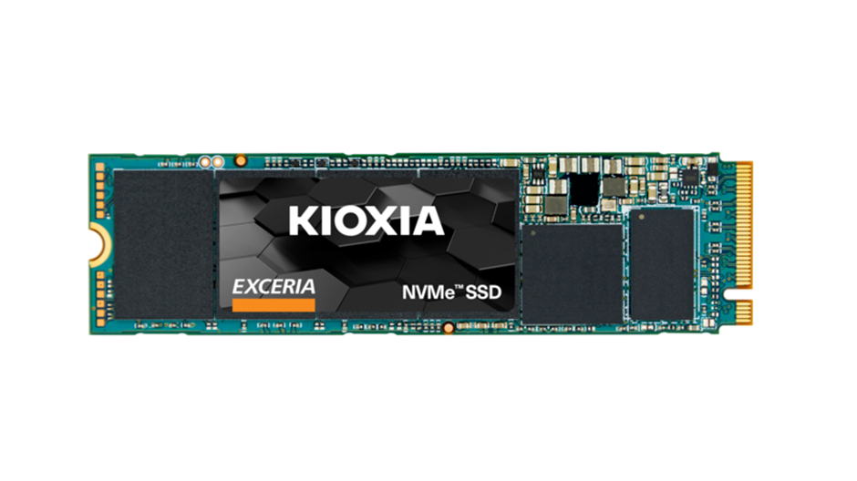

.. _kioxia_exceria_g2:

====================================
铠侠KIOXIA EXCERIA G2 NVMe SSD存储
====================================

2024年9月，针对 :ref:`pi_5_pcie_m.2_ssd` 解决方案:

- :ref:`pi_5` 只支持PCIe gen2和gen3，无法使用我原先采购的 :ref:`samsung_pm9a1`
- 当前已经全面进入PCIe gen4，市场上已经很难找到上一代gen3产品

市场上可选择的PCIe gen3 NVMe SSD存储主要有两种:

- 铠侠KIOXIA EXCERIA G2 NVMe SSD存储
- :ref:`crucial_p3`

铠侠KIOXIA EXCERIA G2
=======================

- EXCERIA系列是铠侠的入门级产品，规格参数非常普通，但是好在 :ref:`pi_5_pcie` 接口性能有限，实际上也发挥不出全部的SSD存储性能
- 铠侠EXCERIA G2 NVMe SSD存储 **2T** 规格是目前该容量规格最低廉的主流存储厂商产品(2T规格745元)，不过最高规格只有 ``2T``

   铠侠KIOXIA EXCERIA NVMe SSD存储

优点:

- 提供了 1G 缓存(但是比较尴尬，完整的ftl表需要大约1T配1G缓存；对于2T规格配备1G缓存不上不下)

缺点:

- 2T规格耐用度 800TBW；1T规格耐用度 400TBW，比其他品牌SSD低很多(例如 :ref:`samsung_pm9a1` 1T规格的耐用度是 600TB); 不过，还是比 :ref:`crucial_p3` 的 2T规格 440TBW 好很多

最终选择
=========

最终，对比 :ref:`crucial_p3` 2TB 和 ``铠侠KIOXIA EXCERIA G2 NVMe SSD存储`` 2TB 之后，我最终选择 **铠侠KIOXIA EXCERIA G2 NVMe SSD存储 2TB** :

- 铠侠EXCERIA G2是TLC颗粒，比英睿达P3的QLC颗粒 ``耐用度好 80%`` ，这是我最看重的存储特性
- 铠侠EXCERIA G2读写性能确实不如英睿达P3，英睿达P3比铠侠EXCERIA G2 ``速度快 66%`` ，但是在我的 :ref:`pi_5_pcie_m.2_ssd` 使用场景中， :ref:`pi_5` 的 PCIe 2.0 x1 接口(激活 PCIe 3.0能力只能达到80%的PCIe 3.0接口速率，最高 8Gbps)，实际上无法发挥出存储完全性能，所以抹平了两者的性能差距
- 铠侠EXCERIA G2 2TB规格 比 英睿达P3 2TB规格便宜，大约低100元(相当于低了12%售价)

参考
=====

- `铠侠官网: EXCERIA NVMe SSD <https://www.kioxia.com.cn/zh-cn/personal/ssd/exceria-nvme-ssd.html>`_
- `techpowerup网站: Kioxia Exceria G2 2 TB 规格 <https://www.techpowerup.com/ssd-specs/kioxia-exceria-g2-2-tb.d1340>`_ 非常详细精确，比官网资料更全，主要参考
