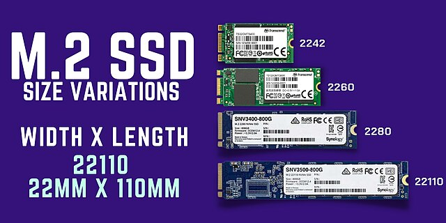
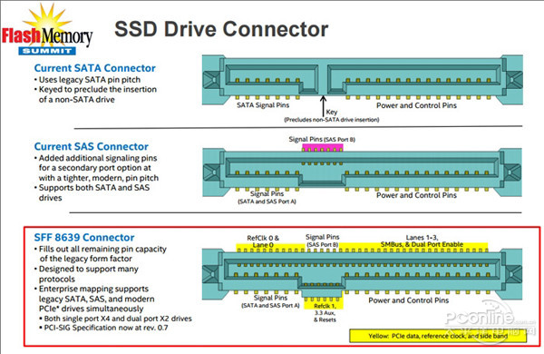
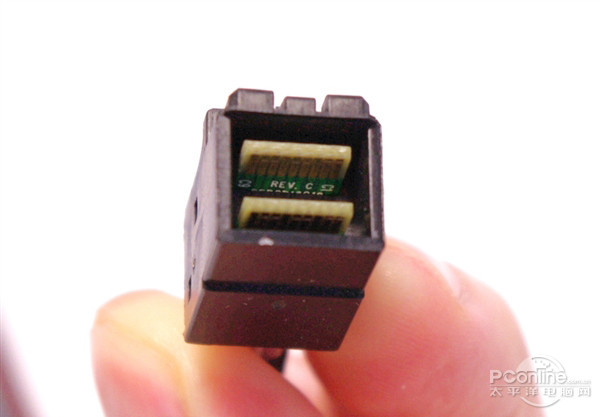
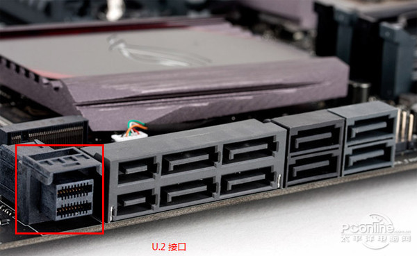
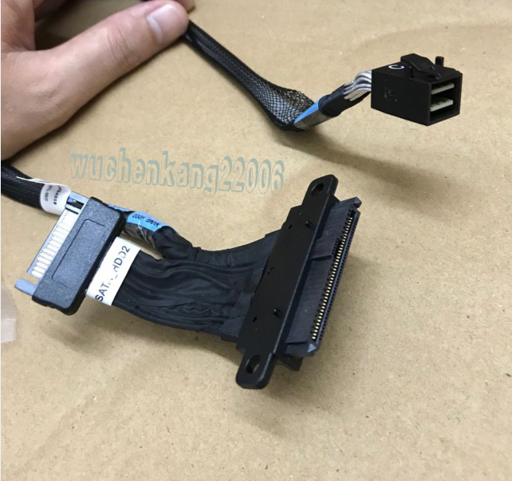
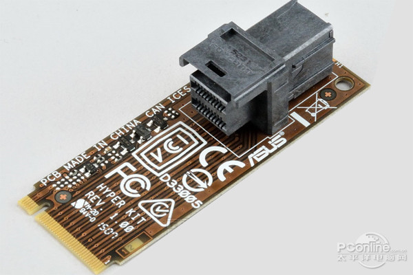

.. _u2_m2:

=====================
硬盘U.2和M.2接口
=====================

.. _m2:

M.2接口
=========

M.2 接口目前是消费级电脑(台式机和笔记本)主流存储接口，支持多种传输协议:

- 传统SATA: 传统 SATA 3.0 (6 Gbps)通过M.2连接器输出
- 使用AHCI驱动的 :ref:`pcie`
- 使用 :ref:`nvme` 的 :ref:`pcie`

.. note::

   M.2 是固态硬盘的一种外形尺寸(接口)，并不是SSD(固态硬盘): M.2 固态硬盘包含 SATA 和 NVMe 两种类型

   .. figure:: ../../../_static/linux/storage/nvme/m.2_sata_nvme.jpg

      注意: M.2 接口有两种SSD存储，分别是SATA和NVMe，注意金手指的缺口不同(SATA类型是2个缺口，NVMe类型是1个缺口)

   利用 PCIe 总线，NVMe M.2 固态硬盘拥有高达 20Gbps 的理论传输速度，比 SATA M.2 固态硬盘的 6Gbps 快:

   - PCIe 3.0 每个通道可以提供 8Gbps 传输速率，所以只需要 PCIe 3.0 x2 就基本能够满足 NVMe M.2 固态硬盘 传输要求；当然使用 PCIe 3.0 x4 就更为绰绰有余了
   - 对于 :ref:`hpe_dl360_gen9` 服务器，如果要支持高性能存储，可以采用slot1/slot3其中一个采用 PCIe 3.0 x4 的 :ref:`pcie_bifurcation` (也就是一分为四)实现高性能，另外一个采用 PCIe 3.0 x2 (一分为八)来提供更多的存储连接

   M.2 接口NVMe存储不同尺寸规格对比

.. _u2:

U.2接口
=========

   SATA SAS 和 U.2 接口对比

U.2 接口，标准名称是 ``SFF-8639`` 。用于连接MultiLink SAS驱动器或者PCIe驱动器。 ``SFF-8639`` U.2 是68针驱动器接口连接器，可以支持 12Gb/s SAS 和 PCIe Gen 3 x4 或者 PCI Express NVMe。

U.2 接口和 SATA-E 设计差不多，尽可能利用现有物理接口，但带宽更大，从 PCIe x2 变成了 PCIe 3.0 x4，此外增加了很多新协议支持，例如 :ref:`nvme` ，这些是SATA E接口不具备的。

U.2 接口最大特色是支持NVMe标准，实现高速低延迟低功耗，带宽走 PCIe 3.0 x4，所以理论传输速度高达 32Gbps (每个PCIe 3.0通道支持8Gbps)，而SATA只有6Gbps，所以U.2接口比SATA快了5倍多

注意，U.2接口的小接口端只能连接PCIe总线:

   U.2 连接线小端

   主板上的U.2插口

   U.2 连接线

U.2 接口SSD存储主要是企业级产品，市场上只有Intel公司提供了消费级 U.2 SSD磁盘，所以直接购买成本非常高。不过，大量的数据中心淘汰 U.2 接口SSD磁盘价格非常低廉。如果你个人只是作为实验性质折腾技术，完全可以采购二手的企业级 U.2 SSD磁盘来构架自己的存储服务器，特别是构建分布式 :ref:`ceph` 或 :ref:`gluster`

U.2 SSD转M.2接口
=================

M.2 和 U.2  都可以走 PCIe 3.0 x4通道，同样支持NVMe规范，两者可以转换。U.2可以专程M.2接口，只要M.2接口也是32Gbps带宽，这种转换不会有性能损失:

   M.2接口转U.2接口，性能无损失

参考
=========

- `U.2和M.2接口区别是什么 M.2和U.2接口优缺点对比 <https://www.163.com/dy/article/GU7O7Q6D0552CT3Q.html>`_
- `科普u.2接口 <https://www.ithb.vip/ke-pu-u-2-jie-kou.html>`_
- `U.2 and NVMe - To speed up the PC performance <https://www.delock.com/infothek/U.2-NVMe/u2-nvme_e.html>`_
- `What you can do with that U.2 port on your motherboard next to the SATA inputs <https://www.pocnetwork.net/technology-news/what-you-can-do-with-that-u-2-port-on-your-motherboard-next-to-the-sata-inputs/>`_
