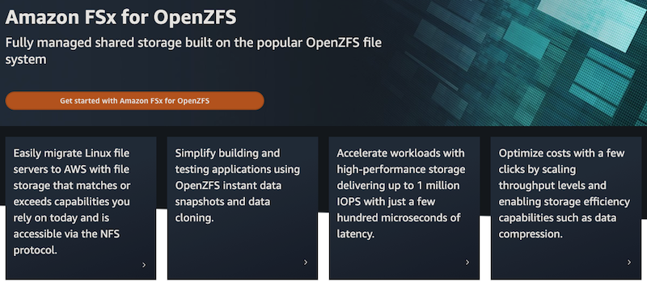

.. _zfs_enterprise:

=======================
ZFS企业级应用
=======================

在企业界(云计算)已经逐步有重量级的产品推出，我希望通过搜集/分析/复刻这些企业级应用案例来佐证以及提供业界发展方向:

亚马逊AWS
=============

亚马逊AWS提供 `Amazon FSx for OpenZFS <https://aws.amazon.com/fsx/openzfs/>`_ 服务，是基于OpenZFS实现的NFS共享存储:

- 通过OpenZFS内置的 :ref:`zfs_nfs` 服务可以让中小企业平滑间更数据迁移到云存储上
- 采用OpenZFS内置的快照( :ref:`zfs_snapshot`  ) 和 数据克隆 ( :ref:`zfs_clone` )
- 提供百万级别IOPS负载下仍然保持100ms+延迟性能(最高 4GB/s 和 16万IOPS ``具体性能数据待查`` )
- 通过 :ref:`zfs_compression` 实现更为有效的存储容量

详细分析待续...

参考
======

- `Amazon FSx for OpenZFS Features <https://aws.amazon.com/fsx/openzfs/features/>`_
