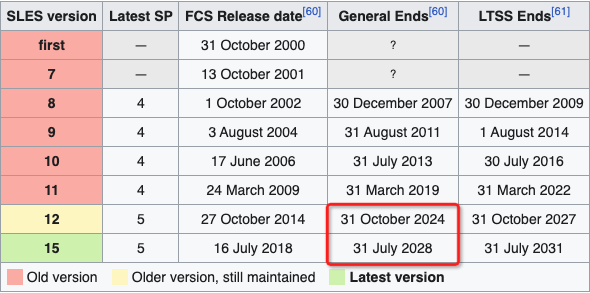

.. _introduce_suse_linux:

====================
SUSE Linux简介
====================

SUSE(发音 ``/ˈsuːsə/`` ) Linux最早是基于SLS/Slackware Linux的发行版，于1992年开始发行。之后SUSE Linux采用了不少 :ref:`redhat_linux` 发行版的特性，例如使用 RPM 和 ``/etc/sysconfig`` 。在SUSE公司发展历史上曾经历多次被收购，但一直独立运作，SUSE Linux在欧洲使用较为广泛。

2003年，Novell收购SuSE Linux AG后创建了更为开放的openSUSE作为SUSE Linux Professional的接替者。类似于Fedora之于Red Hat Enterprise Linux，openSUSE项目通过社区快速发展，提供了不同的社区版本：

- openSUSE Leap: 稳定的基石版本
- openSUSE Tumbleweed: 滚动发行版本

用户可以通过使用openSUSE的开放构建服务(OBS, Open Build Service)参与openSUSE的软件开发。

从openSUSE 13.2之后的openSUSE Leap 42.1开始直接采用了SLE(SUSE Linux Enterprise)的源代码，几乎就是SLE 12 SP1。

openSUSE Leap 是 openSUSE 的常规版本，发行周期如下:

- 大约 12 个月发行一次次要版本，与 SUSE Linux Enterprise Service Packs 保持一致
- 大约 36~48 个月发行一次主要版本，与 SUSE Linux Enterprise Releases 保持一致

.. note::

   SUSE官方提供了非常完善的文档 `SUSE Documetation <https://documentation.suse.com/>`_ ，和Red Hat相似，提供了不同发行版本的部署、管理、优化以及存储、虚拟化等指南手册。

SUSE企业版: SLES
==================

SUSE Linux Enterprise(也称为 ``SLE`` )是SUSE开发的企业级Linux，对标 :ref:`redhat_linux` Enterprise Linux(RHEL)。这是一个非常稳定的发行版，大约每3~4年发布一个主版本，次要版本(也称为 ``Service Packs`` SP)则每12个月发布一次。

SUSE Linux Enterprise在上游openSUSE社区版基础上做了更多测试以及适配:

- 每个主版本提供10年支持周期，并且还可以购买3年扩展支持
- 目前(2023)年有2个主版本得到支持: SLES 12 和 SLES 15 ，都发布了 SP5
- 请参考SUSE SLES的产品周期选择版本(强烈建议选择 SLES 15 SP5):

SUSE特色
==========

YaST包管理
-----------

- YaST(Yet another Setup Tool)控制中心是openSUSE的重要特性之一，可以在集成的界面中处理包括磁盘分区、系统安装、网络与防火墙配置、RPM包管理、在线更新、用户管理等诸多功能。

- AutoYaST - 是YaST2的一部分，用于自动安装。安装配置使用一个XML文件，可用于没有交互的自动安装。

- WebYaST - YaST的网页版本

- Zypp包管理 - Linux软件包管理引擎，提供依赖解析和便捷的包管理API

开放构建服务(Open Build Service)
---------------------------------

`Open Build Servcie <https://openbuildservice.org/>`_ 是一个开源的完整发行版开发平台，可以用于多种Linux发行版的构建，支持诸如 SUSE Linux Enterprise Service, openSUSE, Red Hat Enterprise Linux, Mandriva, Ubuntu, Fedora, Debian 和 Arch Linux的构建服务。OBS服务构建基于GPL发布，被广泛用于Linux社区。

.. note::

   Fedora/CentOS社区发行版采用另外一种Build Service - Koji Build System，是一种RPM-based build system

   OpenStack社区有一篇文章 `Replace OBS with another build system <https://specs.openstack.org/openstack/fuel-specs/specs/7.0/replace-obs.html>`_ 提到了OBS的一些限制以及可以替代OBS的不同build system，可以作为参考。目前主流的build system应该都是采用虚拟机或docker环境来构建编译打包。

   openSUSE的社区wiki有一篇 `openSUSE:Build Service comparison <https://en.opensuse.org/openSUSE:Build_Service_comparison>`_ 提供不同build system简要对比。

   如果你不是追求统一平台，并且主要使用rpm和deb包管理，也可以分别使用两大发行系列的独立build system:

   - RPM系列使用koji
   - DEB系列使用launchpad

参考
=======

- `维基百科SUSE <https://zh.wikipedia.org/wiki/SUSE>`_
- `openSUSE:发行计划 <https://zh.opensuse.org/openSUSE:%E5%8F%91%E8%A1%8C%E8%AE%A1%E5%88%92>`_
- `WikiPedia: SUSE Linux Enterprise <https://en.wikipedia.org/wiki/SUSE_Linux_Enterprise>`_
