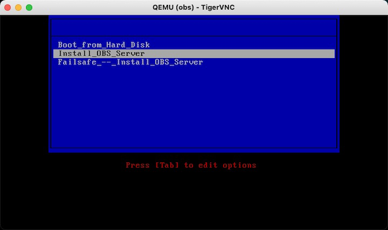

.. _deploy_suse_obs:

=================================
部署SUSE Open Build Service(OBS)
=================================

Open Build Service(OBS) 提供了多种安装方式:

- `OBS Applicance Installer下载 <https://openbuildservice.org/download/>`_ - openSUSE Leap 15.1结合OBS组件
- `VirtualBox/VMware/KVM-QEMU以及Raw Disk镜像下载(当前2.10版本) <http://download.opensuse.org/repositories/OBS:/Server:/2.10/images/>`_

通过OBS Appliance Installer安装OBS
===================================

部署硬件需求
----------------

.. warning::

   实际我验证安装OBS失败：原因是我没有提供足够的磁盘空间。目前我还没有找到合适运行OBS的硬件资源，我准备后续准备一个 2T 容量的移动硬盘或者能够配备2T以上硬盘的主机来运行OBS服务。

`openSUSE:Build Service private installation <https://en.opensuse.org/openSUSE:Build_Service_private_installation>`_ 介绍了硬件资源要求，推荐配置可以在5小时完成完整发行版构建，并在10分钟内完成内核编译。但是，如果只使用4核心4GB内存的PC主机，则完整发行版构建可能需要7天。

默认配置下obs-server同时运行 ``server`` 和 ``worker`` 模式，则需要结合两者的硬件需求

server角色
~~~~~~~~~~~~

- 4 core 2Ghz 处理器 8 GB 内存
- 第一块系统磁盘  250GB sata HDD
- 第二块数据盘  >500GB SAS HDD
- 一个服务器级别千兆以太网接口

worker角色
~~~~~~~~~~~

obs-worker就是实际的编译工作节点，请使用尽可能使用高主频多核心服务器:

- 4核心2.6GHz处理器，双处理器 (即8核系统，实际上核心数量越多越好)
- 64GB内存

  - 其中32GB内存用于系统，另外32GB内存作为RAM磁盘

- 第一块系统磁盘250GB SATA HDD
- 第二块数据盘 80GB SSD(固态硬盘)
- 一个服务器级别千兆以太网接口

准备KVM虚拟机环境
------------------

.. note::

   我是在 :ref:`kvm` 虚拟机环境中安装OBS，使用当前最新版本 2.10

OBS首次启动会扫描一个名为 ``OBS`` 的LVM ``卷组`` 并在LVM上构建逻辑卷用于woker文件系统。如果LVM卷上有一个 ``server`` 逻辑卷就会作为服务器的数据分区。注意：部署镜像的硬盘上说有数据都会被覆盖。

所有应用程序预先配置了正确的repositories并通过YaST或zypper更新，或者通过替换整个镜像进行更新。注意，如果你通过更新镜像来升级系统，一定要确保数据目录位于一个独立的存储，避免数据被删除。

- 参考 :ref:`create_vm` 启动obs安装::

   virt-install \
     --network bridge:br0 \
     --name obs \
     --ram=4096 \
     --vcpus=2 \
     --os-type=opensuse15.1 \
     --disk path=/var/lib/libvirt/images/obs.qcow2,format=qcow2,bus=virtio,cache=none,size=32 \
     --graphics vnc \
     --cdrom=/var/lib/libvirt/images/obs-server.x86_64-2.10.8-oem-Build1.2.install.iso

.. note::

   OBS现在采用的是openSUSE Leap 15.1，所以通过 ``osinfo-query os`` 查询到 ``opensuse15.1`` 作为 ``os-type``

   这里选择的网络是 ``bridge:br0`` ，这个bridge网络是通过 :ref:`libvirt_bridged_network` 构建

此时看到::

   Domain is still running. Installation may be in progress.
   Waiting for the installation to complete.

- 检查虚拟的vnc端口::

   virsh vncdisplay obs

显示输出::

   127.0.0.1:1

- 执行以下命令使用ssh端口转发登陆服务器::

   ssh -L 5901:127.0.0.1:5901 huatai@192.168.6.200

- 使用 TigerVNC 访问自己本地电脑的回环地址端口5901，可以看到如下启动安装界面:

