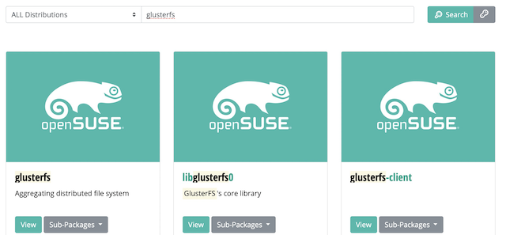
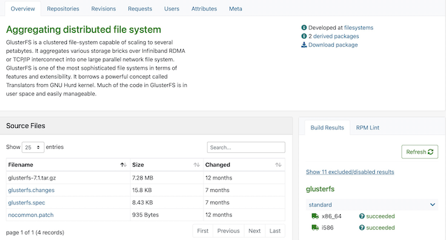

.. _introduce_suse_obs:

==================================
SUSE Open Build Service(OBS)概览
==================================

SUSE于2005年开发了Open Build Service(OBS)。Open Build Service (OBS)可以自动，持续，重复编译及发布包和镜像。OBS能够生成适用于很多系统(SUSE, Debian, Ubuntu, Red Hat, Windows等)及硬件平台(x86, AMD64, z Systems, POWER等)的镜像及安装包。编译目标考虑两个因素，一个是编译包的硬件target，多指CPU版本，一个是编译包的系统distribution，多指系统版本。

编译清单(Build Recipe)
=======================

要在OBS中创建一个软件包，你需要包含以下信息的编译清单:

- 元数据(Metadata): 元数据就是软件包名字和描述，其他数据例如版本、版权，上游URL是可选的。
- 依赖(Requirements):软件包工作所依赖的其他软件包。有两种依赖类型：编译依赖(build requirements)和安装依赖(installation requirements)

编译依赖是我们在OBS中编译过程所需要来的依赖。例如，C++程序需要一个C++编译器。

安装依赖是我们在安装最终软件包所需要的依赖。

- 一个软件表列表(A Package List): 要成功安装或删除一个软件包以及软件包的所有内容，软件包管理器需要知道这个软件包的文件和目录。

在基于RPM的操作系统，例如 openSUSE, SUSE Linux Enterprise, Red Hat Enterprise Linux，上述所有元数据信息都包含在一个扩展名为 ``.spce`` 的文件中。

编译主机和软件包(Build Hosts and Packages)
============================================

b.o.o
===============

SUSE开发了Open Build Service系统，并且基于OBS提供了 `build.opensuse.org <https://build.opensuse.org>`_ (也称为 ``b.o.o`` ) 提供开放的编译服务。

- 首先到 s.o.o/s ( `software.opensuse.org/search <https://software.opensuse.org/search>`_ ) 搜索你需要的软件，例如，我需要 glusterfs ( :ref:`gluster` ) 

- 点击 ``view`` 按钮可以查看软件包详情，然后点击release相关链接可以查看详细情况

.. figure:: ../../../_static/linux/suse_linux/obs/obs_gluster_release.png
   :scale: 80

参考
======

- `OBS Manuals, Screencasts, Talks and Workshops <https://openbuildservice.org/help/>`_
- `OBS Beginner's Guide <https://openbuildservice.org/help/manuals/obs-user-guide/art.obs.bg.html>`_
- `openSUSE:Build Service 新手入门 <https://zh.opensuse.org/openSUSE:Build_Service_新手入门>`_ - SUSE wiki提供的引导新手使用在线OBS编译软件包的指南
