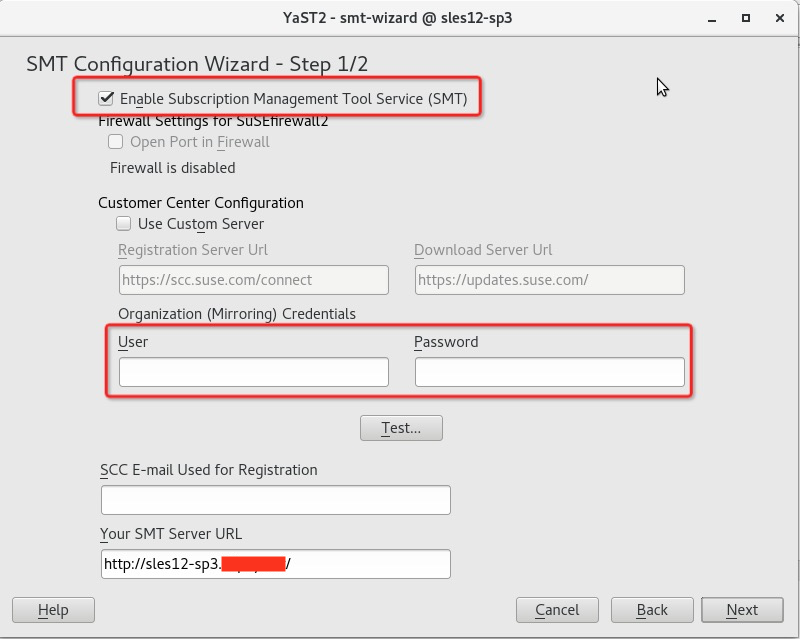
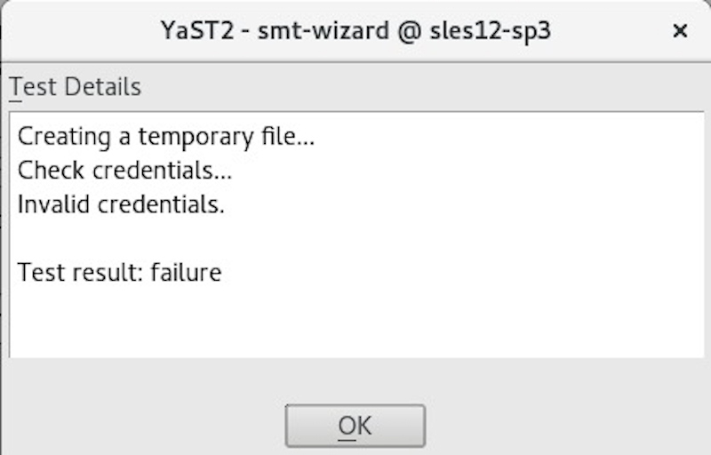

.. _suse_deploy_smt:

==================
SUSE部署SMT服务器
==================

在管理服务器上安装Subscription Management Tool(SMT，订阅管理工具) ，然后就可以从SUSE客户中心镜像所有软件仓库。如果公司已经提供了SMT服务器或者可以从管理服务器上访问一个SUSE Manager server，就不需要这步骤。

安装SMT
=========

- 安装 SMT 只需要一条命令::

   sudo zypper in -t pattern smt

.. note::

   需要使用安装光盘，如果是KVM虚拟机，可以使用 :ref:`vm_attach_dev` 来加载ISO文件。

配置SMT
===========

.. note::

   要配置SMT服务器，必须要具备一个SUSE账号。如果没有SUSE账号，需要到 `SUSE官网 <http://www.suse.com/>`_ 注册，并将SMT服务器所有镜像的产品和扩展注册到 `SUSE Customer Center <http://scc.suse.com/>`_ 。

- 在图形界面中运行 YaST2 ，然后选择 ``smt-wizard`` :

- 输入自己在 `SUSE Customer Center <http://scc.suse.com/>`_ 注册的用户账号(初始注册有60天试用期)和密码，然后点击 ``Test...`` 按钮验证。

.. note::

   SMT服务部署需要一个 mirror credential (镜像凭证)，这个应该需要单独购买订购。如果你已经订购授权，则参考 `Mirroring Repositories on the SMT Server - 3.1 Mirroring Credentials <https://documentation.suse.com/sles/12-SP4/html/SLES-all/smt-mirroring.html#smt-mirroring-getcredentials>`_ 获取镜像凭证。这个获取的凭证会添加到 ``/etc/smt.conf`` 中，也可以通过 YaST SMT Server Configuration module来完成。

参考
=====

- `4 Installing and Setting Up an SMT Server on the Administration Server (Optional)  <https://documentation.suse.com/soc/9/html/suse-openstack-cloud-crowbar-all/app-deploy-smt.html>`_
