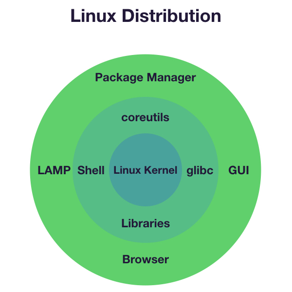

.. _suse_distribution_builds:

=======================
SUSE发行版构建(概述)
=======================

.. note::

   因为 `网友 xTire 指正 称“SLES的上游为openSUSE“不妥 <https://github.com/huataihuang/cloud-atlas/issues/52>`_ ，我查阅了资料，学习了解了SUSE发行版构建的差异，翻译整理本文。 

随着云计算(虚拟化 :ref:`kvm` )和容器( :ref:`docker` 为例) / 容器编排( :ref:`kubernetes` )迅速发展，现代操作系统需要适应和支持 新硬件、新软件以及新需求，同时保持稳定、弹性和安全，以便能够正确支撑 ``上层`` 应用/容器/虚拟化 层。

作为悠久历史的SUSE发行版，也经历着不断演进的构建方式(社区和商业版本构建发行)。

SUSE发行版简史
==================

SUSE作为历史悠久的Linux发行版之一，最早创建于1992年，包含了大量的翻译、文档以及hacking技术。并在同年发布了第一个综合性Linux发行版，名为Softlanding Linux System(SLS)，

在1994年的SUSE第一个发行版S.u.S.E Linux 1.0是基于Slackware(也就是最早的Linux发行版)，不过到1996年SUSE Linux 4.2开始，则基于Jurix。

到了2000年，发布了第一个企业版SUSE Linux Enterprise Server(for IBM S/390)。

Linux发行版
===============

Linux发行版实际上是Linux内核和围绕内核到基础工具，准确地说是GNU/Linux。这里的GNU是诸如GNU编译器(GCC)，GNU C库(glibc)以及GNU和性应用程序(coreutils)，GNU Bash等。而发行版会根据不同需求打包不同等软件，例如web服务器，数据库，开发程序库或者图形环境(例如GNOME)，来组合成所谓的"Linux发行版"。

   Linux发行版

各个Linux发行版的主要区别在于包管理器，主要是两个流派:

- :ref:`rpm` 打包格式，是SUSE Linux所使用的包格式，也是 :ref:`redhat_linux` , :ref:`fedora` 移机CentOS所使用的包格式
- ``deb`` 格式则是 Debian以及其衍生版本 :ref:`ubuntu_linux` 所采用

其他Linux发行版的差异

参考
=======

- `How SUSE builds its Enterprise Linux distribution <https://www.suse.com/c/how-suse-builds-its-enterprise-linux-distribution-part-1/>`_

