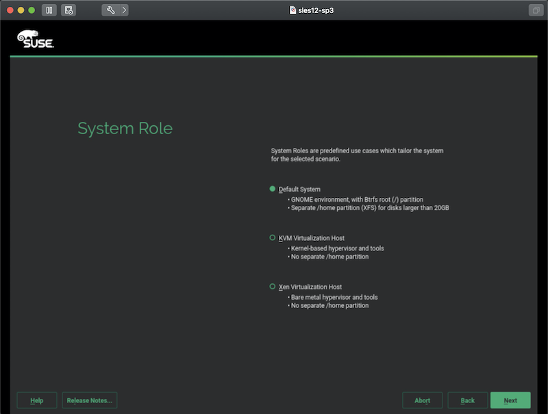

.. _suse_repo_setup:

=====================
部署SUSE本地软件仓库
=====================

在生产环境维护大量服务器时，更新服务器操作系统显然不能一一都通过Internet进行更新，非常有必要在本地局域网部署一个操作系统发行版的软件仓库。这样只需要更新仓库软件，生产环境所有服务器都能够通过本地软件仓库进行更新。

SUSE也支持在本地构建软件仓库，以下是我的实践。我的实践基于SUSE 12 SP3，是一个比较早期的稳定版本。

安装SLES
==========

SUSE企业版安装十分简单，从安装介质启动后自动开始安装，不需要任何交互。只要连接了Internet会自动添加Update Repository并且下载更新软件包。所以，只要联网环境安装，初始安装就能够得到该发行版的最新更新。

这个安装过程可能是最简便的安装步骤了:

- 安装过程可以选择服务器角色，默认是Gnome桌面，并且使用了btrfs作为文件系统。也可以选择KVM或者XEN作为虚拟化服务器:

参考
=====

- `Software Repository Setup <https://documentation.suse.com/soc/9/html/suse-openstack-cloud-crowbar-all/cha-depl-repo-conf.html>`_
