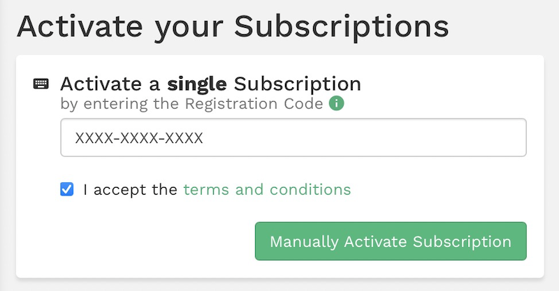

.. _suse_register:

==================
SUSE订阅和注册
==================

SUSE订阅
==========

在 `SUSE Customer Center <http://scc.suse.com/>`_ 首先通过一个邮箱地址注册一个SUSE账号。SUSE会发送一个激活邮件到你的注册邮箱，激活以后就可以登陆到SUSE客户中心。

在SUSE客户中心平台上，点击左边导航栏 ``Activate subscriptions`` ，可以激活订阅:

注册SLES 12
=============

通过 ``SUSEConnect`` 命令可以把SUSE Linux Enterprise Server 12 注册到SUSE SCC平台，这样操作系统就能够获得更新软件。

``SUSEConnect`` 替代了以前用于 Novell Customer Center(NCC)的 ``suse_register`` 命令，可以注册SLES 12系统到新的SCC平台。

- 使用以下命令注册服务器::

   SUSEConnect -r <YourActivationCode> -e <YourEmailAddress>

- 验证注册状态::

   SUSEConnect --status-text

就会看到注册状态::

   Installed Products:
   ------------------------------------------
   
     SUSE Linux Enterprise Server 12 SP3
     (SLES/12.3/x86_64)
   
     Registered
   
       Subscription:
   
       Regcode: XXXXXXXXXXXX
       Starts at: 2020-11-19 00:00:00 UTC
       Expires at: 2021-11-19 00:00:00 UTC
       Status: ACTIVE
       Type: oem
   
   
   ------------------------------------------

此时在SSC的WEB平台也可以看到注册信息。

- 通过以下命令可以检查激活的仓库中可用的安装产品::

   zypper se -t product

安装扩展软件
===============

SUSE提供了很多扩展软件，只要注册了服务器，就可以在联网情况下安装。

查看扩展软件的安装方法是执行::

   SUSEConnect --list-extensions

此时会提示所有扩展和模块以及对应安装方法::

   AVAILABLE EXTENSIONS AND MODULES
   
   FREE EXTENSIONS
   
   ...
     Toolchain Module 12 x86_64
     Install with:      SUSEConnect -p sle-module-toolchain/12/x86_64
   
     SUSE Linux Enterprise Software Development Kit 12 SP3 x86_64
     Install with:      SUSEConnect -p sle-sdk/12.3/x86_64
   ...
   
   PAID EXTENSIONS
   
     SUSE Manager Server 3.0 x86_64
     Install with:      SUSEConnect -p SUSE-Manager-Server/3.0/x86_64 -r REGCODE
   
     SUSE Manager Proxy 3.0 x86_64
     Install with:      SUSEConnect -p SUSE-Manager-Proxy/3.0/x86_64 -r REGCODE
   ...

参考
======

- `How to register SLES 12 using the SUSEConnect command line tool <https://www.suse.com/support/kb/doc/?id=000018564>`_
