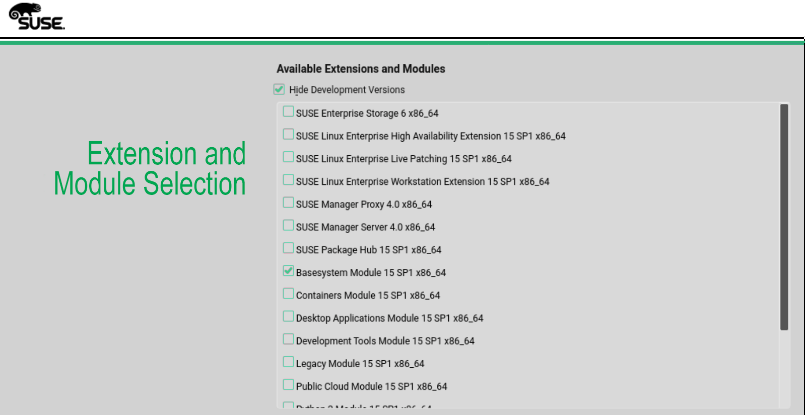
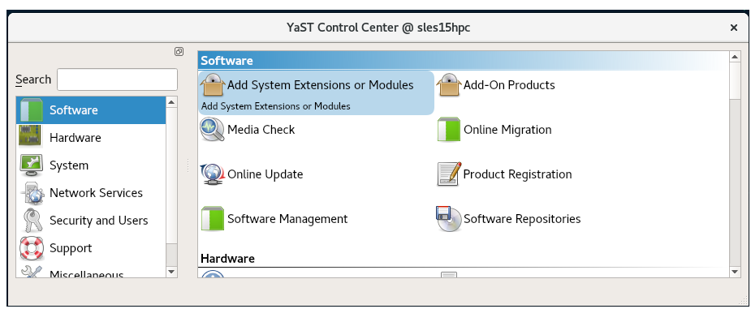
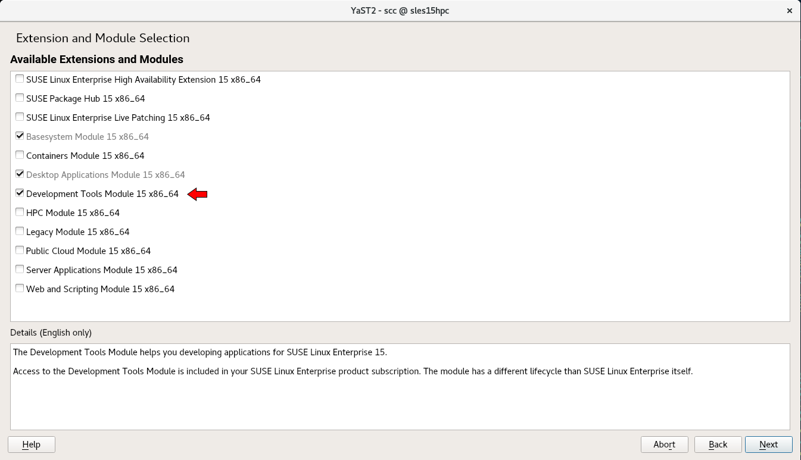
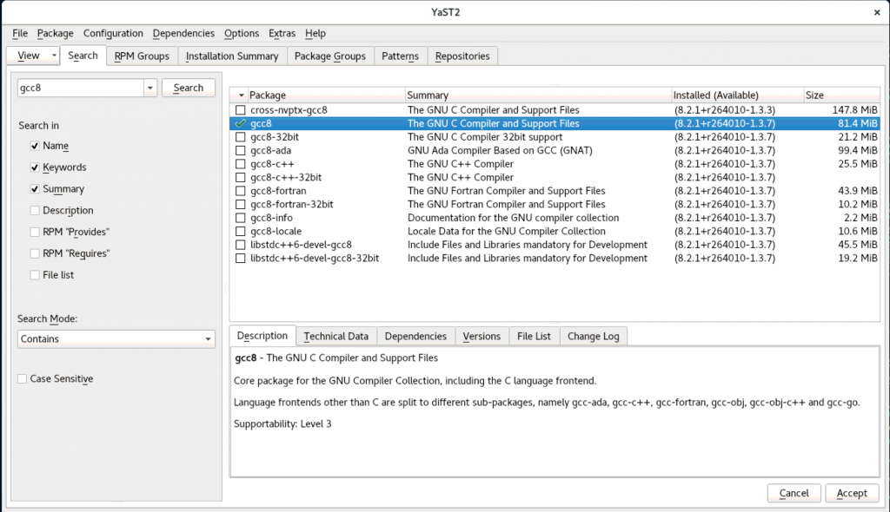

.. _suse_update_dev_tool:

===================
升级SUSE开发工具
===================

SUSE默认使用的gcc版本非常陈旧，例如SUSE Linux Enterprise Server (SLES) 12 SP3 默认使用的gcc版本是 4.8-6.189。在编译一些最新的软件包源代码，常常需要使用最新的编译器支持，所以可以考虑升级编译工具链。

SUSE Linux系统可以有多个gcc编译器版本:

- 首先是称为"System Compiler"的编译构建当前运行的SUSU Linux的编译器版本

  - 这个system compiler通常在整个SLES版本的生命周期都不改变以确保维护的操作系统软件补丁最大兼容性
  - SLES 12使用gcc 4.8; SLES 15使用gcc 7-3.3.22作为system compiler

- Toolchain Compilers:

  - 工具链编译器是用于应用程序开发的主要编译器
  - 工具链编译器会定期更新补丁并且使用新的稳定版本编译器
  - 工具链编译器通常是最常使用的编译器，可以提供更好的优化和功能

SUSE Linux模块
=================

SUSE在SLES 12引入了操作系统模块的概念。SLES Modules是一组相似使用的软件包组合，并且支持在一个模块中作为一组来支持，也就是可以通过一个独立唯一的软件仓库发行。SUSE引入模块概念是为了在一个快速更新的领域中提供最新技术，这样就不用等待下一个SLES Service Pack。SUSE通过SUSE Linux订阅来提供完整的维护和支持。

在SLES 15开始，模块的概念更为重要，因为整个SUSE Linux OS就是作为一个模块打包的。SLES 15安装介质包含了一个统一安装工具并且只发行一个最小化操作系统来部署，更新和注册SUSE Linux Enterprise Server，以及其他SUSE产品。甚至在SLES 15中类似 ``ls`` 和 ``ps`` 这样的命令也是 "Basesystem Module 15" 的一部分。

在部署过程中，你可以选择安装的模块和扩展来添加功能。模块或者扩展能够提供的功能取决于你在安装过哦城中的第一步所选择的软件组合。例如，在SLES 15，HPC模块只在你在安装过程中选择了SUSE Linux Enterprise for HPC产品才会提供。

SUSE Linux模块可以让你只安装需要的软件包组合，使得系统轻量，快速和更安全。这种模块化软件包也使得更容易制作针对容器和云计算的按需定制镜像。模块可以在系统的整个生命周期内添加或移除，这样可以更容易按需修改系统。

需要注意，仅仅激活一个模块并没有安装这个模块中的软件包 - 你依然需要在激活模块后安装。要使用一个模块中的软件包需要两个步骤：

- 激活模块
- 安装指定的软件包

一些模块在你安装产品时候已经预先激活，例如，如果你安装SUSE Linux for High Performance Computing 15，则自动激活HPC模块。

在SLES 15中， ``Development Tools`` 模块包含了最新的编译器，例如gcc, debuggers 和其他工具。而 ``Tool chain Module`` 则为SLES 123提供了较新的编译器。

.. note::

   实际上SUSE模块就是类似一个个独立的软件仓库，类似CentOS也有这样的repo。

图形界面安装Development Tools
==============================

使用YaST激活Development Tools
------------------------------

- 启动 ``YaST``

- 点击 ``Add System Extensions or Modules``

- 选择 ``Development Tools Moudle`` 

- 点击 ``Next`` 激活Development Tools Module

安装Development Tools模块中软件包(gcc8)
-----------------------------------------

一旦Development Tools Module激活，就可以安装模块中的软件包，例如gcc8

- 启动YaST然后点击Software，再点击Software management

.. figure:: ../../_static/linux/suse_linux/Yast_Software-Management.png
   :scale: 41

- 在search栏输入 ``gcc8`` 然后点击 ``Search``

- 选择 ``gcc8`` 然后点击 ``Accept`` ，则完成 gcc8 编译器

命令行安装Development Tools模块
================================

- 激活Development Tools Module::

   sudo SUSEConnect -p sle-module-development-tools/15/x86_64

- 验证Development Tools 模块是否激活::

   sudo SUSEConnect –l

- 检查系统gcc状态::

   zypper search gcc

- 安装::

   zypper install gcc8

- 然后验证::

   zypper search gcc8

- SUSE提供了补丁安装命令::

   zypper in -t patch XXX

类似参考 `SUSE SLES12 Security Update : gcc9 (SUSE-SU-2020:0394-1) <https://www.tenable.com/plugins/nessus/133791>`_ 

参考
=====

- `SUSE Linux Essentials – Where are the compilers? Understanding the Development Tools Module <https://www.suse.com/c/suse-linux-essentials-where-are-the-compilers-understanding-the-development-tools-module/>`_
