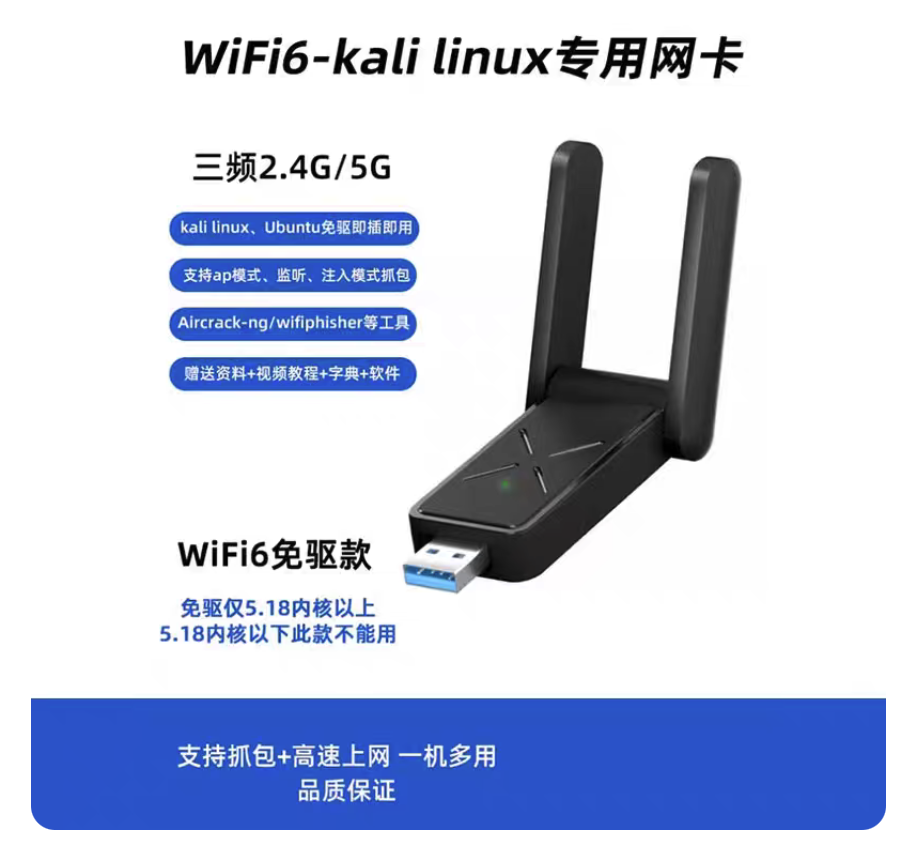

.. _mediatek_mt7921au:

==========================
联发科(MediaTek) MT7921AU
==========================

联发科(MediaTek) MT7921AU是目前Linux开源社区支持最好的无线网卡，官方驱动很早就直接并入Linux 主线内核（Mainline Kernel），只要Linux Kernel 5.18+ （Ubuntu 22.04.2+、24.04 及更新版本）原生支持。

MT7921AU (WiFi 6E / AX1800 级别):

- 状态：绝对的免驱之王。Linux Kernel 5.18+（Ubuntu 22.04.2+、24.04 及更新版本）原生支持。
- 特性：支持 WiFi 6 甚至 6E，延迟低、吞吐量大，非常适合高带宽需求的边缘计算节点。

我在淘宝上找了一家 **CHANEVE MT7921AU (带双天线 / 支持 Kali 抓包注入)** :

- 底层芯片：联发科 MT7921AU
- 卖家申明: **明确支持 Kali Linux 的抓包（Monitor Mode，监听模式）和注入（Packet Injection）** 说明它的固件和 Linux 驱动是非常纯血且无阉割的。这对于网络调试、安全审计或折腾 Homelab 来说是硬核刚需。
- 外置天线: **扁平折叠一体式** ，天线横向折叠在网卡主体两侧。这种扁平紧凑的设计，整体重心离主机的 USB 接口近，不容易因为意外碰触而折断或者把主机的 USB 接口压松导致断连。

