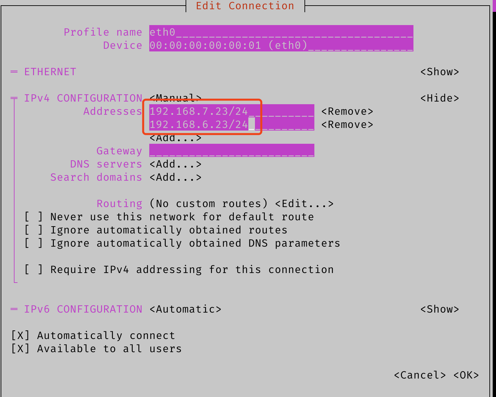

.. _networkmanager:

================
NetworkManager
================

.. note::

   当前主流发行版采用网络管理工具主要有:

   - :ref:`netplan`
   - NetworkManager

   在桌面系统中，例如 Fedora (server/workstation) 以及 Ubuntu Workstation ，通常会使用 NetworkManager 配置，不仅有字符命令配置，也有GUI方便完成设置。

   :ref:`jetson_nano` 上NVIDIA官方提供的是基于 :ref:`ubuntu_linux` 桌面版 18.04 LTS改造的L4T系统，默认使用的就是 NetworkManager管理网络，熟悉使用对桌面发行版Linux会有很大帮助。

nmcli简介
============

``nmcli`` 是一个控制NetworkManager并且报告网络状态的工具。nmcli可以替代 ``nm-applet`` 或者其他图形管理工具来处理网络。nmcli可以创建，显示，编辑，删除，激活和关闭网络连接，也可以用来显示网络设备状态。

通过使用nmcli可以避免手工管理网络链接，也方便脚本编写。注意NetworkManager也支持运行脚本，这种方式称为 ``dispatcher scripts`` 以便能够响应网络事件。nmcli可以在没有图形界面的服务器，headless服务器和终端执行。

General命令
==============

``general`` 命令提供了NetworkManager状态和权限的显示，可以用来获得或修改系统主机名。

- 检查状态::

   nmcli general status

显示输出::

   STATE                  CONNECTIVITY  WIFI-HW  WIFI     WWAN-HW  WWAN    
   connected (site only)  limited       enabled  enabled  enabled  enabled

如果主机配置了DHCP但是没有获得IP地址，则会显示(例如我在 :ref:`priv_cloud_infra` 使用Fedora虚拟机，切换到 :ref:`libvirt_bridged_network` 后没有DHCP提供IP地址)::

   STATE       CONNECTIVITY  WIFI-HW  WIFI     WWAN-HW  WWAN
   connecting  none          enabled  enabled  enabled  enabled

- 检查主机名::

   nmcli general hostname

显示输出的是主机名::

   jetson

- 可以修改主机名(实际是修改 ``/etc/hostname`` )::

   nmcli general hostname jetson-r

这个命令和 ``hostnamectl set-hostname jetson-r`` 是同样效果，都是修改 ``/etc/hostname`` 配置。

nmcli命令规律
================

nmcli命令的规律是尽可能使用 ``help`` ，每一级命令都有help可以帮助你进行下一级子命令。

- 假设我们需要修改连接名字，即上述默认名字是 ``Wired connection 1`` 和我期望的管理网络连接命名不一致，所以我想修改。则先输入命令 ``nmcli connection modify help`` ，就会提示::

   Usage: nmcli connection modify { ARGUMENTS | help  }

   ARGUMENTS := [id | uuid | path] <ID> ([+|-]<setting>.<property> <value>)+
   ...
   Examples:
   nmcli con mod home-wifi wifi.ssid rakosnicek
   nmcli con mod em1-1 ipv4.method manual ipv4.addr "192.168.1.2/24, 10.10.1.5/8"
   nmcli con mod em1-1 +ipv4.dns 8.8.4.4
   nmcli con mod em1-1 -ipv4.dns 1
   nmcli con mod em1-1 -ipv6.addr "abbe::cafe/56"
   nmcli con mod bond0 +bond.options mii=500
   nmcli con mod bond0 -bond.options downdelay

- 检查连接::

   nmcli con

例如，在 Fedora 虚拟机中看到::

   NAME    UUID                                  TYPE      DEVICE
   enp1s0  239c09f4-a28c-46e3-b5c7-2beb90c594f2  ethernet  enp1s0

就可以通过后续 ``nmcli con modify "enp1s0"`` 来修订(默认安装以后系统生成的是DHCP配置 ``/etc/NetworkManager/system-connections/enp1s0.nmconnection`` )

- 注意 ``nmcli conneciton edit`` 命令会需要你使用子命令 ``set connection.id XXX; set connection.interface-name xxx;`` 都会使用 ``set`` 子命令，在单条命令时不需要使用 ``set`` ，所以我们直接使用::

   nmcli connection modify "Wired connection 1" connection.id manage

可以看到，如果我们需要修改 ``connection`` 的子属性，只需要使用 ``.`` ，所以上述命令就把连接的名字修改成 ``manage`` ，此时我们检查 ``nmcli connection`` 就可以看到连接名字修改了::

   NAME    UUID                                  TYPE      DEVICE 
   ali     3bdf8189-6c9b-4d35-a83b-71441b22ba92  wifi      wlan0  
   manage  a94fa1de-b290-3b83-9f49-137981396543  ethernet  eth0

- 如果之前没有用NetworkManager管理网络，则可以添加::

   nmcli con add con-name "static-eth0" ifname eth0 type ethernet ip4 192.168.6.7/24 gw4 192.168.6.200
   nmcli con mod "static-eth0" ipv4.dns "xxx.xxx.120.1,8.8.8.8"

- 很多修改需要看一下属性案例，例如需要修改IP地址::

   nmcli connection modify "manage" ipv4.method manual
   nmcli connection modify "manage" ipv4.address 192.168.6.9/24
   nmcli con modify manage ipv4.gateway 192.168.6.1

- 很多时候初始安装的虚拟机采用DHCP方式，需要切换到静态IP地址，执行以下命令::

   nmcli connection modify "enp1s0" ipv4.method manual ipv4.address 192.168.6.242/24 ipv4.gateway 192.168.6.200 ipv4.dns "192.168.6.200,192.168.6.11"

.. note::

   我感觉手册非常枯燥，还是需要看案例比较清晰，请参考 `27 nmcli command examples (cheatsheet), compare nm-settings with if-cfg file <https://www.golinuxcloud.com/nmcli-command-examples-cheatsheet-centos-rhel/>`_

- 假设我要删除 ``eth0`` 上的默认网关，则修改 ``manage`` 网络连接::

   nmcli con modify "manage" ipv4.gateway ""

- 注意：修改配置以后不会直接生效，需要执行激活 ``nmcli connection up id <connection name>`` ::

   nmcli connection up id "manage"

提示显示::

   Connection successfully activated (D-Bus active path: /org/freedesktop/NetworkManager/ActiveConnection/3)

nmcli命令案例
===============

.. note::

   在游泳中学游泳

检查NetworkManager是否运行
----------------------------

- nmcli提供了 ``-t`` 参数可以简短( ``--terse`` )输出，结合 ``-f`` 可以指点字段 ( ``--field`` )::

   nmcli -t -f RUNNING general

输出就是简单的::

   running

- 当然，什么参数也没有就是所有信息::

   nmcli general

输出::

   STATE      CONNECTIVITY  WIFI-HW  WIFI     WWAN-HW  WWAN    
   connected  full          enabled  enabled  enabled  enabled

列出所有可用设备
---------------------

- ``dev`` 对象状态可显示所有可用设备::

   nmcli dev status

输出显示::

   DEVICE  TYPE      STATE      CONNECTION 
   wlan0   wifi      connected  ali        
   eth0    ethernet  connected  manage     
   l4tbr0  bridge    unmanaged  --         
   dummy0  dummy     unmanaged  --         
   rndis0  ethernet  unmanaged  --         
   usb0    ethernet  unmanaged  --         
   lo      loopback  unmanaged  --

.. note::

   我注意到这里有2个特别的以太网设备::

      rndis0  ethernet  unmanaged  --
      usb0    ethernet  unmanaged  --

   这是我之前调研过的 ethernet over usb设备，也就是微软平台和Linux平台通讯的USB连接以太网卡，我后续准备参考 `ARM9 Based Platforms - Enabling USB RNDIS Support <https://support.criticallink.com/redmine/projects/arm9-platforms/wiki/Enabling_USB_RNDIS_Support>`_ 实践

   `USB Device RNDIS to Ethernet Bridge <https://www.keil.com/pack/doc/mw/USB/html/dev_cdc_acm_rndis_bridge.html>`_

   `How to use USB device networking <https://developer.ridgerun.com/wiki/index.php/How_to_use_USB_device_networking>`_

配置静态IP地址
===============

- 检查连接::

   nmcli

- 配置静态IP地址::

   nmcli con add con-name "static-eth0" ifname eth0 type ethernet ip4 192.168.6.7/24 gw4 192.168.6.200
   nmcli con mod "static-eth0" ipv4.dns "xxx.xxx.120.1,8.8.8.8"
   nmcli con up id "static-eth0"

配置单网卡多IP(IP Aliasing)
==============================

我没有找到直接使用 ``nmcli`` 来添加IP别名的命令行文档，不过 NetworkManager 有一个终端交互界面程序 ``nmtui`` (Text User Interface for controlling NetworkmNager)，可以非常方便配置网络以及IP Aliasing:

- 运行::

   nmtui

- 选择菜单 ``Edit a connection => eth0 =>`` 则在下图中，可以为 ``eth0`` 添加多个IP地址:

- 实际完成后可以检查 ``/etc/NetworkManager/system-connections/eth0`` :

.. literalinclude:: networkmanager/eth0
   :language: bash
   :emphasize-lines: 15,16
   :caption: nmtui配置/etc/NetworkManager/system-connections/eth0的单网卡多IP(IP Aliasing)

- 然后需要重启一次网卡来激活::

   nmcli con down eth0
   nmcli con up eth0

- 观察 ``ip addr list`` 就可以看到 ``eth0`` 上绑定了2个IP地址::

   3: eth0: <BROADCAST,MULTICAST,UP,LOWER_UP> mtu 1500 qdisc pfifo_fast state UP group default qlen 1000
       link/ether 00:00:00:00:00:01 brd ff:ff:ff:ff:ff:ff
       inet 192.168.7.23/24 brd 192.168.7.255 scope global noprefixroute eth0
          valid_lft forever preferred_lft forever
       inet 192.168.6.23/24 brd 192.168.6.255 scope global noprefixroute eth0
          valid_lft forever preferred_lft forever
       inet6 fe80::1f6:d793:b68c:bbcd/64 scope link noprefixroute
          valid_lft forever preferred_lft forever

.. note::

   不过，NetworkManager不直接支持 ``IP Aliasing`` 的 ``eth0`` 和 ``eth0:1`` 这样的配置   

.. _nmcli_wifi:

配置无线网络
===============

我在 :ref:`kali_network` 实践中有一个配置无线网络的案例，汇总整理在这里

- 对于5GHz无线网络必须指定的国家编码，否则会导致非常奇怪的连接不存在全为0的SSID热点 ( :ref:`wifi_5ghz_country_code` ):

  - 配置 ``wpa_supplicant.conf`` ::

     ``country=CN``

  - 或者配置 ``/etc/default/crda`` ::

     REGDOMAIN=CN

- 检查无线网络AP::

   sudo nmcli device wifi list

显示::

   IN-USE  BSSID              SSID    MODE   CHAN  RATE        SIGNAL  BARS  SECURITY
   ...
           80:A2:35:45:8D:D8  office  Infra  56    130 Mbit/s  52      **    WPA2 802.1X
   ...
           80:A2:35:45:B2:00  home    Infra  8     130 Mbit/s  80      ***   WPA2   

- 增加连接到 ``home`` 热点(WPA认证)的网络连接:

.. literalinclude:: networkmanager/nmcli_wifi_wpa-psk
   :language: bash
   :caption: nmcli添加wpa-psk认证wifi

- 我在 :ref:`edge_cloud_infra` 为 :ref:`edge_jetson_net` 的无线网络配置静态IP以便能够构建 :ref:`k3s` 工作节点:
   
.. literalinclude:: networkmanager/nmcli_wifi_wpa-psk_static_ip
   :language: bash
   :caption: nmcli添加wpa-psk认证wifi的静态IP地址

- 添加连接到 ``office`` 热点的网络连接:

.. literalinclude:: networkmanager/nmcli_wifi_wpa-eap
   :language: bash
   :caption: nmcli添加wpa-eap认证(802.1x)wifi

- 执行以下命令连接到 ``home`` 热点::

   nmcli con up home

如果要连接 ``office`` 热点则使用::

   nmcli con up office

MAC Spoofing
===============

NetworkManager的Mac Spoofing是通过 ``ethernet.cloned-mac-address`` 和 ``wifi.cloned-mac-address`` 属性实现的，通过 ``nmcli`` 命令可以设置。

- 查看连接::

   nmcli con show

- 修改连接，添加 ``cloned-mac-address`` 属性::

   nmcli con modify <con_name> wifi.cloned-mac-address XX:XX:XX:XX:XX:XX

.. note::

   如果不知道需要修改的属性名字，可以通过 ``nmcli con show <con_name> | grep cloned`` 来查看。

- 然后启动连接::

   nmcli con up <con_name>

一旦启动连接，就会看到无线网卡的MAC地址做了spoofing修改。

参考
=======

- `nmcli - command-line tool for controlling NetworkManager <https://developer.gnome.org/NetworkManager/stable/nmcli.html>`_
- `CONFIGURING IP NETWORKING WITH NMCLI <https://access.redhat.com/documentation/en-us/red_hat_enterprise_linux/7/html/networking_guide/sec-configuring_ip_networking_with_nmcli>`_
- `MAC Address Spoofing in NetworkManager 1.4.0 <https://blogs.gnome.org/thaller/2016/08/26/mac-address-spoofing-in-networkmanager-1-4-0/>`_
- `Configuring Wi-Fi on Debian 10 <https://linuxhint.com/wi-fi_configuring_debian_10/>`_
- `How To Add Secondary IP / Alias On Network Interface in RHEL/CentOS 7 <https://ma.ttias.be/how-to-add-secondary-ip-alias-on-network-interface-in-rhel-centos-7/>`_
- `How to connect to wifi using nmcli with a static IP address and password? <https://unix.stackexchange.com/questions/270217/how-to-connect-to-wifi-using-nmcli-with-a-static-ip-address-and-password>`_
