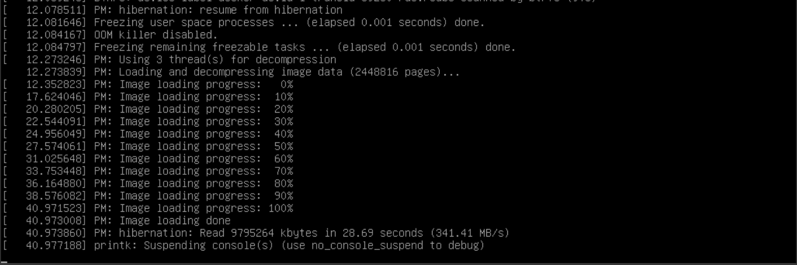

.. _ubuntu_hibernate:

==================================
Ubuntu Hibernate休眠
==================================

从Ubuntu 21.04 开始，需要采用 :ref:`systemd` 结合内核来实现休眠，原先用户端 ``uswsusp`` 已经不再支持。

``systemd-hibernate.service`` 直接激活会提示错误:

.. literalinclude:: ubuntu_hibernate/enable_systemd-hibernate
   :caption: 尝试激活 ``systemd-hibernate.service``

提示报错:

.. literalinclude:: ubuntu_hibernate/enable_systemd-hibernate_error
   :caption: 尝试激活 ``systemd-hibernate.service`` 报错

需要向内核传递swap参数，也就是 ``resume=UUID=`` :

- 当使用 swap 分区时不需要传递 ``resume_offset`` 参数
- 当时用 swap 文件时，则需要参考 :ref:`archlinux_hibernates` 实践中设置传递swap文件的offset参数

准备swap分区
===============

可以使用 swap 分区，也可以使用 swap 文件: 在提供hibernate的磁盘存储上没有本质区别，只是 swap 分区只需要向内核传递 ``resume=UUID=`` 参数指向分区即可；而 swap 文件还需要同时传递一个 ``swap_file_offset`` 参数(见 :ref:`ubuntu_hibernate_old` )。我在这里的实践采用swap分区:

- 分区准备:

.. literalinclude:: ubuntu_hibernate/swap_partition
   :caption: 准备swap分区

- 检查磁盘分区的uuid:

.. literalinclude:: ubuntu_hibernate/blkid
   :caption: 检查sda1的磁盘uuid

显示uuid如下:

.. literalinclude:: ubuntu_hibernate/blkid_output
   :caption: 检查sda1的磁盘uuid

- 对应在 ``/etc/fstab`` 添加swap配置:

.. literalinclude:: ubuntu_hibernate/fstab
   :caption: 在 ``/etc/fstab`` 中添加swap配置

配置内核参数
===============

- 编辑 ``/etc/default/grub`` 添加

.. literalinclude:: ubuntu_hibernate/grub
   :caption: 编辑 ``/etc/default/grub`` 传递hibernate resume参数

- 编辑 ``/etc/initramfs-tools/conf.d/resume`` 

.. literalinclude:: ubuntu_hibernate/resume
   :caption: 编辑 ``/etc/initramfs-tools/conf.d/resume`` 为 initramfs 传递resume参数

- 重建 ``initramfs`` :

.. literalinclude:: ubuntu_hibernate/update-initramfs
   :caption: 重新生成initramfs

- 重启一次服务器; ``reboot``

- 重启完成后，就可以通过 :ref:`systemd` 来管理hibernate:

.. literalinclude:: ubuntu_hibernate/systemctl_hibernate
   :caption: 通过 :ref:`systemd` 管理 hibernate

当完成hibernate存储运行到磁盘之后，服务器就会断电关机。要重新恢复运行状态，则按下电钮即可，在控制台终端最后会看到一段有关image加载的记录:

   操作系统启动时恢复hibernate存储状态

- 系统恢复以后，可以通过以下命令检查 ``systemd-hibernate`` 服务，可以看到加载是否成功以及出错信息(如果有的话):

.. literalinclude:: ubuntu_hibernate/systemctl_hibernate_status
   :caption: 检查hibernate恢复状态

输出类似如下:

.. literalinclude:: ubuntu_hibernate/systemctl_hibernate_status_output
   :caption: 检查hibernate恢复状态信息输出(多次记录)
   :emphasize-lines: 12-15

非root用户
===========

.. note::

  `How To Enable Hibernation On Ubuntu (When Using A Swap File) <https://www.linuxuprising.com/2021/08/how-to-enable-hibernation-on-ubuntu.html>`_ 还提供了一些非root用户使用hibernate的配置方法，我没有实践。如有需要请参考原文

参考
======

- `archlinux wiki:Power management/Suspend and hibernate <https://wiki.archlinux.org/index.php/Power_management/Suspend_and_hibernate>`_
- `How To Enable Hibernation On Ubuntu (When Using A Swap File) <https://www.linuxuprising.com/2021/08/how-to-enable-hibernation-on-ubuntu.html>`_
