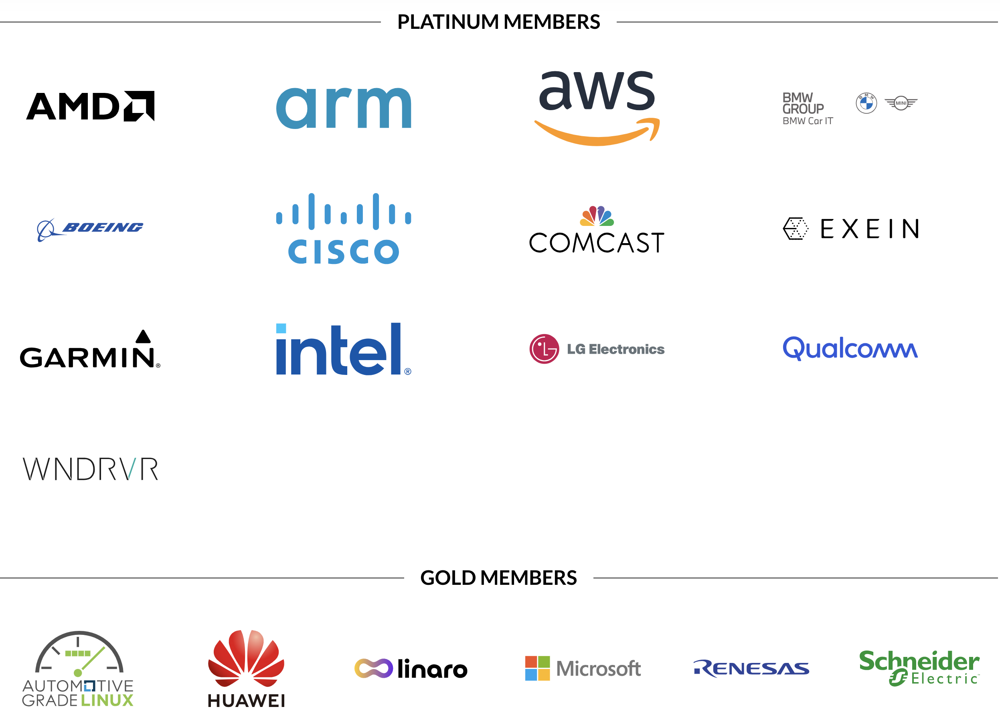

.. _intro_yocto:

=================
Yocto简介
=================

`Yocto Project <https://www.yoctoproject.org/>`_ 是一个帮助开发者构建定制化的Linux系统的开源项目，有点类似于 :ref:`lfs` ，并非Linux发行版，而是一个构建工具。并且， ``Yocto`` 的主要目标是构建嵌入式系统的Linux，所以特别适合为 :ref:`arm` 架构设备定制系统。

`Yocto Project <https://www.yoctoproject.org/>`_ 是Linux基金会项目，得到了众多软硬件厂商的支持，是目前构建嵌入系统最常见的平台工具。

   重量级厂商的支持是 ``Yocto`` 项目最好的背书

:ref:`raspberry_pi`
=====================

``Yocto`` 支持构建 :ref:`raspberry_pi` ，并且有专门的开源项目 `GitHub: agherzan/meta-raspberrypi <https://github.com/agherzan/meta-raspberrypi>`_ 用于构建不同型号树莓派的自定义镜像

BuildRoot
============

`Buildroot <https://buildroot.org/>`_ 是另一个常用于构建嵌入式系统的工具链，和 ``Yocto`` 类似，也是采用 Make 文件 BitBike来构建。BuildRoot似乎更为依赖手工完成，适合对底层有更多了解的技术场景。

Buildroot不像Yocto是完成整的包含多层和不同工具的项目，而是一个简化版构建，其核心避免负载和扩展构建实践，这使得Buildroot更容易理解和使用。Yocto的使用更为广泛，并且由于是Linux基金会项目，得到商业公司的支持，能够构建复杂的全功能嵌入式系统。

.. note::

   目前仅记录，后续再实践补充

参考
=====

- `So you want to build an embedded Linux system? <https://news.ycombinator.com/item?id=24800037>`_
- `To Yocto or not to Yocto for embedded Linux? <https://www.vikingsoftware.com/blog/yocto-or-not-for-embedded-linux/>`_
- `when Building your Custom Embedded Systems <https://www.incredibuild.com/blog/yocto-or-buildroot-which-to-use-when-building-your-custom-embedded-systems>`_
