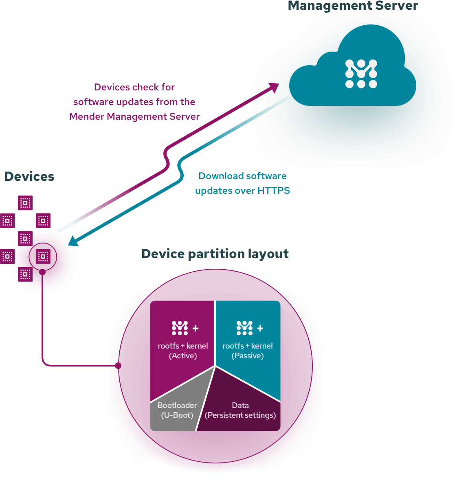

.. _yocto_ota:

================
Yocto OTA更新
================

嵌入式系统，例如 Android 手机 :ref:`pixel` 系列，都支持采用A/B双分区系统更新。这也是目前主流的手机更新运行模式，包括开源 ``LineageOS`` 也是采用这种方式。

OTA( ``over-the-air`` )更新可以为嵌入式系统、手机、平板、PC以及不同的IoT设备完成在线更新，对于 :ref:`yocto` 构建的嵌入式系统也可以结合进行大规模更新:

- Memfault
- Mender
- RAUC

Memfault
===========

`Memfault <https://memfault.com/>`_ 是商业化OTA解决方案供应商，有众多商业公司采用了它作为产品OTA更新平台，按照更新的芯片和架构计费，主要是大型电子公司使用。

Mender
===========

``Mender`` 是 `Mender.io <https://www.mender.io/>`_ 开源的OTA更新解决方案。 ``Mender`` 的客户端 `mender <https://github.com/mendersoftware/mender>`_ (c++)开源，服务器端则提供 :ref:`kubernetes` 部署安装，按照客户度license计数。

``Mender`` 的开发公司 ``Northern.tech`` 是著名的配置管理软件 `CFengine <https://cfengine.com/>`_ (历史非常悠久)的开发公司，目前CFengine依然是配置管理重要的开源软件。

RAUC
==========

`rauc.io <https://rauc.io/>`_ 开发的开源 ``RAUC - Robust Auto-Update Controller`` 

``RAUC`` 开源更为彻底，是完整的LGPL-2.1开源软件，其架构和代码是OTA解决方案良好的参考。

参考
=======

- `OTA Updates: Choosing Among Memfault, Mender, and RAUC <https://lembergsolutions.com/blog/ota-updates-choosing-among-memfault-mender-and-rauc>`_
