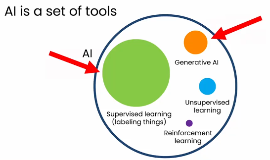
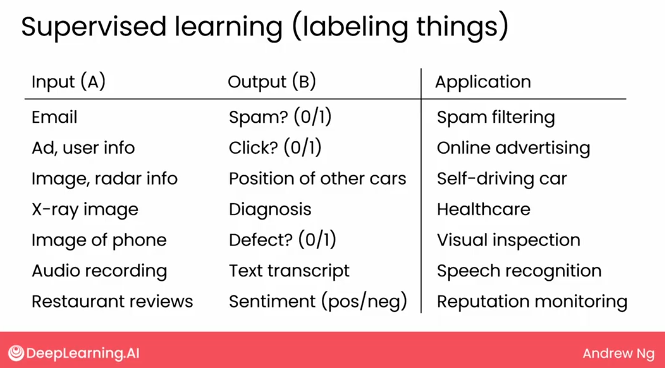
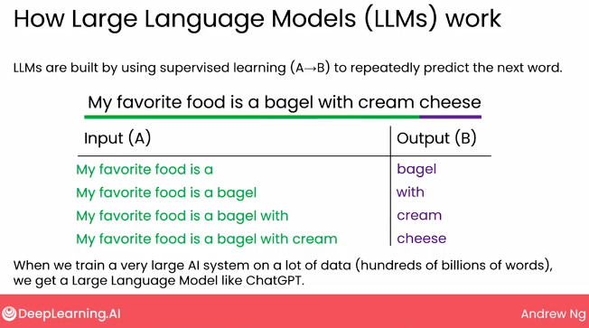
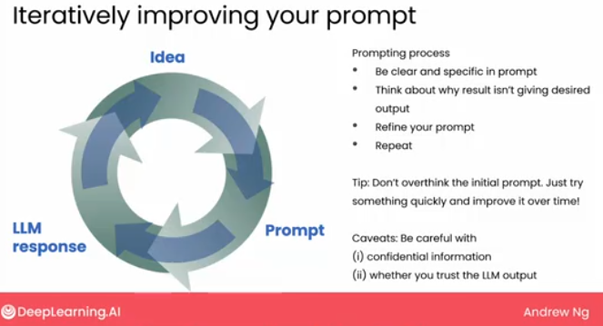
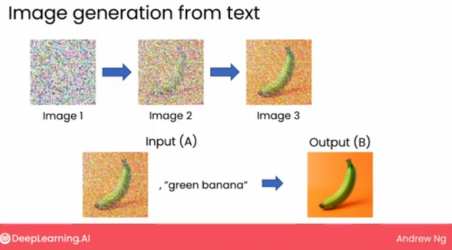

.. _generative_ai_for_everyone:

======================================
吴恩达《Generative AI for Everyone》
======================================

和 :ref:`ai_for_everyone` 相似， `吴恩达最新《面向每个人的生成式AI》Generative AI for Everyone <https://www.bilibili.com/video/BV11G411X7nZ/>`_ 是一个入门级非技术型视频讲座，对于普通人了解生成式AI基本原理、破除过度神话AI有很大帮助。本文是我观看摘要，仅供参考。建议观看原视频!

生成式AI的崛起
====================

Generative AI，即生成式AI是2022年11月开始引起主流关注的人工智能技术，起因是OpenAI发布了 ``ChatGPT`` ，令人惊叹的拟人化对答，几乎无所不知的知识和"推理"似乎远超普通人的认知。

.. note::

   生成式AI对我们生活和工作的影响，特别是编程、文稿、艺术类，已经显现出端倪。就像一个超级无敌的搜索引擎的自动汇编者，普通人的知识和技能储备是无法和人类历史上所有知识的积累相比较的。

   目前值得思考的是，生成式AI限于原理仅仅是人类历史知识的 ``概率性浓缩`` ，它自身是没有理解能力和主动性的。所以一个良好训练的人类依然能够以自己的理性和感情，指引生成式AI执行和review结果进行调整。

**生成式AI为世界带来了对生产力巨大提升的期待，也带来了自动化导致失业的忧虑**

生成式AI的定义
================

生成式AI指能够产生高质量内容，特别是文本、图像、音频、视频的人工智能系统: 根据用户输入的提示词(prompt)生成内容

.. note::

   **我的理解** :

   生成式AI对软件开发工作有很深刻的影响，相当于中低级别的开发人员(自动生成常规重复性代码，但是需要人类把关)，所以有可能使用者必须达到非常高的层次才能真正理解和掌握编程类生成式AI。而此时，中低端开发人员已经没有工作可干了，除非你更加磨练自己的技能上升到高级开发者的水平。

生成式AI的工作原理
=======================

- 当前主要的AI技术:

  - 监督学习(标记)
  - 生成式AI: 目前生成式AI主要通过监督学习来构建
  - 无监督学习
  - 强化学习

   AI技术

监督学习
------------

   监督学习的应用案例

大规模监督学习为现代生成式AI奠定了基础(2010-2020年):

- 发现在非常快速、强大且拥有大量内存的计算机上训练AI大模型，当输入越来越多的数据时，就会不断地变得越来越好

  - 这个特性和AI小模型不同，AI小模型不会随着输入数据增加而不断提升性能(在一定数据输入后不再提升性能)

- 使用大语言模型(Large Language Models, LLMs)生成文本

  - 本质是通过监督学习(A->B)来预测下一个单词

   通过监督学习构建LLM，预测一句语句中每个单词的下一个单词   

大语言模型
=============

大语言模型提供了寻找信息的新方式:

- 大语言模型能够直接回答问题(海量人类知识数据训练)
- 大语言模型会编造事情，而且看起来很权威和自行，这就是大语言模型的幻觉(概率原理)，如果对真实性有高要求一定要有专业能力辨析真伪
- 大语言模型可能需要多轮对话来引导模型给住正确答案(我感觉是通过不断提醒LLM实际上提示词增加了正确答案的概率，因为提示词和正确答案之间的概率相关性更强)
- 大语言模型有时可以作为思维伙伴来帮助你思考问题(实际上是历史上海量的人类知识根据你的提示词被概率提取出来，从而触发了你自己的目标灵感)

  - 可以将你的提纲或文章重写(润色)，因为你的提纲和文章相当于映射到人类文明历史中的知识的概率提示词，大语言模型将以全人类的知识文明来扩展你有限的文笔能力
  - 但是，反过来也限制了你的扩展和想像能力，因为你的大脑将退化掉迭代能力(所以我觉得不应该照抄，而是想办法和大语言模型对话，启发自己，由自己来重新而不是由大语言模型代笔)

生成式AI的使用案例
=====================

AI对很多任务都有用，就像电力驱动了不同的设备(无所不在)

- 写作

  - 提供一些词汇(想法)，LLM就能够像头脑风暴一样提供创意建议(本质上也人类积累的知识概率提取,普通人不可能看过所有人类的知识，但是LLM训练过程会扫描所有知识)
  - 回答企业相关知识问题
  - 提示词越详细越贴合需求，则得到的生成内容越专业越精准

- 翻译

  - 大语言模型翻译，特别是对于在互联网上有大量文本的语言，则翻译越精准；反之，对于低资源语言(互联网上该语言的文本较少)的翻译往往较差

- 阅读

  - 代替人类阅读大数据量的文章，并提取关键信息浓缩成概要
  - 校对人类撰写的文档分析语法和拼写错误并提供修正
  - 语音信息转录文本以后可以通过LLM进行摘要，方便管理者快速了解和评估
  - 阅读邮件判断分类，将客户邮件路由到合适处理的部门
  - 点评网站根据用户点评进行用户情感分析(正向评论或负面评论)

- 聊天

  - 构建在线(专业)聊天机器人: 旅游规划、职业规划指导、烹饪建议
  - 机器人调用公司的各种软件接口来执行特定任务: 外卖、IT管理的特定任务
  - 客户服务中的chatboots:

    - 混合人工和bots的对话服务(human in the loop)，以降低LLM生成错误导致异常概率
    - 使用bot triages for humans模式，自动分流简单任务给bot处理，复杂任务给人类处理，以提高服务效率
    - 通过bots，客服能够并发服务更多的客户

生成式AI(LLMs)的缺陷
================================

- LLMs是通过训练获得推理能力，所以它的训练集截止时间决定了它的能力范围或者说它的信息来源(知识截止点, knowledge cutoff)。
- 幻觉: 也就是LLM有时候会编造信息(例如要求提供三句莎士比亚写的有关碧昂丝的名言，显然这是不可能的事，但是LLM会编造; 例如LLM会编造虚假的法庭判例)
- 输入(和输出)长度有限: 大多数LLMs不能接受超过数千的提示词，并且用户提交的上下文总量是有限的(上下文总量其实是驶入和输出大小的总量)
- 目前LLMs还无法很好地处理结构化数据(监督学习是处理结构化数据较好的技术)；相反，LLs擅长处理非结构化数据(文本、图像、音频、视频)
- 生成式AI还容易产生偏见，甚至输出有毒或有害言论(因为训练文本取自互联网，而互联网上文本可能反映社会中存在的偏见)

提示词(prompt)技巧
====================

- 提示词要详细和具体

  - 提供足够的上下文或足够的背景信息，明确你想要得到的结果

- 提示词要引导模型思考它的答案

- 实验和迭代

  - 最初可能不是最好，通过尝试调整使得输出更接近想要的答案
  - 以简单的提示词快速开始，并根据输出思考为何没有达到想要的目标，然后完善提示词以澄清指令

- 需要考虑提示词的机密性要求

- 并考虑是否信任LLM输出(double check)

   LLM提示词需要不断迭代

图像生成
===============

能够生成文本或图像的多模态大模型:

- 图像生成主要通过扩散模型的方法来完成: 扩散模型从大量的图形中学习(扩散模型是监督学习)

  - 首先向图像添加噪音，使得图像变得嘈杂，最终得到一个看起来像纯噪声的图片(完全碎片看不出原图)
  - 以上述方式不断处理海量图片让系统学习
  - 生成图片是反向操作，将噪声图片反向去除噪声，直到形成清晰的图像
  - 由于训练时，用于训练的图片是有标签，并添加噪声形成完全噪声图片；当生成图片输入提示词时，会反向执行将最终噪声图片去噪

   LLM提示词反向将图片去除噪音

Generative AI的生命周期
============================

构建Generative AI是一个高度实验性的过程，需要不断尝试并修正错误:

- 提示词
- 检索增强生成(Retrieval augmented generation, RAG)

  - RAG为大语言模型访问外部数据提供了能力

- 微调模型(Fine-tune models)

  - 将大模型修改成适合你的任务

- 预训练模型(Pretrain models)

  - 从头开始训练LLM(Train LLM from scratch)

Generative AI的成本估算
===========================

参考
=======

- `吴恩达最新《面向每个人的生成式AI》Generative AI for Everyone <https://www.bilibili.com/video/BV11G411X7nZ/>`_
