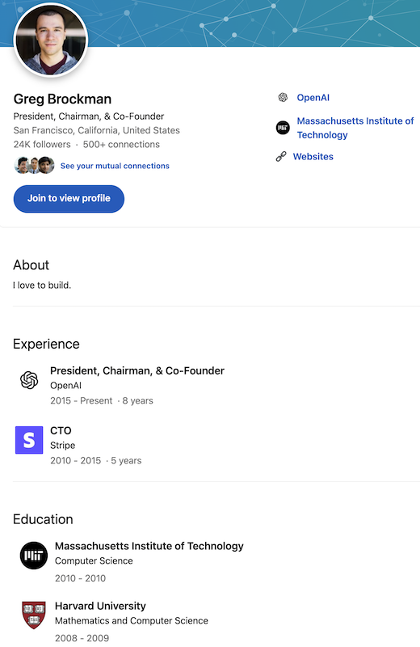

.. _become_a_machine_learning_practitioner:

=======================
成为一名机器学习实践者
=======================

2016年，当 `【Netflix】阿尔法狗 AlphaGo (2017) <https://www.bilibili.com/video/BV1Ct411u71n>`_ 向世界展示了深度学习战胜人类最强棋手李世石的时候，我也曾想过是否要学习机器学习知识，但是自己以往的计算机知识局限于Linux系统以及运维为主，对于机器学习涉及的理论知识非常匮乏。虽然看了一些资料，但始终摸不到门槛。

2022年底，ChatGPT的横空问世(实际上要早很多，但是出圈确实是在2022年底)，特别是随后GPT-4惊人的AGC能力，让人再次被机器学习/深度学习的能力所震撼。但是，处于这场狂潮之中，又该如何开始学习和真正掌握这项能力呢？

Greg Brockman: 如何成为一名机器学习实践者
==========================================

   `OpenAI联合创始人Greg Brockman在Linkedin上的个人介绍 <https://www.linkedin.com/in/thegdb>`_

.. note::

   如果你想一睹Greg Brockman的风采和理念，可以观看一下他在TED的演讲 `The Inside Story of ChatGPT’s Astonishing Potential <https://www.youtube.com/watch?v=C_78DM8fG6E>`_

   .. youtube:: C_78DM8fG6E

今天，我读到一篇 OpenAI 联合创始人 Greg Brockman 在2019年撰写的blog 译文「 `创立OpenAI前，Greg Brockman都不懂机器学习 <https://mp.weixin.qq.com/s?__biz=Mzg5Mjc3MjIyMA==&mid=2247565263&idx=1&sn=54b8b2056b2544cab85500544891ded4&chksm=c03ab5dcf74d3cca744cc76110ce9a51f8a64ddb69ae0771e590c014b3bd4a4d1ac42d9dc451&mpshare=1&scene=1&srcid=1205knHUh4ptaqrp2uBTQSTs&sharer_shareinfo=779dddba0685bf70929aa98bff9d8518&sharer_shareinfo_first=779dddba0685bf70929aa98bff9d8518&exportkey=n_ChQIAhIQ%2FNVukkGyyKU13cALcr%2FoqhKZAgIE97dBBAEAAAAAACuJAS8%2Fw7AAAAAOpnltbLcz9gKNyK89dVj0VXRAFVQvoN3yy9G85PnGjy%2BKHjnv63afvpcrCVXpyJrWgsv64gAT3bKeAqFmaykdewB%2B3NLmB8VcQ7X2g8eMKcPbKIjdrfZVgiB4fzHd0aRN3wY%2FHwDlgb02zh86sZJOSFZOA17ahHZ8EDK2fKMpVCLYZTFCOWpd0gl3iXSwetxx262T0PA%2Bf3yGXsfYzvjQZee4khUj%2FSevRQNCMRqWfH%2BKTQCF%2BwMnHAhyzkNs%2B%2FeIeYF3ELrkRBQMBT7skYoCf9TVEeAPG5kTQkcRq5golDTkFuaHK%2BZlSQTB%2BVGO6xtzJphbmn2UDjWqtSLatl7tKzYn&acctmode=0&pass_ticket=n8nl9hDyReOW39AJGwtYzR94f5lwg34pNoIvuNxt9Hqw5H%2BKKTyYGGdGc0KL2bpvOpa8KfvrPHnK81dzSHJu1A%3D%3D&wx_header=0#rd>`_ 」(原文见 `How I became a machine learning practitioner <https://blog.gregbrockman.com/how-i-became-a-machine-learning-practitioner>`_ )，对我有所启发和激励( **见贤思齐** ):

- Greg Brockman 说他的软件技能在OpenAI中非常受欢迎(技术领袖)，但是这也是阻碍他学习机器学习技能的绊脚石

  - 确实，我们非常容易陷入 "技术舒适圈" ，在自己熟悉的技术领域不断(些微)进步，但是我们会畏惧进入自己不能控制的技术领域，例如机器学习(虽然我们知道这是一个先进和面向未来的技术)

- 2017年 Greg Brockman 在首次尝试Dota游戏的机器学习，虽然他构建了软件基础设施，以及贡献了训练代码，但是(我感觉)他承认当时他并 **没有掌握结合软件和机器学习的关键技能**

- 2018年11月 Greg Brockman 在输掉了国际邀请赛之后(应该是AI竞赛，当年OpenAI和DeepMind的AlphaGo一争长短)，他下决心用三个月来尝试:

  - **最有效的方式是要有一个具体的构建目标** : 构建一个聊天机器人(Greg Brockman自学训练基于LSTM的语言模型和基于Transformer的模型)
  - 研究信息论、阅读大量论文(直到完全理解每一行内容)

::

   虽然进展缓慢，但这次我有所准备。

   我并没有体验到那种心流状态。这让我想起我刚开始学习编程时的感觉，我一直在想花了多长时间才达到精通的感觉。

   说实话，我不确定自己是否能在机器学习领域变得优秀。

   但我继续前进，因为…… 坦白说，我不想仅仅局限于理解项目的一部分。

   我想清楚地看到整个画面。

::

  
   ...一个重要的概念性突破，我克服了之前在 Dota 项目中因过于胆怯而未曾尝试的障碍：

   对别人的机器学习代码做出实质性的更改。...

   ...但当我尝试生成更长的消息时，过程变得非常缓慢，这种挫败感甚至超过了我的恐惧...

   ...当我最终让它工作时，我意识到我学到了一些之前认为不可能的东西：我现在了解整个模型是如何构建的...

- 2019年初，在经过三个月自学之后 Greg Brockman 开始参与项目(他提到自己75%时间写代码，其余时间专注于机器学习)，并且在六个月时间内转型为机器学习实践者(我理解他深度参与并构建了机器学习工程化):

  - 作为OpenAI的核心技术领袖，他坦承 **我之所以(以前)无法转型，是因为我不愿意再次成为初学者。** 
  - 他以自身的经历来鼓励机器学习的后来者:

::

   如果你想成为深度学习实践者，你完全可以做到。

   你需要给自己留出失败的空间和时间。

   如果你 "从足够多的失败中学习" ，你最终会成功 -- 而且可能比你预想的要快得多。

.. note::

   Greg Brockman 并不是没有基础的小白(虽然他很谦虚):

   - 2008年 Greg Brockman 进入哈佛攻读 数学和计算机专业 ，2010年转学到MIT就读计算机科学: 也就是说他本人 **数学** 和计算机能力已经非常强
   - 2010年 Greg Brockman 辍学加入Stripe(支付巨头)成为"第四人"，并成为CTO，构建了Stripe的基础架构(可见他的计算机工程能力极强，为后续OpenAI的机器学习工程化提供了基础)
   - 2015年 Greg Brockman 加入OpenAI，虽然此时他不懂深度学习，但是他作为技术负责人，为组建初期技术团队提供了主要推动(人脉)：OpenAI训练ChatGPT的软硬件架构是由Gre Brockman主导的
   - 2019年7月，他撰写 `How I became a machine learning practitioner <https://blog.gregbrockman.com/how-i-became-a-machine-learning-practitioner>`_ 阐述他作为软件后端基础设施和架构的传统软件开发者(十年的编程经验)，如何以初学者的心态花费了九个月时间转型为一名机器学习实践者

我的思考
==========

虽然我们绝大多数人都无法达到Greg Brockman高度，但是以他的传统软件开发者转型机器学习架构师，这个技术道路是我们借鉴的方向。哪怕我们能够学习和做到他1/10的程度，也是极大的成就和进步。

我看到了自己类似的情况，多年的基础设施运维使得我自己技能还算过得去，但是却始终没有跨出软件开发以及结合机器学习的爆发一步。想到连 Greg Brockmon 这样优秀的技术高手都承认自己的不足，我有什么理由不 ``以初学者的心态`` 来开始自己的机器学习之路呢？

Greg Brockmon 的后端开发和软硬件基础架构能力也是他最终转型 ``机器学习实践者`` 的技术基石，我想我也可以以 :ref:`kubernetes` 以及 :ref:`kubeflow` 的工程实践来实现和理解机器学习，从部署到训练，从工程化到开发，也是类似的机器学习之路...

参考
======

- 「 `创立OpenAI前，Greg Brockman都不懂机器学习 <https://mp.weixin.qq.com/s?__biz=Mzg5Mjc3MjIyMA==&mid=2247565263&idx=1&sn=54b8b2056b2544cab85500544891ded4&chksm=c03ab5dcf74d3cca744cc76110ce9a51f8a64ddb69ae0771e590c014b3bd4a4d1ac42d9dc451&mpshare=1&scene=1&srcid=1205knHUh4ptaqrp2uBTQSTs&sharer_shareinfo=779dddba0685bf70929aa98bff9d8518&sharer_shareinfo_first=779dddba0685bf70929aa98bff9d8518&exportkey=n_ChQIAhIQ%2FNVukkGyyKU13cALcr%2FoqhKZAgIE97dBBAEAAAAAACuJAS8%2Fw7AAAAAOpnltbLcz9gKNyK89dVj0VXRAFVQvoN3yy9G85PnGjy%2BKHjnv63afvpcrCVXpyJrWgsv64gAT3bKeAqFmaykdewB%2B3NLmB8VcQ7X2g8eMKcPbKIjdrfZVgiB4fzHd0aRN3wY%2FHwDlgb02zh86sZJOSFZOA17ahHZ8EDK2fKMpVCLYZTFCOWpd0gl3iXSwetxx262T0PA%2Bf3yGXsfYzvjQZee4khUj%2FSevRQNCMRqWfH%2BKTQCF%2BwMnHAhyzkNs%2B%2FeIeYF3ELrkRBQMBT7skYoCf9TVEeAPG5kTQkcRq5golDTkFuaHK%2BZlSQTB%2BVGO6xtzJphbmn2UDjWqtSLatl7tKzYn&acctmode=0&pass_ticket=n8nl9hDyReOW39AJGwtYzR94f5lwg34pNoIvuNxt9Hqw5H%2BKKTyYGGdGc0KL2bpvOpa8KfvrPHnK81dzSHJu1A%3D%3D&wx_header=0#rd>`_ 」原文见 `How I became a machine learning practitioner <https://blog.gregbrockman.com/how-i-became-a-machine-learning-practitioner>`_
- `不为人知的创始人山姆：OpenAI创始人Greg Brockman <https://zhuanlan.zhihu.com/p/635305355>`_
- `ChatGPT背后的男人——OpenAI“总设计师”Brockman <https://zhuanlan.zhihu.com/p/622324970>`_
