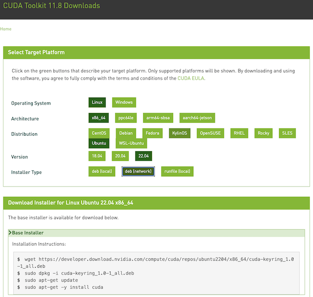

.. _install_nvidia_cuda:

==========================
安装NVIDIA CUDA
==========================

.. note::

   我规划采用 :ref:`vgpu` 在虚拟机内部构建完整的机器学习环境，所以会在VM内部来实现NVIDIA CUDA安装，而在物理主机上仅 :ref:`install_nvidia_linux_driver` 。

   然后在此基础上构建 :ref:`gpu_k8s` ，实现分布式的机器学习部署

   对于底层物理主机，仅需要 :ref:`install_nvidia_linux_driver`

说明
======

.. _install_cuda_prepare:

安装CUDA准备
=============

- 验证硬件是否支持 CUDA ::

   lspci | grep -i nvidia

根据输出的信息，查询 `CUDA GPUs - Compute Capability <https://developer.nvidia.com/cuda-gpus>`_ 网站信息确认

.. note::

   NVIDIA的计算图形卡需要BIOS支持 ``64-bit IO`` ，不过对于不同服务器厂商可能会使用不同的技术术语，例如 :ref:`dl360_gen9_large_bar_memory`

- 验证是否是支持的Linux版本::

   uname -m && cat /etc/*release

确保采用了 ``x86_64`` 版本Linux (或者是 ``aarch64`` 的64位ARM版本，需要下载对应架构的驱动)

- 验证系统已经安装了gcc，以及对应版本::

   gcc --version

- 验证系统已经安装了正确的内核头文件和开发工具包:

CUDA驱动需要内核头文件以及开发工具包来完成内核相关的驱动安装，因为内核驱动需要根据内核进行编译。

对于 RHEL 7 /CentOS 7执行以下安装命令::

   sudo yum install kernel-devel-$(uname -r) kernel-headers-$(uname -r)

对于 Fedora / RHEL 8 / Rocky Linux 8 执行以下安装命令::

   sudo dnf install kernel-devel-$(uname -r) kernel-headers-$(uname -r)

对于OpenSUSE/SELES 执行以下安装命令::

   sudo zypper install -y kernel-default-devel=$(uname -r | sed 's/\-default//')

对于Ubuntu执行以下安装命令::

   sudo apt-get install linux-headers-$(uname -r)

- 如果要支持 :ref:`nvidia_gpudirect_storage` (GDS)，需要同时安装CUDA软件包和 MLNX_OFED软件包 (需要使用NVMe硬件) ，这样可以在直接内存访问(DMA)方式在GPU内存和存储之间传输数据，不需要经过CPU缓存: 这种直接访问路径可以增加系统带宽和降低延迟以及降低CPU负载

这步跳过，后续在 :ref:`nvidia_gpudirect_storage` 实践

安装CUDA
===========

- 有两种安装方式:

  - 发行版无关run文件包( `NVIDIA官方提供的 P40 驱动 <https://www.nvidia.com/download/index.aspx#>`_ )
  - 采用官方提供针对不同发行版的软件仓库方式(见下文实践)

.. _cuda_repo:

CUDA软件仓库
--------------

从NVIDIA官方提供 `NVIDIA CUDA Toolkit repo 下载 <https://developer.nvidia.com/cuda-downloads>`_ ，针对我 :ref:`upgrade_ubuntu_20.04_to_22.04` 的 :ref:`priv_cloud_infra` 底层物理主机操作系统(Ubuntu 22.04)，我采用官方仓库网络安装模式(参考下图选择自己对应的发行版，并选择网络安装):

.. literalinclude:: install_nvidia_cuda/cuda_toolkit_ubuntu_repo
   :language: bash
   :caption: 在Ubuntu 22.04操作系统添加NVIDIA官方软件仓库配置

安装CUDA(通过软件仓库)
-----------------------

.. literalinclude:: install_nvidia_cuda/cuda_toolkit_ubuntu_repo_install
   :language: bash
   :caption: 使用NVIDIA官方软件仓库安装CUDA

.. _cuda_install_post_actions:

安装CUDA完成后操作
===================

强制性操作
-------------

在安装完CUDA Toolkit 和 Driver之后，必须完成以下操作:

环境变量设置
~~~~~~~~~~~~~

- 安装了 CUDA Toolkit 则设置环境变量 ``/etc/profile`` 添加::

   export PATH=/usr/local/cuda-11.8/bin${PATH:+:${PATH}}
   # 使用runfile安装方式需要添加 LD_LIBRARY_PATH 
   export LD_LIBRARY_PATH=/usr/local/cuda-11.8/lib64\
                            ${LD_LIBRARY_PATH:+:${LD_LIBRARY_PATH}}

有关POWER9设置是适配IBM服务器的，个人恐怕不会接触到，忽略

建议操作
--------

- 安装持久化服务(NVIDIA Persistence Daemon)

- 安装Writable Samples: CUDA Samples 位于 https://github.com/nvidia/cuda-samples ，然后编译和运行一些sample程序来验证CUDA安装是否成功

- 验证驱动版本::

   cat /proc/driver/nvidia/version

参考
======

- `NVIDIA CUDA Installation Guide for Linux <https://docs.nvidia.com/cuda/cuda-installation-guide-linux/index.html>`_
