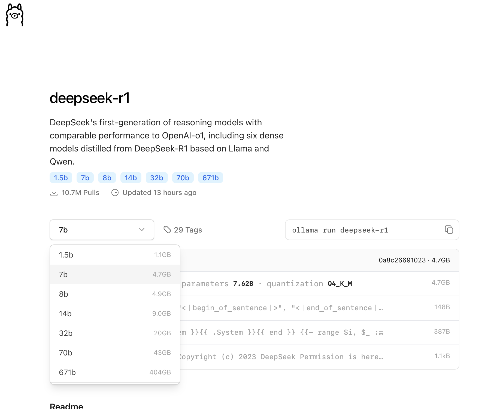

.. _macos_ollama_deepseek-r1-distill-qwen-1.5b:

======================================================
macOS本地通过Ollama部署DeepSeek-R1-Distill-Qwen-1.5B
======================================================

本地尝试部署，给自己一个感性认识:

- macOS笔记本是 :ref:`mbp15_2018` , 显卡 Radeon Pro 555X 4GB

Ollma
========

`Ollma.com <https://ollama.com>`_ 提供了不同大语言模型本地化运行，其中包含了 ``DeepSeek-R1`` :

`Ollama: deepseek-r1 <https://ollama.com/library/deepseek-r1>`_ 页面提供了不同模型运行命令以及对应显存要求:

- 选择最小的 1.5b ，所以对应运行命令就是:

.. literalinclude:: macos_ollama_deepseek-r1-distill-qwen-1.5b/ollama_deepseek
   :caption: 通过Ollma运行最小的一个deepseek-r1蒸馏模型

Ollma运行会自动下载对应模型并运行，但是字符界面交互不方便

Chatbox
===========

参考 `如何将 Chatbox 连接到远程 Ollama 服务：逐步指南 <https://chatboxai.app/zh/help-center/connect-chatbox-remote-ollama-service-guide>`_ 下载Chatbox桌面版本: 我下载的是 macOS Intel 版本

- 运行Chatbox，在设置中选择模型提供方 ``Ollama`` ，就可以在模型下拉框中看到刚才运行的本地模型，点击保存后就可以开始对话

- Chatbox也可以连接远程Ollama服务，不过要求Ollma服务配置成暴露在本地网络中以便Chatbox可以访问:

  - 为了安全，也可以通过 :ref:`ssh_tunneling` 来构建本地回环地址到远程服务器的回环地址的通道(Ollama服务端口默认是 ``11434`` )，这样对于Chatbox来说依然是连接本地服务(实际映射到远程服务器上)

  - Ollama的远程服务设置参考 `如何将 Chatbox 连接到远程 Ollama 服务：逐步指南 <https://chatboxai.app/zh/help-center/connect-chatbox-remote-ollama-service-guide>`_ ，简单来说就是设置 ``OLLAMA_HOST`` 和 ``OLLAMA_ORIGINS`` 两个环境变量

参考
======

- `公司数据不泄露，DeepSeek R1本地化部署+web端访问+个人知识库搭建与使用，喂饭级实操教程，老旧笔记本也能跑出企业级AI <https://zhuanlan.zhihu.com/p/20733964413>`_
