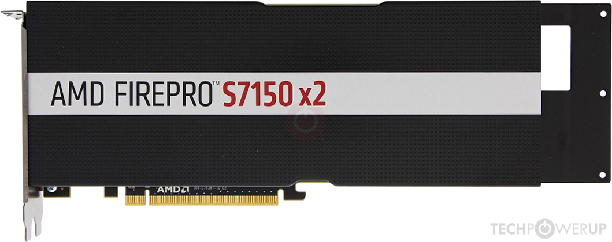
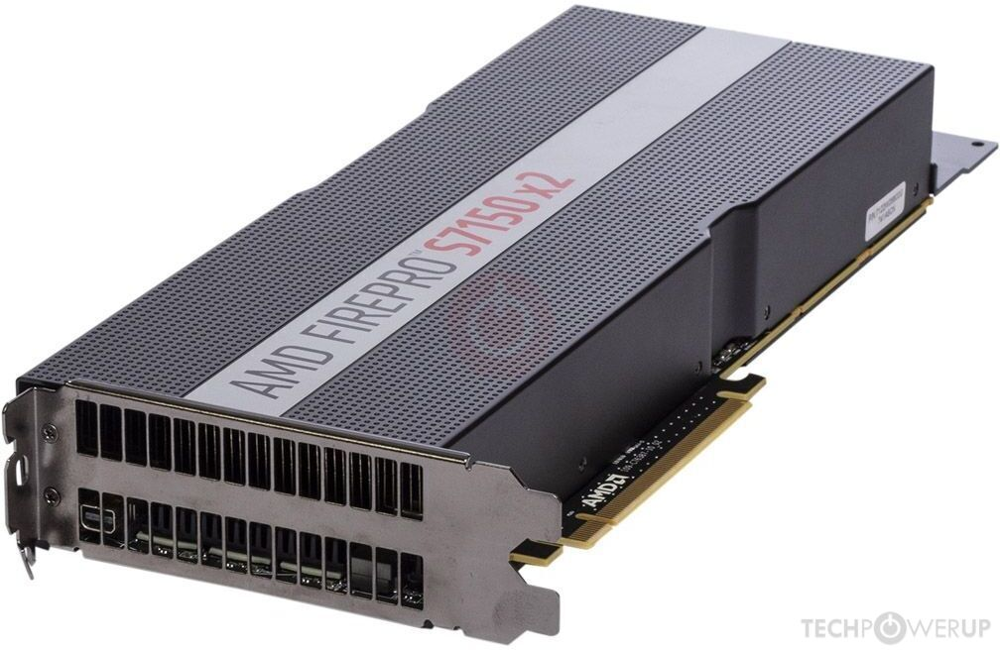
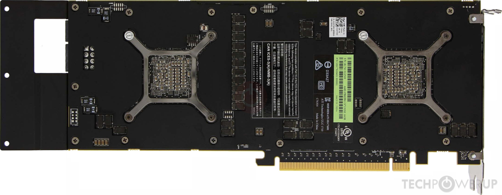

.. _amd_firepro_s7150x2:

============================
AMD FirePro S7150 x2运算卡
============================

``AMD FirePro S7150 x2`` 是目前能够在淘宝上买到的非常廉价的AMD GPU计算卡，成本大约只有200+ RMB。

.. note::

   根据网上信息查询，AMD GPU由于浮点计算由于同时代NVIDIA GPU，但是游戏性能较差，并且没有针对挖矿进行反制，导致很多矿场大量使用AMD显卡/计算卡进行挖矿。这可能也是矿难之后，流入市场的AMD显卡/计算卡价格低廉的原因，毕竟矿卡的使用寿命和稳定性存疑。

   `Advanced Tonga BIOS editing <https://nerdralph.blogspot.com/2016/09/advanced-tonga-bios-editing.html#comment-form_6941846982170234189>`_ 矿工分享的有关AMD Tonga BIOS编辑来帮助稳定运行挖矿的blog

   不过，出于学习的兴趣，以及我重组 :ref:`hpe_dl380_gen9` 之后希望有最低的二手硬件投入来实践学习，我准备入手一个AMD 矿卡来练习。

AMD FirePro S7150 x2
==========================

FirePro S7150 x2 是 AMD 于 2016 年 2 月 1 日推出的运算卡，基于Cloud Tau变体 ``Tonga`` 图形处理器:

- 芯片面积为 366 mm²，拥有 50 亿个晶体管
- AMD 已禁用 FirePro S7150 x2 上的一些着色单元(虽然GPU和完全解锁的Radeon R9 285X相同)
- **结合了两个图形处理器** 以提高性能 -- **每个 GPU** 具有:

  - 1792 个着色单元 (合计x2 = 3584)
  - 112 个纹理映射单元 (合计x2 = 224)
  - 32 个 ROP (合计x2 = 64)
  - GPU工作频率 920MHz

- 每个GPU配备:

  - 8G GDDR5内存 (合计x2 = 16GB)
  - 256位内存接口连接(合计x2 = 512位)
  - 内存工作频率 1250MHz

这款图形加速卡实际上相当于2块 ``AMD FirePro S7150`` 合并:

- AMD这种双GPU核心主要是为了降低制造成本，因为单个芯片面积越大成本越高
- AMD的GPU采用了28nm工艺，比同一年发布的 :ref:`tesla_p10` (16nm)要落后2代，所以功耗上要大很多，不得不降低运行频率并合并两个GPU核心来获得接近的性能
- 双GPU核心带来另一个问题是分配到每个GPU的显存只有总体的1/2，也就是对操作系统而言，主机上就是安装了两块GPU

  - 在机器学习中，单个GPU只有8G大大限制了大模型的运行参数，所以不利于训练和推理
  - 跨GPU的通许会降低GPU的运算能力，猜测可能降低1/3

:ref:`tesla_p10` vs  AMD FirePro S7159 x2
============================================

.. csv-table:: Tesla P10 vs. FirePro S7159 x2 vs. GeForce GTX 1080 Ti
   :file: amd_firepro_s7150x2/firepro_s7159x2_spec.csv
   :widths: 25,25,25,25
   :header-rows: 1

从理论数据来看 ``AMD FirePro S7159 x2`` 的 ``FP16`` 半精度性能要远好于 :ref:`tesla_p10` ，感觉在训练和推理上应该不差。不过，现在深度学习都针对N卡优化，有可能理论数据并不能代表性能。

:ref:`pytorch` 最新2.0版本已经宣布支持AMD GPU，但是不清楚这么早期的卡是否能够支持，有待实践。

资源
=========

- AMD官方 `FirePro™ S7150 X2 Drivers & Support <https://www.amd.com/en/support/downloads/drivers.html/graphics/firepro/firepro-s-series/firepro-s7150-x2.html>`_

  - 官方提供的支持不同虚拟化平台的驱动，不过比较古早，不确定是否还能继续使用

- `AMD ROCm Software <https://www.amd.com/en/products/software/rocm.html>`_ 官方Portal

  - `AMD ROCm docs <https://rocm.docs.amd.com/en/latest/>`_

    - `Use ROCm on Radeon GPUs <https://rocm.docs.amd.com/projects/radeon/en/latest/index.html>`_

      - `Linux® Drivers for AMD Radeon™ and Radeon PRO™ Graphics <https://www.amd.com/en/support/download/linux-drivers.html>`_ 驱动下载(仓库配置包)，可以在线安装AMD ROCm

- :ref:`mxgpu` 相关

  - `Proxmox 7.2 AMD FirePro s7150 MxGPU vGPU passthrough <https://forum.proxmox.com/threads/proxmox-7-2-amd-firepro-s7150-mxgpu-vgpu-passthrough.116380/>`_ 提到的 GIM Fork Repo `GitHub: Hardconkers/MxGPU-Virtualization <https://github.com/Hardconkers/MxGPU-Virtualization>`_ 验证支持kernel 6.8，或许是一个思路(AMD似乎没有继续开源?)

参考
=======

- `TechPowerUP GPU Database > FirePro S7150 x2 Specs <https://www.techpowerup.com/gpu-specs/firepro-s7150-x2.c2812>`_
