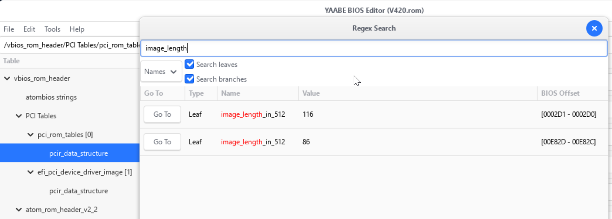

.. _amd_mi50_change_vbios_bar_size:

===================================
修订AMD MI50 VBIOS的BAR size
===================================

为了能够在 :ref:`dell_t5820` 上使用 :ref:`amd_mi50` ，我尝试 :ref:`amd_mi50_flash_vbios` 来模拟Workstation Graphics，但是没有成功。进一步怀疑是T5820不支持resize BAR，也就是不能够支持大规格BAR，所以考虑将 :ref:`amd_mi50_flash_vbios` 之后的 V420的VBIOS ，修改BAR size，强制使用 small bar并配合注入的 GOP 来实现一个Workstation Graphics。

准备工作
===========

我已经在 :ref:`hpe_dl380_gen9` 上执行 :ref:`amd_mi50_flash_vbios` 刷入了 ``V420`` 的VBIOS，经 ``rocm-smi`` 验证确认正常加载驱动。现在将该VBIOS备份:

.. literalinclude:: amd_mi50_change_vbios_bar_size/save_vbios
   :caption: 提取已经刷入的V420 VBIOS

HxD手工修改 PCIe BAR Aperture Size(失败)
==========================================

.. note::

   修改在gemini指导下完成

AMD 的 VBIOS 结构（AtomBIOS）非常标准，可以通过特征码定位法在 HxD 中手动锁定那几个关键字节:

在 ``HxD`` 中按下 ``Ctrl+F`` ，选择 "Hex-values" 或 "Text-string" 搜索 ``PCIR`` ，位置通常位于 ``0x100`` 到 ``0x200`` 之间，找到 ``PCIR`` 字符串后，它后面紧跟着的是 ``PCIe`` 数据结构:

- **Vendor ID** : 应该是 ``02 10`` (代表 AMD 的 ``0x1002`` )
- **Device ID** : 应该是 ``1F 0E`` (代表 V420 的 ``0x0E1F`` )
- **Class Code** : 通常是 ``00 00 03`` (代表 ``Display Controller`` )

找到以后，尝试修改后面的偏移 **16到20个字节** ，将 ``0F`` (32GB) 或 ``0E`` (16GB) 修改成 ``08`` (256MB)

另外建议修改 ``0E 1F`` (V420 原有 SSID) 替换成 ``1E 08`` (表示MI50原生SSID是 ``081E`` )

.. note::

   现代显卡是一个多功能设备 (Multi-function Device)。一个 .rom 固件文件其实是一个“容器”，里面封装了多个镜像：

   - 镜像 1: GPU 核心的 Legacy VBIOS (这是我们要改的)。
   - 镜像 2: 集成音频控制器的驱动。 ``00 00 18`` Class Code，18 开头通常对应 Multimedia Controller（多媒体控制器）
   - 镜像 3: UEFI GOP 驱动。

   当使用 ``Ctrl+F`` 搜索 ``PCIR`` ，如果找到的 ``PCIR`` 后面跟的不是 ``1F 0E`` (代表 ``V420`` 的 ``0x0E1F`` )和  ``00 00 03`` (代表 Display Controller)，则表示需要继续查找下一个，直到找到 ``00 00 03`` 。

但是很不幸，我实际上没有找到上述连续的 ``02 10 1F 0E 00 00 03`` ，我只找到似乎有点相关的 ``50 43 49 52 02 10 A0 66 00 00 18 00 00 00 00 03`` ，但是gemini判断位置不正确，而我找到的两处 ``50 43 49 52`` 都是这样的。

gemini判断这是因为VBIOS镜像是压缩的(Compressed ROM)，只有当显卡初始化时，内部的解压逻辑才会把它释放到内存中，所以用HxD查看ROM文件只能看到未压缩的音频部分。

.. note::

   gemini提示如果使用 ``GOPUpd`` 来解包和封包过程中，会尝试对齐各个镜像块，生成的 ``_upd.rom`` 有时候会将原本压缩的内容展开，或者重新生成标准的结构，这时候可能会观察到 ``PCIR`` 内容

AtomBIOS Editor修改PCIe BAR Aperture Size
============================================

`Andybf/AtomBiosEditor <https://github.com/Andybf/AtomBiosEditor>`_ 是早期的AMD GPU firmware editor，针对macOS平台源代码(黑苹果（Hackintosh）社区非常活跃，因为他们经常需要修改 VBIOS 里的输出接口定义)

`netblock/yaabe <https://github.com/netblock/yaabe>`_ 是一个持续活跃开发的 **Yet Another AtomBIOS Editor** ，专注于VBIOS的数据结构，通过Meson build系统编译，采用GTK 4.12 UI toolkit以及json5 for python。这个开源软件也提供Windows环境移植，所以可以非常方便使用。

使用 ``yaabe`` 成功打开V420 ROM，该工具提供了结构化展示VBIOS配置的功能，并且可以搜索字符串或HEX字符。

需要修订的是 ``Data Table (数据表)`` 中二进制数据，以指示主板BIOS分配资源。经过和gemini协助尝试，最后确认通过 ``image_length`` (Name) 能够找到两个位置存在 ``image_length_in_512``

   搜索Name包含 ``image_length`` 的字段

这里2个 ``image_length_in_512`` 都位于 ``/vbios_rom_header/PCI Tables/`` 结构下，都是 ``pcir_data_structure`` ，需要记录下这个 ``pcir_data_structure`` 所在的 **十六进制原始偏移量(Physical Offset)** :

- ``pci_rom_table[0]/pcir_data_structure`` : ``0002D7-0002C0]``

  - 镜像 A (偏移 [0002D1-0002D0]): 116×512=59,392 字节 (约 58KB)，这是典型的 Legacy VBIOS 镜像。它位于文件头部附近，是给老主板或 CSM 模式使用的

- ``efi_pci_device_driver_image[1]/pcir_data_structure`` : ``[00E833-00E81C]``

  - 镜像 B (偏移 [00E82D-00E82C])：86×512=44,032 字节 (约 43KB)，这是 UEFI / GOP 镜像。它位于文件较后的位置（0xE800 附近），是让 T5820 在 UEFI 模式下点亮屏幕的关键

V420 ROM 是一个 Hybrid（混合） 镜像。它包含两个独立的执行体：

- 第一个执行体：Legacy 模式启动
- 第二个执行体：UEFI 模式启动

为了让 :ref:`dell_t5820` 认出 256MB 的显卡，这两个镜像里的 BAR 定义都必须修改，否则可能会出现“BIOS 能看得到，但一进系统就 Code 43”或者“能进系统但 BIOS 阶段不亮”的情况。

.. warning::

   手工修订VBIOS比想象中要难，gemini指导下依然有很多不清楚的地方，我最终也没有搞定。

换一个思路:修订主板BIOS的Aperture Size
==========================================

我在上面尝试修订 :ref:`amd_mi50` 的BAR size遇到重重困难，gemini给出了另一个思路(AI就像一个无边无际的游戏地图，只有探索才能偶然触发宝箱)，可以结合

- :ref:`dell_t5820_config_aperture_size` 强制主板忽略GPU申请的BAR，使用自定义256MB Aperture Size来启动主机
- 然后使用开源工具ReBarUEFI 实现 :ref:`dell_t5820_rebaruefi` ，通过注入驱动来实现32GB BAR的功能

checksum
==========

现代显卡固件是一个复合体，当修改VBIOS内容，需要修复校验和(checksum)，这包含两层校验:

- Legancy部分的checksum: 位于ROM的前半部分，这是主板BIOS在Legacy模式下读取的，通常是整个文件字节累加取模的结果
- UEFI/GOP模块的checksum: 位于ROM的后半部分，这是一个符合UEFI规范的独立签名/校验

参考
======

- gemini
