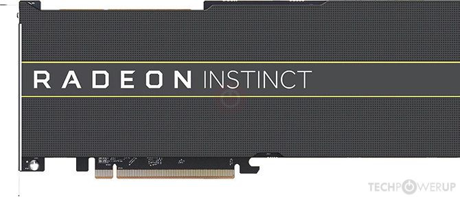
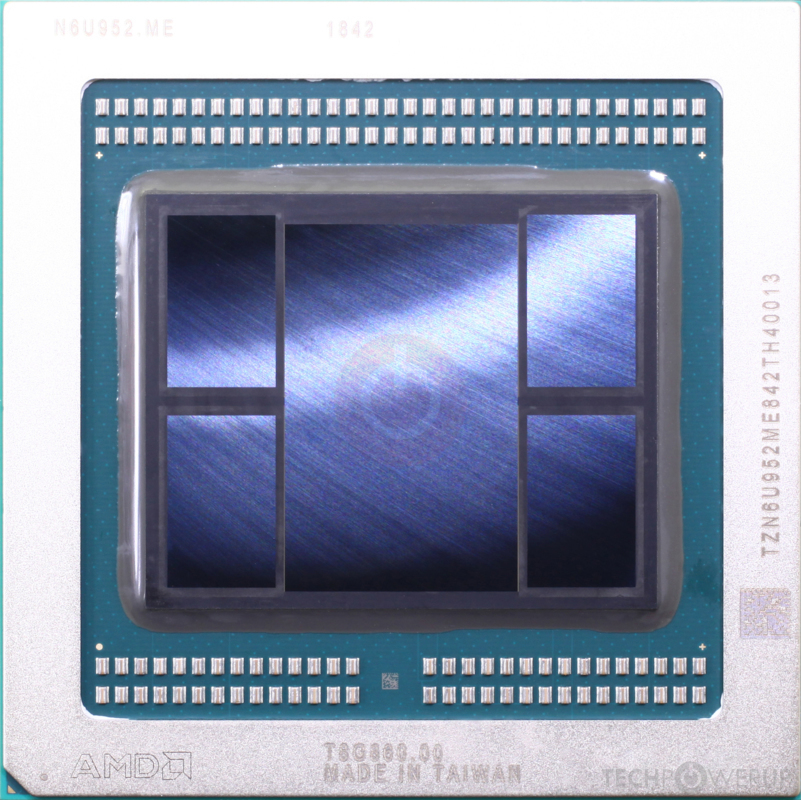
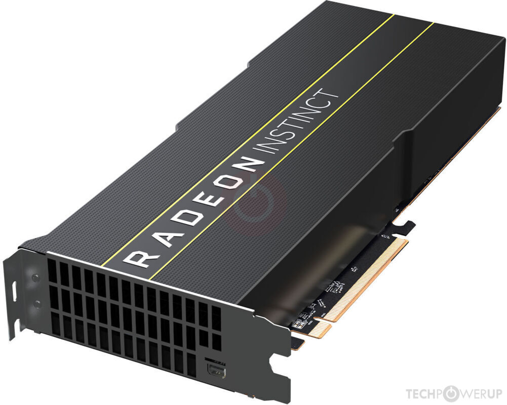
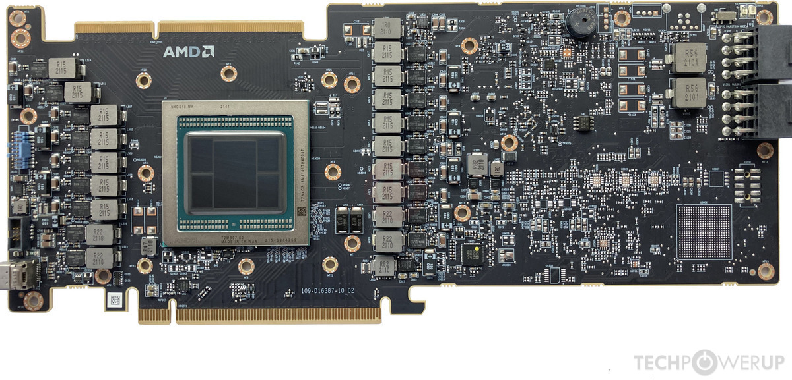
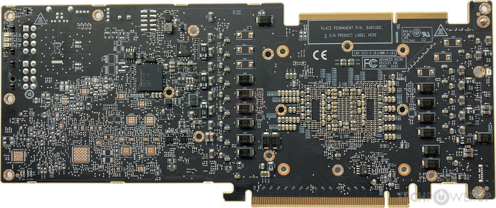

.. _amd_radeon_instinct_mi50:

=============================
AMD Radeon Instinct MI50
=============================

Radeon Instinct MI50 是 AMD 于 2018年11月18日分布的专业显卡，该卡采用了 7nm 工艺制造(TSMC台积电代工)，基于 Vega 20 图形处理器。(原来2018年台积电就已经代工了7nm工艺，而2024年底中美贸易站，美国禁止的7nm工艺居然是6年前的工艺)

AMD Radeon Instinct MI50 有两个内存版本，一个是 16GB HBM2内存，通过4096为显存接口连接；另一个规格是 32GB 内存。这两款AMD GPU在淘宝上非常廉价，我购买的 32GB 版本(1000元)，甚至比 16GB规格 :ref:`tesla_t10` (1400元)，而从技术性能的纸面数据来看，MI50其实比T10要更好一些。这可能就是NVIDIA CUDA护城河的威力了，在AI领域，AMD的存在感非常低。

   MI50外观

   MI50芯片

   MI50接口

   MI50主板前视图

   MI50主板后视图

MI50规格
==========

- Vega 20 图形处理器芯片面积: 331 平方毫米
- 132.3 亿个晶体管
- 3840 个着色单元
- 240 个纹理映射单元
- 64 个 ROP（光栅操作单元）
- GPU 运行频率为 1200 MHz，最高可提升至 1746 MHz
- 显存频率为 1000 MHz
- 2 个 8 针电源接口供电，最大额定功率为 300 W
- 1 个 mini-DisplayPort 1.4a 接口
- PCI-Express 4.0 x16 接口

.. note::

   MI50的性能比 :ref:`tesla_t10` 更好一些，但是功耗翻倍(300W)，所以散热和电源要求较高

.. csv-table:: AMD MI10 vs. Tesla T10 vs. P10
   :file: amd_radeon_instinct_mi50/mi50_spec.csv
   :widths: 25, 25, 25, 25
   :header-rows: 1

选择MI50的原因
================

- 显存是同一档次的 :ref:`tesla_t10` 的 **2倍** ，理论上可以运行更大参数的推理模型，也可能更适合训练微调
- 7nm工艺其实比 :ref:`tesla_t10` 的12nm工艺要先进一代，这可是当前美国禁运的7nm技术，普通人居然能够用1kRMB体验(简直有点黑色幽默)
- 当前主流的机器学习/大语言模型框架都已经支持 AMD 的 :ref:`rocm` ，所以能够用来完成训练和推理:

  - ``MI50`` 是2017年的 Vega 系列，其微架构是 GCN 5.1，已经被RDNA架构淘汰，所以当前最新的ROCm 6.x 发布文档中已经申明不在支持 GCN 5代，也就是 **不再明确支持 MI50**
  - 不过根据Reddit的帖子 `Interesting cheap GPU option: Instinct Mi50 <https://www.reddit.com/r/LocalLLaMA/comments/1b5ie1t/interesting_cheap_gpu_option_instinct_mi50/>`_ 有人说在ROCm 6.3.2 中仍然可以使用MI50 (实在不行我准备回退到ROCm 5.7.1版本，这个2023年10月14日的旧系列版本明确支持MI50)

- 从技术参数来看，Intel Arc A750和MI50相当，但是据说Intel驱动现在优化还有差距，并且消费级Intel Arc A750只有8GB规格，难以满足机器学习的需求(Intel Arc A750是新品，但价格要达到1300元)
- 当然最重要的原因是Radeon Instinct MI50 32GB太便宜了，感觉非常有性价比，虽然肯定会比 :ref:`nvidia_gpu` 要折腾得多，甚至有可能软件支持上存在大坑。但是，这么低廉的价格以及当前官方软件还能够支持运行实现主流机器学习框架运行，也许真值得冒险一试

一些参考信息
===============

- `Reddit: Instinct MI50 on consumer hardware <https://www.reddit.com/r/ROCm/comments/1kwirmw/instinct_mi50_on_consumer_hardware/>`_

  - ROCm目前新版 ``6.4.0`` 支持MI60，由于MI60和MI50的芯片相同，所以虽然官方文档没有说支持MI50，但实际上只要支持MI60就会支持MI50
  - 当使用容器(LXC)时，物理主机只需要使用 ``--no-dkms`` 参数安装amdgpu模块，然后在容器中安装RPCm就可以在容器中使用GPU
  - 大概相当于NVIDIA RTX 3060的性能，比NVIDIA 3090慢2-4倍
  - 当使用qwen3 32B gptq int4是，使用2块32GB MI50，大概 35token/s; llama3 70B gptq int4 大约 15token/s
  - `GitHub: nlzy/vllm-gfx906 <https://github.com/nlzy/vllm-gfx906>`_ 提供了一个针对 AMD gfx906 GPU (即Radeon Vii/MI50/MI60)的 :ref:`vllm`

参考
======

- `TechPowerUP GPU Database > Radeon Instinct MI50 Specs <https://www.techpowerup.com/gpu-specs/radeon-instinct-mi50.c3335>`_
- `WikiPedia : ROCm <https://en.wikipedia.org/wiki/ROCm>`_
- `Reddit: Instinct MI50 on consumer hardware <https://www.reddit.com/r/ROCm/comments/1kwirmw/instinct_mi50_on_consumer_hardware/>`_
