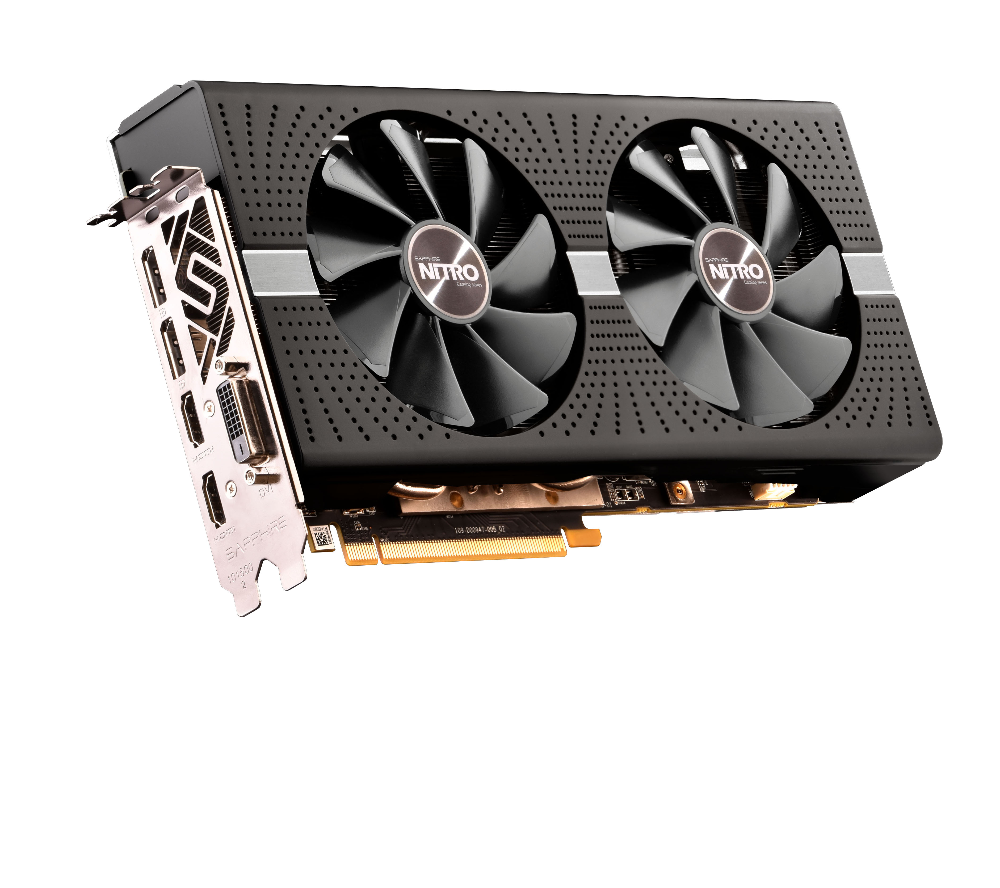

.. _amd_rx580:

=====================
AMD Radeon RX580显卡
=====================

蓝宝石于2017年4月发布了基于AMD的14nm工艺Polaris架构核心的Radeon RX580 8G D5系列显卡，主要版本有：

- 超白金OC
- 超白金限量版
- Pulse版(主流市场)
- 极光特别版(2017年11月发布注重外观和散热性)

技术参数
==========

RX570 8G D5 超白金 OC:

- 2048个流处理器
- 核心频率：1411MHz
- 显存规格：8000MHz GDDR5/256bit
- 6相供电与8层PCB设计
- 支持双BIOS
- Dual-X 散热
- 双滚珠轴承
- 风扇快拆

该系列显卡基于AMD Polaris 20 XTX/XTR/XL等核心架构，采用14纳米制程工艺，配备2304个流处理器。

其支持DirectX 12、OpenGL 4.5、OpenCL 2.0及Mantle等图形与计算API。同时支持AMD FreeSync防撕裂、Radeon Chill节能、VR Ready、最多5屏输出以及CrossFire多卡互联等技术。

.. note::

   蓝宝石RX580 8G D5系列包含超白金、海外版OC、白金版OC及Pulse等多个细分型号，核心频率和显存频率有差异，供电相数、散热设计、外观配色及特色功能（如RGB灯效与双BIOS）方面存在差异。这里只记录我购买的 ``超白金`` 版本参数，其他请参考 

散热系统
-----------

- 部分型号采用Dual-X 双风扇散热设计，并配备多根热管（如超白金OC为四热管）。
- 风扇采用双滚珠轴承，并支持智能启停技术（第三代智能风扇控制技术），可在低负载时停转以降低噪音。
- 部分型号（如超白金OC）使用了新的IC芯片控制风扇，使双风扇转速误差降低至3.2%，散热鳍片有效覆盖面积相比之前增加一倍，噪音降低30%。

PCB与背板
-------------

采用8层PCB设计,部分型号（如Pulse、超白金系列）配备合金背板加固

特色
------

- 部分型号（如超白金系列）支持双BIOS（性能/静音模式切换），用户可通过物理拨杆或Tri-XX软件切换。
- 支持Tri-XX软件控制，可进行超频、风扇调节、灯光控制等。
- 部分型号（如超白金限量版）支持风扇快拆功能。

矿卡
========

我在2026年8月初在淘宝上入手了一块 "二手蓝宝石 RX 580" : 价格是479元

由于现在芯片荒，各种二手显卡价格疯涨，这款相对低廉价格的显卡是一块"矿卡":

- 所有淘宝上在售的RX580都集中在 "山东、河南、黑龙江、安徽" ，这是因为 2017—2021 年的“大矿潮”期间，RX 580（特别是 2304 满血版 8G）是史上最经典的“神矿卡”（算力高、功耗比好、残值高）。当时全国的大型以太坊（ETH）矿场主要分布在:

  - 水电矿场： 四川、云南、贵州（利用夏季廉价水电）
  - 火电/风电矿场： 内蒙古、新疆、青海，以及山东、河南、东北、安徽等传统能源/工业大省

- 2021 年国家彻底清退加密货币挖矿后，以及 2022 年以太坊转 ASIC/PoS 之后，数以百万计的 RX 580 集中退役。所以形成了上述4个区域性二手拆机、洋垃圾、矿卡翻新

虽然 ``RX580`` 只能买到矿卡，但是由于价格低廉并且在macOS下免驱且Metal 3加速良好，所以经过矿难之后依然有参与价值值得再坚持发光发热!

测试
=======

我拿到这块卖家宣称的 "蓝宝石超铂金580 8G 2304满血版" ，发现卡上贴着一张标签 “不亮" ，心里不由一凉!

咨询了gemini，这种二手矿卡交易经常出现 **电源线没插紧、主板 BIOS 没有开启 CSM/UEFI 模式、显示器接口不兼容（如老 VGA 转换头）、或者老主板 BIOS 没更新** 而导致点不亮。另外很有可能是 ``矿农或前买家刷了错误的 VBIOS`` 。所以还是需要自己仔细检测验证。

- 由于我的 :ref:`dell_t5820` 已经安装了一块 ``NVIDIA Quadro P400显卡2GB`` 作为亮机卡，所以这块 ``RX580`` 我安装在T5820的第二个PCIe 插槽，也就是 ``PCIe 3.0 x16`` 插槽，开机以后观察到信仰灯正常亮起，并且散热风扇开始转动

但是没有想到，过了一会 ``RX580`` 的信仰灯熄灭了，并且风扇也不转，整块显卡陷入沉寂(几乎不发热)。这个现象是不正常的，因为无论如何节电休眠，信仰灯应该始终常亮。

不过我发现，在Linux下执行 ``lspci`` 能够观察到设备，也就是说明 **硬件供电和 PCIe 通讯是正常的** ， ``可能输出接口或 BIOS 有问题`` 

.. literalinclude:: amd_rx580/lspci
   :caption: 通过lspci检查

- 既然怀疑VBIOS异常(矿卡BIOS会关闭视频输出)，考虑到蓝宝石 RX 580（如超白金/脉冲版）顶部有一个 **物理 双 BIOS 切换开关** ，尝试切换到原厂备份BIOS，再次开机

非常幸运，这次开机后显卡的"信仰灯"终于常亮了，而且单 ``RX580`` 也看到了屏幕的输出内容，至少看上去救活的希望很大。

.. note::

   在挖矿时期，很多矿工为了追求极致的算力和低功耗，会刷入修改过时序（VRAM Timings）的专有矿工 VBIOS。有些矿工 VBIOS 会关闭物理显示输出接口（如 DP/HDMI），或者只保留某一个接口（比如仅 DVI 接口有输出，DP 接口黑屏）。

.. note::

   蓝宝石 RX 580 拥有 Fan Stop（风扇智能停转）技术。在低负载、温度低于 52°C~60°C 时，风扇确实会彻底停止转动。

   但是： 蓝宝石顶部的 SAPPHIRE 信仰灯在开机时是绝对会亮的（哪怕风扇不转）。如果连灯都彻底灭了，说明供电主轨（12V）已经断电。

压测
==========

- 在安装了 :ref:`rocm` 之后，可以通过 ``rocm-smi`` 观察该显卡:

.. literalinclude:: amd_rx580/rocm-smi
   :caption: rocm-smi输出
   :emphasize-lines: 6

- 安装OpenCL工具:

.. literalinclude:: amd_rx580/opencl
   :caption: 安装OpenCL

- 安装 clpeak 工具(也是一个压测工具)

.. literalinclude:: amd_rx580/clpeak
   :caption: 安装clpeak

- 尝试一些测试:

.. literalinclude:: amd_rx580/test
   :caption: 测试

.. note::

   不过我实践发现总有各种错误，实际测试并不顺利，还是直接安装macOS来进行实际验证

物理尺寸问题
================

``蓝宝石 Radeon RX580`` 是一块特殊尺寸的显卡，简单来说这是一块典型的"越肩卡"(高度达到135mm-140mm)，这使得显卡的顶部热管、PCB边缘以及外接8-Pin供电线，会直接顶住 Dell T5820 机箱侧板内部的标准高度(约111mm)的PCIe顶杆(一种铆接在侧板上针对标准PCIe显卡的压板)。

解决的方法是拆卸掉T5820侧板上的PCIe压板，我观察下来需要用类似一字螺丝刀这样的撬棒来铲除掉铆接在侧板的压板。

另外，由于RX580的高度超高，而它的电源线是设计在显卡顶部而不是后部，所以也存在顶住侧板的风险。可能的解决方法是 **180 度 PCIe 8-Pin 弯头** 将向外突出的电源线改为紧贴显卡背板倒扣，彻底消除电源线带来的额外厚度开销。

VBIOS更新
============

我在使用RX580时发现在T5820工作站上，屏幕等到进入 Linux 服务日志时才亮起，完全看不到开机 Dell Logo，来不及按 F2 进入 BIOS。原因是 **Dell 的 UEFI 引导机制与这块显卡的 VBIOS（GOP 协议）握手失败** :

- Linux 的显卡初始化机制: Linux 内核自带 ``amdgpu`` 驱动（DRM/KMS），内核加载时会跳过主板 BIOS 的显示逻辑， **直接给 GPU 核心发指令重新初始化** 并点亮屏幕。所以 Linux 只要开始跑服务，屏幕就能亮。
- Dell BIOS 的显示机制: Dell T5820 工作站主板开机时，必须依靠显卡 VBIOS 里的 ``UEFI GOP`` （ ``Graphics Output Protocol`` ）模块来渲染 Dell Logo 和 BIOS 界面。很多退役矿卡的 ``VBIOS`` 被修改过，或者其 ``GOP``  固件版本过老、与戴尔的纯 UEFI 固件不兼容，导致 Dell BIOS 无法通过这块显卡输出画面。

根据gemini提示，我检查了 TechPowerUp VBIOS ，发现网站提供的VBIOS基本是2017年版本，也就是说自从RX580发布以后就几乎没有更新过。gemini给出的解释是: **VBIOS 的本质是硬件底层配置文件** ，也就是说主板的BIOS需要不断更新以支持新推出的CPU和新功能，而显卡的VBIOS主要是出厂时写入的硬件参数表(核心频率、电压、风扇曲线、显存时序以及 **UEFI GOP驱动模块** )，所以只要显卡硬件出厂定型，VBIOS就没有持续更新的需求。

官方更新仅针对早期修复: AMD 或蓝宝石仅在 2017 年 RX 580 发售初期（或 2018 年推出新显存颗粒批次时），发布过少量用于修复风扇停转逻辑或兼容不同显存（如海力士/三星/镁光）的微调补丁。

目前开机不亮 Dell Logo，并不是因为 VBIOS “太老”，而是因为它被前一手买家或矿工刷入了修改版的 VBIOS: 矿工为了追求极致的挖矿算力和低功耗，会使用工具修改 VBIOS 中的显存时序，甚至删掉了 VBIOS 内部占用空间的 UEFI GOP（Graphics Output Protocol）引导模块。

删掉 GOP 会导致显卡丧失了在纯 UEFI 模式下渲染图像的能力。只有等待 Linux 内核启动、加载了 amdgpu 驱动后，屏幕才会被重新唤醒。

TechPowerUp 收集的是2017 年出厂时的纯原厂备份。这些官方原厂 .rom 内部完整保留了 AMD 原生的 UEFI GOP 模块。重新刷入后，UEFI GOP 被复原，Dell T5820 主板就能在 POST 开机阶段正常通过这块显卡输出 Dell Logo 和 BIOS 界面。

.. note::

   在 TechPowerUp 下载 RX 580 VBIOS 时，最重要的不是看发布日期，而是匹配显存颗粒厂商（Memory Type）。

悲剧: "烧"主板了
===================

.. warning::

   这是一个惨痛的教训: 当RX580矿卡第一次熄灭"信仰灯"，其实已经预示了这块显卡存在严重的硬件缺陷。我过于迷信gemini对于T5820所谓的电路保护的承诺，轻信主板的电路保护能够不受显卡硬件故障影响。

   而实际上，电路击穿短路带来的硬件伤害可能远超自己的预估，使用这种矿卡的风险极高，至少我付出了重新购买一块 :ref:`dell_t5820_mainboard` 的代价(718元)

正当我以为捡漏了一块"能够使用的矿卡"而沾沾自喜时，悲剧发生了...我突然发现这块"蓝宝石RX580"的 ``信仰灯`` 再次熄灭，再仔细一看，发现原来是Dell T5820主机自动关机了。

情况不妙!

我发现T5820已经无法启动，不管怎么按电源按钮都没有反应。此时发现前面板电源开关上的指示灯出现了 ``琥珀色闪烁4次`` ，也就是表示 **电源/主板过载保护锁定（Latched Protection）** 

我尝试将显卡换回 NVIDIA P400 亮机卡，发现依然无法启动，还是 ``琥珀色闪烁4次`` 。gemini提示是 **RX 580 突发功耗过大触发了电源的过流/短路保护（OCP/SCP），戴尔主板和电源进入了自锁状态。**

不过，我尝试了各种手段释放主板电容残电(目的是重置主板电源管理芯片):

- 长按机箱前面板电源开关 30 秒以上
- 重新插拔内存并测试: 琥珀色灯闪烁 4 次（或 2,4 闪烁模式）通常对应 电源轨异常（Power Rail Failure） 或 内存自检未通过（Memory/DIMM Power Fault），通过重新插拔内存来强行触发戴尔主板的硬件重配置（Memory Re-training）与底层电源管理芯片的状态刷新
- 更换显卡PCIe插槽: 看看是否是PCIe插槽局部保险丝问题
- 尝试将所有显卡拔出，插电开机(观察指示灯是否从4次琥珀色闪烁变成其他代码)
- 尝试一根一根安装内存，来排查是否存在某根内存被"击穿" (很不幸所有内存尝试对比都停留在 ``琥珀色闪烁4次`` )
- 尝试拔掉所有卡板(显卡)和所有存储连接: 排除掉所有可能的电路问题(短路)
- 主板 RTCRST 硬重置跳线（强制清除 CPLD 保护锁）: 实际采用 ``清理 CMOS（Clear CMOS）``

然而，很不幸，所有的尝试都没有改变 ``琥珀色闪烁4次``

最终，gemini "叹了口气" ，告诉 ``4 闪（Power Rail Failure） 在重置后依然无法消退`` 代表 **主板或电源背板（PDB）的 12V/3.3V 硬件电路存在物理级短路或供电元器件烧毁**

故障原因推测
================

这块 RX 580 在静置运行一段时间后导致 T5820 突发关机，并直接拉塌了戴尔 950W 电源的主板 12V 供电轨触发自锁，这证实了该显卡存在极其危险的硬件隐患:

核心原因： 显卡 PCB 上的 12V 供电 MOS 管热击穿短路（通电发热后内部短路），或者主供电电容击穿。这种短路在冷机时可能能通电（所以你之前能短暂看到画面），但一旦温度升高或工作几分钟，就会彻底短路并引发主机保护性关机。

主板 / PDB 背板已受损: 蓝宝石 RX 580 的击穿短路反向倒灌，烧毁了 Dell T5820 主板的 PCIe 12V 供电主轨元器件（如供电 MOS、滤波电容或保险丝）。

.. note::

   这块 ``蓝宝石RX580`` 最后退货了，很不幸付出了一块主板的代价(目前诊断)

   但是，我在查询 :ref:`dell_t5820_mainboard` 资料时，意外发现可能解决 :ref:`dell_t5820_gpu` 问题的方法: 更换T5820新版本主板。详见 :ref:`dell_t5820_mainboard` 说明以及实践记录。

参考
=======

- Radeon RX580 8GB 游戏效果见 `The Radeon RX 580 8GB is still pretty good! <https://www.youtube.com/watch?v=OjM1fAnyAos>`_
- `蓝宝石官方网站: RX580系列 <https://www.sapphiretech.com/zh-cn/consumer/nitro-rx-580-8g-g5-oc_c>`_
- `百度百科: 蓝宝石RX580 8G D5 <https://baike.baidu.com/item/%E8%93%9D%E5%AE%9D%E7%9F%B3RX580%208G%20D5/20784718>`_
