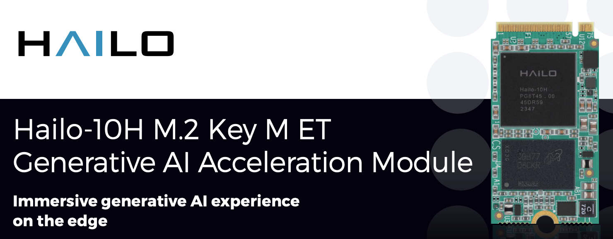

.. _intro_hailo_ai:

===================
Halio.ai 简介
===================

虽然 NVIDIA 目前统治了AI计算的绝大多数市场，但是仍然有很多公司试图从不同的角度切入并争取成为当前生成式AI乃至未来AGI的翘楚。以色列公司 `halio.ai <https://hailo.ai/>`_ 以其新型的边缘计算AI加速芯片，正在尝试开拓新的AI领域。

.. note::

   我是在研究 :ref:`pi_5` 的使用时发现树莓派可以使用 `halio.ai <https://hailo.ai/>`_ 公司的 ``Hailo-8L M.2 AI加速模块`` ，淘宝售价 ``575元`` (13TOPS) 。另外一款26TOPS的 ``Hailo-8 M.2 AI加速模块`` 则售价翻倍，高达 ``1299元`` 。

通过 ``PCIe 转 M.2`` 转接板，使用树莓派AI Kit可以构建边缘设备的AI视觉应用，具有低延迟和低功耗的实时运行特性，特别适合对象检测、语义和实例分割、姿势估计和面部标志等神经网络应用，从而解放 :ref:`pi_5` 的CPU资源用于其他任务:

- 每秒 13 万亿次运算 (TOPS) 的推理性能
- 以 8Gbps 运行的单通道 PCIe 3.0 连接
- 与 Raspberry Pi 图像软件子系统完全集成
- 与第一方或第三方相机的兼容性
- 加速器硬件的高效调度：在单个摄像头上运行多个神经网络，或者同时在两个摄像头上运行单个 / 多个神经网络

Hailo 创建了一个庞大的模型库，用户可以在其中找到各种预训练的神经网络模型，这些模型可随时部署和优化，以便在 AI Kit 上运行。

.. note::

   我看到这款AI Kit和树莓派的结合非常紧密，是后续学习机器学习的合适硬件( :ref:`mobile_pi_dev` )

   **待实践**

Hailo-10H M.2 生成式AI加速模块
=================================

目前(2024年9月)在淘宝上能够买到的是 ``Hailo-8`` (26TOPS) 和 ``Hailo-8L`` (13TOPS)，是 `halio.ai <https://hailo.ai/>`_ 上一代产品。不过，根据 `halio.ai <https://hailo.ai/>`_ 官方在2024年第二季度发布的新产品 ``Hailo-10H M.2 生成式AI加速模块`` ，则达到了 ``40TOPS`` 性能。 ``Hailo-10`` 是 Hailo公司为边缘计算引入的生成式AI设备，也是目前大热的 :ref:`gpt` 技术中具有前景的方向。(例如，苹果公司在iPhone 16开始引入手机移动端本地生成式AI，未来会在这个赛道上投入巨大资源)

   Hailo-10H M.2

``Hailo-10`` 是不需要云网络的本地GenAI设备，可见的应用前景有:

- 实时翻译
- 摘要服务
- 文生图/文生视频 (或相反)

``Hailo-10`` 的亮点是性价比和性能功耗，该款芯片可以在不倒5W的功率下以每秒10个token的速度运行 ``Llama2-7B`` ，当与 Stable Diffusion 2.1 配合使用，生成图像不倒5秒钟(消耗功率几乎相同)。

.. note::

   Nvidia的Jetson系列模块可以处理边缘AI，性能高达275TOPS(但功耗增加)。Nvidia针对入门级边缘AI应用推出的 :ref:`jetson_nano` 可提供高达40TOPS的AI性能，功率选项在5W到15W之间。

参考
=======

- `Hailo takes on Nvidia with energy-efficient gen AI accelerator for edge devices and $120M in funding <https://venturebeat.com/ai/hailo-takes-on-nvidia-with-energy-efficient-gen-ai-accelerator-for-edge-devices-and-120m-in-funding/>`_
