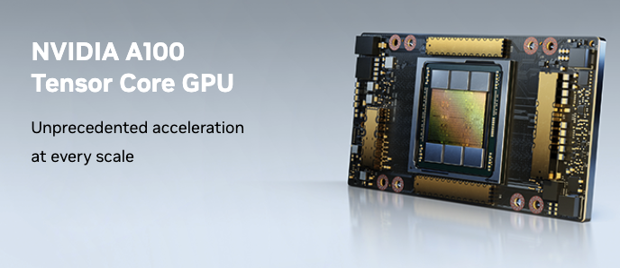

.. _nvidia_a100:

=============================
NVIDIA A100 Tensor Core GPU
=============================

A100多实例GPU( :ref:`nvidia_mig` )
====================================

A100 for NVLink vs. for PCIe
===============================

NVIDIA A100 Tensor Core GPU有两种接口形式:

- :ref:`nvidia_sxm_socket` 提供了 2.039 GB/s GPU内存带宽
- ``PCIe`` 版本的GPU内存带宽为 1.555 GB/s

从技术规格来看，两者主要的差别是GPU Memory (Bandwidth): SXM Socket接口更胜一筹，而且SXM配置的GPU Memory能够达到80GB(也有40GB 规格)，而PCIe接口只有40GB规格一种。

参考
=======

- `NVIDIA A100 Tensor Core GPU: Unprecedented acceleration at every scale <https://www.nvidia.com/en-us/data-center/a100/>`_ 官方网站A00产品Portal
- `NVIDIA A100 TENSOR CORE GPU: UNPRECEDENTED SCALE AT EVERY SCALE <https://www.nvidia.com/content/dam/en-zz/Solutions/Data-Center/a100/pdf/a100-80gb-datasheet-update-nvidia-us-1521051-r2-web.pdf>`_ 官方A100产品介绍pdf
- `NVIDIA A100 SXM4 80 GB <https://www.techpowerup.com/gpu-specs/a100-sxm4-80-gb.c3746>`_
- `NVIDIA A100 SXM GPU 40GB and 80GB - System Overview <https://www.itcreations.com/nvidia-gpu/nvidia-a100-sxm-gpu>`_
- `NVIDIA A100 Concepts, Specs, Features <https://www.run.ai/guides/nvidia-a100>`_ 搜集A100规格非常详细
