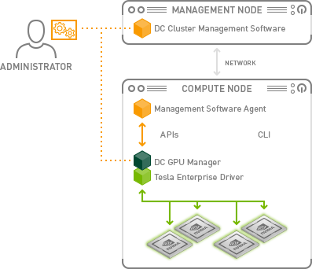

.. _nvidia_dcgm_infra:

======================================
NVIDIA DCGM 架构
======================================

NVIDIA 数据中心 GPU 管理器 (DCGM, Data Center GPU Manager) 是一套用于在集群环境中管理和监控 NVIDIA 数据中心 GPU 的工具:

- 主动健康监控(active health monitoring)
- 综合诊断(comprehensive diagnostics)
- 系统报警(system alerts)
- 治理策略(governance policies): 电源和始终管理

NVIDIA DCGM 可以独立使用，也可以集成到集群管理工具、资源调度和监控产品中。DCGM 简化了数据中心的 GPU 管理，提高了资源可靠性和正常运行时间，自动执行管理任务，并有助于提高整体基础设施效率。

支持以下架构的Linux操作系统:

- x86_64
- Arm
- POWER(ppc64le)

安装软件包包括:

- 库
- 二进制执行程序
- NVIDIA 验证套件 (NVVS, NVIDIA Validation Suite)
- 使用 API（C、Python 和 Go）的源代码示例

DCGM 通过 :ref:`dcgm-exporter` 集成到 :ref:`kubernetes` 生态系统中，以在容器化环境中提供丰富的 GPU 可观测性。

参考
=======

- `Manage and Monitor GPUs in Cluster Environments <https://developer.nvidia.com/dcgm>`_
