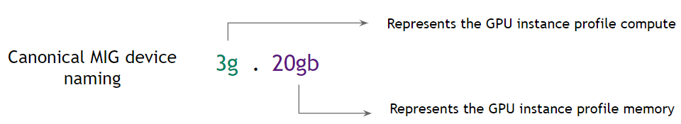
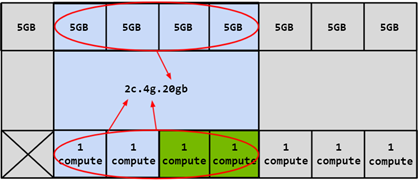

.. _deploy_nvidia_mig:

==========================
部署NVIDIA MIG
==========================

.. note::

   NVIDIA MIG(Multi-Instance GPU)部署 **不需要独立的vGPU license**

   不过，如果要部署NVIDIA AI Enterprise，则因为包含了预构建的vGPU 驱动镜像，则需要使用NVIDIA License System(NLS)来配置(请参考 `NVIDIA Docs Hub > Cloud Native Technologies > NVIDIA GPU Operator > NVIDIA AI Enterprise <https://docs.nvidia.com/datacenter/cloud-native/gpu-operator/latest/install-gpu-operator-nvaie.html#about-nvidia-ai-enterprise-and-supported-platforms>`_

   NVIDIA AI Enterprise是一个云原生软件工具、库和框架的软件集，包括了NVIDIA NIM和NeMo微服务，用于加速和简化AI应用的开发、部署和伸缩。

部署要求
===========

MIG功能是通过 ``NVIDIA GPU驱动`` 来提供的:

- A100/A30 需要CUDA 11,  ``NVIDIA Driver`` 版本 ``525+``
- H100及以后产品则需要CUDA 12

  - H100/H200 ``NVIDIA Driver`` 版本 ``450+`` 
  - B200 ``NVIDIA Driver`` 版本 ``570+``
  - Blackwell微内核则需要 ``NVIDIA Driver`` 版本 ``575+``

操作系统
-------------

- MIG只支持使用 :ref:`cuda` 的 :ref:`linux` 发行版

  - 从 ``450.51.06`` 版本以后废弃了 ``/proc`` 方式输出系统级接口， **建议使用** ``/dev`` 系统级接口通过 :ref:`cgroup` 来控制访问MIG设备

- 支持配置选项如下:

  - 裸金属硬件，包括容器环境
  - 在支持的 hypervisor上管理GPU Pass-Through 到Linux guest操作系统
  - 在支持的 hypervisor上实现 :ref:`vgpu`

- 在A100/A30上设置MIG模式需要reset GPU: 一旦GPU进入MIG模式，实例管理就是动态的，并且设置是基于每一个GPU来进行的
- 在NVIDIA Ampere架构GPU，MIG模式在重启后保持不变，直到用户明确切换设置
- 在激活MIG之前，所有使用驱动模块的服务都必须停止

  - 健康度监控服务 ``nvsm``
  - GPU健康监控
  - 类似 :ref:`dcgm-exporter` 的遥测服务

- 激活MIG模式需要 ``CAP_SYS_ADMIN`` 能力，其他MIG管理，例如创建和销毁实例，则需要超级用户权限，不过可以通过 ``/proc/`` 中修改MIG的修订权限赋予普通用户这个权限。

MIG设备命名
=============

默认情况下，一个MIG设备由一个"GPU 实例"和一个"计算实例"组成:

- 

   MIG 设备命名

正如 :ref:`nvidia_mig_infra` 所述，先划分GPU Instance(包含memory slice)，然后再划分Compute Instance: Compute Instance会共享父级GPU Instance的GPU SM Slice和Memory Slice:

   基于 ``4g.20gb`` 的GPU Instance再划分为Compute Instance，这里是 ``2c.4g.20gb``

CUDA设备
===========

- 单个 CUDA 进程都只能枚举一个 MIG 设备
- CUDA 应用程序将 CI 及其父 GI 视为单个 CUDA 设备
- CUDA 只能使用单个 CI，如果有多个可见的 CI，它将选择第一个可用的 CI

.. note::

   上述MIG限制可能会再未来NVIDIA驱动中放宽

使用以下命令检查MIG设备:

.. literalinclude:: deploy_nvidia_mig/nvidia-smi_list
   :caption: 检查MIG设备

MIG Profiles
================

不同的NVIDIA GPU对MIG profile支持不同，请参考 `MIG User Guide: Supported MIG Profiles <https://docs.nvidia.com/datacenter/tesla/mig-user-guide/#supported-mig-profiles>`_

MIG配置
==========

- 核对 `MIG配置环境要求 <https://docs.nvidia.com/datacenter/tesla/mig-user-guide/#prerequisites>`_

  - 必须是NVIDIA ``Ampere`` 架构或更新的架构
  - 安装符合要求的CUDA和驱动版本(建议用最新版本)
  - 使用 `CUDA支持的Linux发行版 <https://docs.nvidia.com/cuda/cuda-installation-guide-linux/index.html#system-requirements>`_
  - 如果使用 :ref:`docker` 或 :ref:`kubernetes` ，则需要安装

    - NVIDIA Container Toolkit (nvidia-docker2): v2.5.0 or later ( :ref:`install_nvidia_container_toolkit_for_docker` / :ref:`install_nvidia_container_toolkit_for_containerd` )
    - NVIDIA K8s Device Plugin: v0.7.0 or later
    - NVIDIA gpu-feature-discovery: v0.2.0 or later

MIG可以通过以下两种方式进行编程管理:

- 使用NVIDIA Management Library (NVML) APIs(可以通过查看CUDA Toolkit软件包提供的NVML header ``nvml.h`` 了解MIG Management APIs)
- 使用 :ref:`nvidia-smi` 命令行接口(可以通过 ``nvidia-smi mig --help`` 查看支持选项)

对于RTX PRO 6000 Blackwell 和 RTX PRO 5000 Blackwell GPU，还需要关注 `Additional Prerequisites for RTX PRO Blackwell GPUs <https://docs.nvidia.com/datacenter/tesla/mig-user-guide/#additional-prerequisites-for-rtx-pro-blackwell-gpus>`_ 对 ``vBIOS`` 版本的要求。

激活MIG模式
--------------

默认情况下GPU ``没有激活`` MIG Mode

- 使用 :ref:`nvidia-smi` 命令可以检查MIG Mode

.. literalinclude:: deploy_nvidia_mig/nvidia-smi
   :caption: ``nvidia-smi`` 指定设备0

输出案例:

.. literalinclude:: deploy_nvidia_mig/nvidia-smi_output
   :caption: 设备默认没有激活MIG Mode
   :emphasize-lines: 10

- 激活MIG模式:

.. literalinclude:: deploy_nvidia_mig/enable_mig
   :caption: 激活MIG

可以使用不同的方式来引用GPU:

  - 使用GPU indexes
  - PCI总线ID
  - UUID

如果没有指定GPU ID，则会激活系统上所有GPU的MIG Mode

MIG模式保持
~~~~~~~~~~~~~~

.. warning::

   Hopper+ 架构以上的GPU重启系统会丢失MIG模式状态

   早期的 Ampere 架构 GPU 由于GPU InforROM存储了一个状态位，所以重启系统MIG模式保持不变

当GPU启用MIG之后，根据GPU产品不同，可能需要重置GPU以使MIG模式生效:

- Hopper+ 架构以上的GPU不再需要GPU Reset就能够生效MIG(所以驱动程序不会在后台重置GPU)

  - MIG 模式（禁用或启用状态） **仅在内核模块已加载情况下才会持续存在** : 如果操作系统重启则MIG模式不再续存(GPU InfoROM 中不再存储状态位)
  - 卸载并重新加载驱动程序内核模块 **也将禁用MIG模式**

- Ampere 架构 GPU，启动MIG模式后，驱动程序将尝试reset GPU以使MIG模式生效

  - Ampere 架构 GPU 在操作系统重启后会依然保留之前的MIG 模式（禁用或启用状态），这是因为GPU InfoROM 中存储了一个状态位
  - 必须明确禁用 MIG 模式才能将 GPU 恢复到默认状态

驱动客户端
~~~~~~~~~~~~~

如果系统中有agent(如监控)在使用GPU，则可能不能执行GPU reset，此时会报错，例如:

.. literalinclude:: deploy_nvidia_mig/mig_reset_error
   :caption: 由于有agent在使用GPU而无法reset导致不能激活MIG

此时可能需要停止 ``nvsm`` 和 ``dcgm`` 服务:

.. literalinclude:: deploy_nvidia_mig/stop_agent
   :caption: 停止agent激活MIG

列出GPU Instance Profiles
----------------------------

NVIDIA驱动程序提供了配置文件(profiles)列表，来方便用户配置MIG功能时选择使用

- 列出支持的GPU Instance Profiles:

.. literalinclude:: deploy_nvidia_mig/mig_list_profiles
   :caption: 列出支持的GPU Instance Profiles

注意这里的参数 ``-lgip`` 表示 ``List GPU Instances Profiles`` ，后面的案例对于已经创建好的GI，则去掉 ``p`` 仅使用 ``-lgi`` 表示 ``List GPU Instances`` 

输出案例(A100)，这里高亮的是后面案例将要使用的ID为9的profile:

.. literalinclude:: deploy_nvidia_mig/mig_list_profiles_output
   :caption: 列出支持的GPU Instance Profiles
   :emphasize-lines: 18

创建GPU Instance
------------------

- 使用 ``-cgi`` 参数来创建 ``GPU Instance`` ，参数值可以是:

  - Profile ID (e.g. 9, 14, 5)
  - 使用profile的短名(例如 ``3g.20gb`` )
  - 使用GPU Instance的完成profile名字(例如 ``MIG 3g.20gb`` )

一旦GPU Instance创建完成后，就需要创建相应的 Compute Instance (CI)，则使用 ``-C`` 参数

.. note::

   - 如果不创建GPU Instance以及相应的Compute Instance，CUDA工作负载就无法在GPU上运行(仅仅激活MIG模式是不够的)
   - **已创建的 MIG 设备在系统重启后不会保留**

     - 管理员需要重新创建MIG配置
     - 可以使用NVIDIA MIG Partition Editor（或 ``mig-parted`` ）工具

       - 创建在系统启动时重建MIG Geometry的 :ref:`systemd` 服务

- 以下案例创建了 **2个** ``GPU Instances`` (注意，一个使用了profile ID ``9`` ，另一个使用了 ``3g.20gb`` profile short name，实际上是一样的，所以其实是两个一样的 ``GPU Instances`` ，profiles之间使用逗号分隔)，以及对应的 ``Compute Instances`` :

.. literalinclude:: deploy_nvidia_mig/create_gpu_instances
   :caption: 创建 ``GPU Instances`` 以及对应 ``Compute Instances``

输出类似:

.. literalinclude:: deploy_nvidia_mig/create_gpu_instances_output
   :caption: 创建 ``GPU Instances`` 以及对应 ``Compute Instances``

现在就可以查看 GPU Instances:

.. literalinclude:: deploy_nvidia_mig/list_gpu_instances
   :caption: 列出已经创建好的GPU Instances

输出类似:

.. literalinclude:: deploy_nvidia_mig/list_gpu_instances_output
   :caption: 列出已经创建好的GPU Instances

此时可以用不带任何参数的 ``nvidia-smi`` 查看GIs和相应的CIs:

.. literalinclude:: deploy_nvidia_mig/nvidia-smi_gi_ci
   :caption: 检查 ``nvidia-smi`` 输出显示GIs和相应的CIs
   :emphasize-lines: 8,10

- 其他的一些创建GI案例(混合了不同的profiles)

.. literalinclude:: deploy_nvidia_mig/nvidia-smi_gi_exapmles
   :caption: 创建GI案例

Compute Instances
-----------------------

在创建了GPU Instances之后(如果没有同时使用 ``-C`` 创建相应的Compute Instances)，就可以先查看 ``gi`` 对应的 ``ci`` profile，然后选择其中之一进行Compute Instances创建

- 查看CI profiles:

.. literalinclude:: deploy_nvidia_mig/list_compute_instances_profile
   :caption: 列出指定 ``GI`` 所支持的 ``CI`` profiles

这里参数 ``-lcip`` 表示 ``List Compute Instance Profiles`` ，参数 ``-gi`` 表示 ``GPU Instances``

.. literalinclude:: deploy_nvidia_mig/list_compute_instances_profile_output
   :caption: 列出指定 ``GI`` 所支持的 ``CI`` profiles输出案例
   :emphasize-lines: 7

- 创建3个 ``CI`` ，这里使用了刚才输出中高亮的 ``profile 0`` :

.. literalinclude:: deploy_nvidia_mig/create_ci
   :caption: 在 ``GI`` 1 上创建 ``compute instance``

这里参数 ``-cci`` 表示 ``Create Compute Instance`` , 参数 ``-gi`` 表示 ``GPU Instance``

输出显示

.. literalinclude:: deploy_nvidia_mig/create_ci_output
   :caption: 在 ``GI`` 1 上创建 ``compute instance``

此时使用 ``nvidia-smi`` 检查( ``list`` ) ``Compute Instance`` :

.. literalinclude:: deploy_nvidia_mig/list_compute_instances
   :caption: 检查 ``Compute Instances``

这里参数 ``-lci`` 表示 ``List Compute Instance``

输出显示

.. literalinclude:: deploy_nvidia_mig/list_compute_instances_output
   :caption: 检查 ``Compute Instances``

- 执行不带参数的 ``nvidia-smi`` 显示当前 ``GI`` 和 ``CI`` 情况:

.. literalinclude:: deploy_nvidia_mig/list_gi_ci
   :caption: 检查当前 ``GI`` 和 ``CI``

销毁GPU Intances
====================

一旦GPU进入了MIG模式，就可以动态配置 ``GI`` 和 ``CI`` ，也可以动态被销毁 ``destroy`` :

- 没有指定 ``CI`` 和 ``GI`` 则 ``destroy`` 会销毁主机上所有 ``CI`` 和 ``GI`` (注意销毁顺序和创建顺序相反，必须先销毁 ``CI`` 再销毁 ``GI`` :

.. literalinclude:: deploy_nvidia_mig/destroy_ci_gi
   :caption: 销毁主机上所有 ``CI`` 和 ``GI``

这里参数 ``-dci`` 表示 ``Destroy Compute Instance`` , ``-dgi`` 表示 ``Destroy GPU Instance``

- 也可以指定 ``GI`` 和 ``CI`` 进行销毁，这销毁 ``GI`` 1 上的 ``CI`` 0,1,2

.. literalinclude:: deploy_nvidia_mig/destroy_ci_gi_specific
   :caption: 销毁主机上指定的 ``CI`` 和 ``GI``

监控MIG设备
===============

对于监控MIG设备，包括GPU metrics特性(利用率和其他采样metrics)，建议使用 :ref:`nvidia_dcgm` v3 或更高版本

使用CUDA MPS
=================

CUDA多进程服务(Multi-Process Service, MPS)支持在GPU上并发处理协作式多进程CUDA应用程序。MPS和MIG可以协同工作，从而有可能在某些工作负载下实现更高的利用率。

详细参考 `architecture and provisioning sequence <https://docs.nvidia.com/deploy/mps/index.html#provisioning-sequence>`_ for MPS

在容器中运行CUDA应用
========================

:ref:`nvidia_container_toolkit` 是现在 :ref:`docker_gpu` 的标准方法(早期的 :ref:`nvidia-docker` 已经停止开发)，并且支持MIG设备，允许用户使用 :ref:`container_runtimes` 来运行GPU容器

.. note::

   :ref:`nvidia_container_toolkit` 待实践

在Kubernetes中使用MIG设备
============================

从 :ref:`nvidia_device_plugin_for_k8s` v0.7.0开始，支持 :ref:`nvidia_mig_support_in_k8s`

.. note::

   :ref:`nvidia_mig_support_in_k8s` 待实践

MIG设备节点和能力
===================

当前，NVIDIA内核驱动将自己的接口通过一系列系统级别设备节点输出。每个物理GPU都有自己的设备节点，例如 ``nvidia0`` , ``nvidia1`` 等

系统级接口
----------------

有两种不同的系统级接口，通过 ``nvidia-capabilities`` 工作:

- ``/dev`` 基于 :ref:`cgroup` 的设备文件，也提供了第二层访问控制，不过主要控制机制是 ``cgroups``
- ``/proc`` 基于用户权限和挂在的命名空间，有限度地提供部分能力

建议使用 ``/dev`` ，因为后续 ``/proc`` 将被废弃

在 ``nvidia.ko`` 内核模块加载参数 ``nv_cap_enable_devfs`` 设置为 ``0`` 时候，就会激活 ``/proc`` ；如果设置为 ``1`` ，则激活 ``/dev``
参考
========

- `MIG User Guide <https://docs.nvidia.com/datacenter/tesla/mig-user-guide/#>`_
