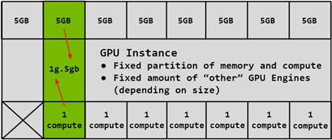
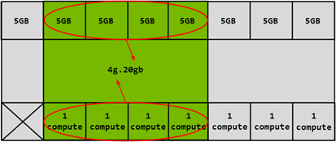
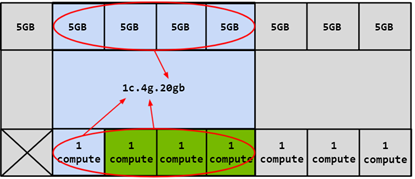

.. _nvidia_mig_infra:

=====================================
NVIDIA Multi-Instance GPU(MIG) 架构
=====================================

NVIDIA多实例GPU(Multi-Instance GPU, MIG)技术扩展了 NVIDIA H100, :ref:`nvidia_a100` 和 A30 Tensore Core GPU的性能和价值:

- MIG可以将 ``单个GPU`` 划分为多达 ``7个实例``

  - 每个实例完全隔离: 具有独立的高带宽内存(DRAM地址总线均唯一分配给单个实例)、缓存和计算核心
  - 支持从最小到最大的每个工作负载
  - 确保服务质量保证(guaranteed quality of service (QoS))为独立每个用户提供计算加速

- 优化GPU使用率

  - MIG提供了不同实例大小的灵活性: 可以为每个工作负载配置合适大小的GPU实例，最终优化利用率并最大化数据中心投资
  - MIG工作在 :ref:`linux` 操作系统上

    - 支持容器化( :ref:`docker` / :ref:`kubernetes` )
    - 支持虚拟化( Red Hat Virtualization: :ref:`kvm` / VMware vSphere)

- 运行并发工作负载

  - MIG 使 **推理、训练和高性能计算(HPC)** 工作负载能够在具有确定性延迟和吞吐量的 ``单个GPU`` 上 **同时运行**

- 硬件要求:

  - NVIDIA从 ``Ampere`` 架构开始支持 ``Multi-Instance GPU (MIG) `` 功能

    - 2020年5月14日发布 ``Ampere`` 架构: A100 80GB SXM4 GPU 是首个支持最高7个实例的MIG虚拟化和GPU分区
    - 2022年发布 ``Hopper`` 架构: H100 SXM5 GPU
    - 2024年发布 ``Blackwell`` 架构: B100 / B200 SXM6 GPU

- MIG支持的部署配置:

  - 裸金属硬件，包括容器环境
  - 在支持的 hypervisor上管理GPU Pass-Through 到Linux guest操作系统
  - 在支持的 hypervisor上实现 :ref:`vgpu`

概念
======

.. note::

   基本概念对理解NVIDIA MIG分区有重要意义

- 流式多处理器(Streaming Multiprocessor, SM) 是GPU上执行计算机指令的部分
- GPU上下文(GPU Context) 类似CPU进程，封装了在GPU上执行操作的所有资源(独立的地址空间、内存分配等)。GPU上下文具有如下属性:

  - 故障隔离
  - 独立调度
  - 独立的地址空间
  - GPU引擎(GPU Engine)

- GPU引擎(GPU Engine)是GPU上执行工作的引擎: 每个引擎可以独立调度，并未不同的GPU上下文执行工作

  - 计算引擎(Compute engine)
  - 图形引擎(Graphics engine)
  - 负责执行DMA的复制引擎(copy engine, CE)
  - 负责视频解码的NVDEC
  - 负责视频编码的NVENC

- GPU内存切片(Memory Slice) 是GPU内存的最小部分

  - 包括内存控制器和缓存
  - GPU内存切片大约是GPU内存总资源(包括容量和带宽)的 ``1/8``

- GPU SM切片(SM Slice) 是GPU上SM(流式多处理器)的最小部分

  - 在MIG模式下，GPU SM切片大约站GPU上可用SM总数的 ``1/7``

- GPU切片(GPU Slice) 是GPU中最小部分

  - GPU Slice 结合了单个GPU 的 ``内存切片和SM切片``

- GPU实例(GPU Instance, GI) 是 GPU切片和GPU引擎的组合

  - GPU实例中的任何内容始终共享所有GPU内存切片和其他GPU殷勤
  - SM切片可以进一步细分为计算实例(CI)
  - GPU实例提供内存QoS

- 计算实例(Compute Instance):

  - 一个GPU实例可以细分为多个计算实例
  - 计算实例(CI)包含父GPU实例的SM切片和其他GPU引擎
  - **CI共享内存和引擎** (后面的案例会看到将组合好的GPU实例再划分成计算实例，此时内存和引擎是共享的)

GPU分区(Partitioning)
=======================

- H100 GPU 可以划分为大小合适的分区，以适应不需要完整 GPU 的工作负载，这对于推理工作负载尤其有益
- MIG 允许多个工作负载在同一 GPU 上运行，以实现最佳效率

.. note::

   这段案例以 A100-40GB 举例:

   - 40GB显存按照8等分，每份是5GB显存
   - SM slice是 ``1/7`` 整个CPU的SM(Streaming Multiprocessor, 流式多处理器)

分区概述如下:

- 首先GPU被划分成8份内存分片(Memory Slice)和7份流式多处理器分片(SM Slice)
- 组合Memory Slice和SM Slice成为GPU Instance: 例如 ``1g.5gb`` 或 ``4g.20gb`` 规格的GPU实例
- 然后再划分GPU实例成为计算实例(Compute Instance)

  - 此时计算实例是共享内存切片和引擎的，只是Compute Slice是独享的

GPU Instance
-------------------

- ``1g.5gb`` GPU Instance案例:

   组合 1个compute slice (对应是1个SM slice) 和 1个memory slice(根据硬件规格A100 40GB，实际每个memory slice是 ``5gb`` )

- ``4g.20gb`` GPU Instance案例:

   组合 4个compute slice (对应是4个SM slice) 和 4个memory slice(根据硬件规格A100 40GB，实际是 ``4*5gb`` 即 ``20gb`` )

Compute Instance
--------------------

**计算实例是在GPU实例上进行的再划分** :

- SM资源独享
- 父级GPU Instance所包含的内存资源和引擎资源是共享的

- ``1c.4g.20gb`` Compute Instance案例:

   基于 ``4g.20gb`` 的GPU Instance再划分为Compute Instance，这里是 ``1c.4g.20gb``

- ``2c.4g.20gb`` Compute Instance案例:

.. figure:: ../../../../_static/machine_learning/hardware/nvidia_gpu/nvidia_mig/mig-partitioning-ex5.png

   基于 ``4g.20gb`` 的GPU Instance再划分为Compute Instance，这里是 ``2c.4g.20gb``

注意， ``compte slice`` 可以更多分配，例如 ``3c`` (3c.4g.20gb)或 ``4c`` (4c.4g.20gb)，当划分为 ``4c`` 时，实际上就是父级GPU Instance的所有 ``compute slice`` 都占据了，此时就可以省略掉 ``4c`` (即 4c.4g.20gb 可以略写为 ``4g.20gb`` )

CUDA并发机制(Concurrency Mechanisms)
=======================================

- MIG 的设计对 CUDA 应用程序基本透明，因此 CUDA 编程模型保持不变，从而最大限度地减少编程工作量。
- CUDA 流是 CUDA 编程模型的一项功能，在 CUDA 应用程序中，不同的任务可以提交到独立的队列，并由 GPU 独立处理。

  - CUDA 流只能在单个进程中使用，并且不提供太多隔离——地址空间、SM、GPU 内存带宽、缓存和容量都是共享的
  - 任何错误都会影响所有流和整个进程

- MPS 是 CUDA 多进程服务

  - MPS允许协作的多进程应用程序在 GPU 上共享计算资源。它通常用于协作的 MPI 作业，但也用于在不相关的应用程序之间共享 GPU 资源
  - MPS 目前不提供客户端之间的错误隔离
  - 内存带宽、缓存和容量均在 MPS 客户端之间共享

MIG结合虚拟化
=================

MIG不能直接将分区输出给不同的虚拟机使用，但是可以使用 :ref:`sr-iov` 来结合虚拟化:

- 虚拟化通过 PCIe SR-IOV 实现（每个 MIG 实例对应一个虚拟功能 (VF)）
- 多种基于硬件的安全功能确保机密性和数据完整性，硬件防火墙则在 GPU 实例之间提供内存隔离

.. figure:: ../../../../_static/machine_learning/hardware/nvidia_gpu/nvidia_mig/mig_sr-iov.png

   MIG结合sr-iov实现虚拟机的vGPU隔离

.. _nvidia_mig_vs_vgpu:

NVIDIA MIG技术和 :ref:`vgpu` 辨析
==================================

- ``NVIDIA MIG`` 是基于硬件的分区技术，而 :ref:`vgpu` 和 :ref:`sr-iov` 一样是基于软件的分区技术
- 因为 ``MIG`` 是硬件分区技术，所以使用MIG的CUDA应用(包括容器化运行)相互之间完全隔离 ``GI`` ，能够实现极致的响应性能；而 :ref:`vgpu` 是共享型软件分区，所以延迟等QoS不能完全保证
- 但是 ``MIG`` 硬件分区也导致了，如果某个分区没有分配CUDA应用，则完全浪费，其性能不能被其他CUDA应用利用
- ``NVIDIA MIG`` 只支持 :ref:`container_runtimes` 方式使用，可以直接通过 :ref:`nvidia_container_toolkit` 支持docker容器分别使用不同的 ``CI/GI`` ; 但是 ``MIG`` 的 ``CI/GI`` 无法分别输出给不同的虚拟机(MIG不是虚拟化技术)
- ``MIG`` 可以结合 :ref:`sr-iov` 或 :ref:`vgpu` 技术使用，此时就可以输出给虚拟机使用(待实践)

  - 当结合 :ref:`vgpu` 使用，需要 :ref:`install_vgpu_license_server`
  - 当结合 :ref:`sr-iov` 使用，依然需要 :ref:`install_vgpu_license_server` ，否则功能和性能可能是有影响的(Google AI)，(我不确定这是否正确，需要实践)

总之， ``MIG`` 不是虚拟化技术，而是物理主机上的GPU硬件分区技术，提供给不同CUDA应用使用时能够隔离相互间影响。 ``MIG`` 激活后的GPU是可以通过 ``passthru`` 技术输出整个GPU给一个虚拟机使用，但是不能分给不同虚拟机使用。

参考
======

- `MIG User Guide <https://docs.nvidia.com/datacenter/tesla/mig-user-guide/#>`_
- `NVIDIA Multi-Instance GPU and NVIDIA Virtual Compute Server GPU Partitioning Technical Brief <https://www.nvidia.com/content/dam/en-zz/Solutions/design-visualization/solutions/resources/documents1/TB-10226-001_v01.pdf>`_
- `NVIDIA Multi-Instance GPU <https://www.nvidia.com/en-us/technologies/multi-instance-gpu/>`_
- `NVIDIA Multi-Instance GPU and NVIDIA Virtual Compute Server (GPU Partitioning) Technical Brief <https://www.nvidia.com/content/dam/en-zz/Solutions/design-visualization/solutions/resources/documents1/Technical-Brief-Multi-Instance-GPU-NVIDIA-Virtual-Compute-Server.pdf>`_
- `MIG or vGPU Mode for NVIDIA Ampere GPU: Which One Should I Use? (Part 1 of 3) <https://blogs.vmware.com/performance/2021/09/mig-or-vgpu-part1.html>`_
- `Extreme Performance Series 2022: Time Sliced vGPU vs MIG vGPU for Machine Learning Workloads <https://www.youtube.com/watch?v=GL9fghrSwMk>`_ VMware公司在发vSPhere上使用NVIDIA vGPU的方案介绍，对比了 time sliced vGPU 和 Multi Instance vGPU 。在视频的说明中还提供了一些延伸阅读资料
- `NVIDIA Multi-Instance GPU User Guide <https://docs.nvidia.com/datacenter/tesla/mig-user-guide/#partitioning>`_ NVIDIA官方使用手册，介绍了从ampere架构开始引入的Multi-Instance GPU功能
