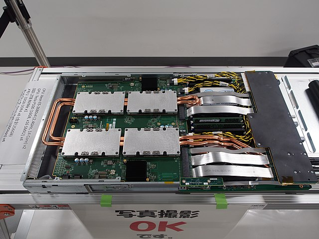

.. _nvidia_sxm_socket:

========================
NVIDIA SXM Socket(接口)
========================

SXM 是一种高带宽Socke(接口)解决方案，将NVIDIA计算加速器(也就是NVIDIA的GPU，销售策略下也称为Compute Accelerator，以区别于CPU)连接到系统中。

从P100型号以来每一代NVIDIA数据中心GPU (Tesla, DGX compute系列和HGX系列) 主板都有SXM插座类型，可以实现高带宽、功率传输等，用于匹配的GPU紫卡:

- 第一代SXM: 基于 Pascal 的 GPU
- 第二代、第三代SXM: 基于 Volta 的 GPU
- 第四代SXM: 基于 Ampere 的 GPU(例如 :ref:`nvidia_a100` )
- 第五代SXM: 基于 Hopper 的 GPU

SXM Socket的特定型号产品逗比PCIe同代产品具有更高的GPU性能: 配置更高的GPU Memory并且具备更大的GPU Memory Bandwidth

SXM 板通常带有四个或八个 GPU 插槽，NVIDIA提供预制的NVIDIA HGX板，使得基于SXM的GPU服务器大大降低了成本和难度，并且实现了同代所有板卡的兼容性和可靠性。

SXM模块，如HGX板，在最近系带，可能具备NVLink开关以实现 ``GPU到GPU`` 通信，减少了通常位于 ``CPU和PCIe`` 的瓶颈:

- 子卡上的 GPU 仅使用 NVLink 作为其主要通信协议

  - 例如，基于 Hopper 的 ``H100 SXM5 GPU`` 可以在 **18 个 NVLink 4 通道** 上使用高达 900GB/s 的带宽，每个通道贡献 50GB/s 的带宽 (PCIe 5.0 可以处理高达 64GB 的带宽 /x16 插槽内的带宽)
  - NVLink高带宽还意味着 GPU 可以通过 NVLink 总线共享内存，从而允许 **整个HGX板作为单个大型GPU呈现给主机系统** 。

- 供电也由 SXM 插座处理，无需外部电源线(PCIe同等GPU卡需要外接电源)

  - 可以采用更高效的冷却选项，从而是SXM的GPU以更高的TDP运行(同代的GPU，SXM的最高功率大约是PCIe的两倍: 例如，基于Hopper微架构的H100仅通过SXM Socket就可以消耗高达700W功率)
  - 没有布线也使得大型系统的组装和维修变得更加容易，并且还减少了可能的故障点

参考
======

- `SXM (socket) <https://en.wikipedia.org/wiki/SXM_(socket)>`_
