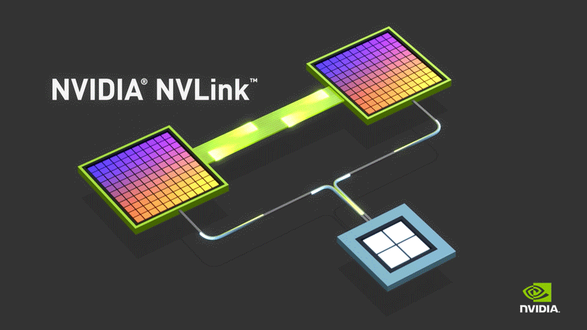

.. _intro_nvlink:

======================
NVIDIA NVLink简介
======================

NVIDIA NVLink是NVIDIA公司设计开发的多GPU系统互联通讯技术，绕开了传统的基于 :ref:`pcie` 传输数据的瓶颈。当采用 NVLink 连接2块NVIDIA GPU卡是，能够提供更好的内存扩展和更大的虚拟计算负载性能:

参考
=======

- `NVIDIA NVLink High-Speed GPU Interconnect <https://www.nvidia.com/en-sg/design-visualization/nvlink-bridges/>`_ 官网
