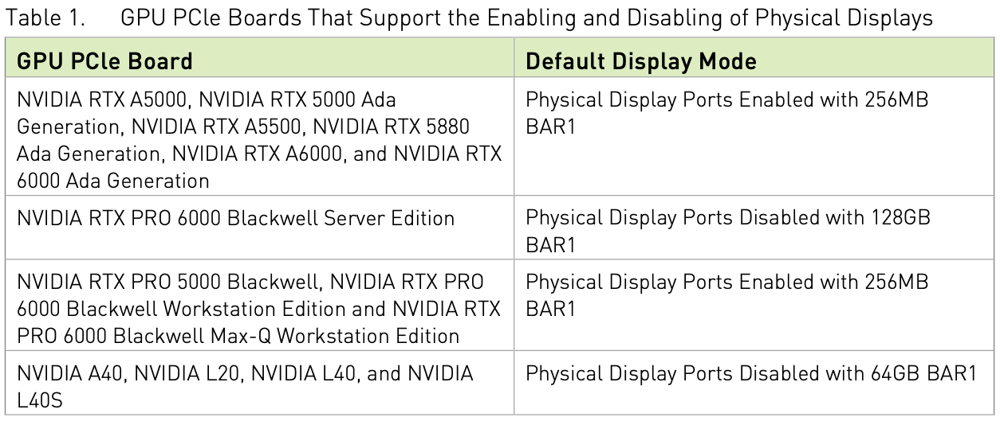
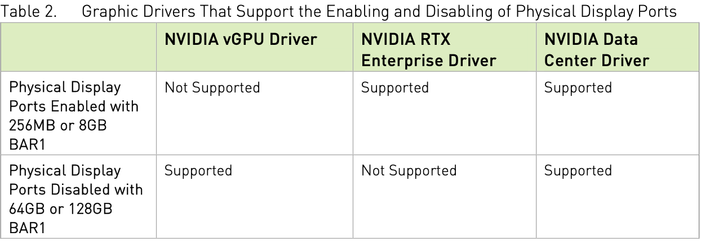

.. _tesla_a2_display_mode_switch:

==============================
Tesla A2显示模式切换
==============================

.. note::

   由于我实际上规划的就是在 :ref:`dell_t5820` 上使用 :ref:`amd_mi50` ，在我的兼容组装台式机上使用 :ref:`tesla_a2` ，目前两者都已经实现，所以我折腾 T5820 上运行 Tesla A2其实对我而言意义不大，我放弃折腾了。

.. warning::

   我的实践最终没有成功实现 :ref:`tesla_a2` 切换Graphics模式，推测是这块计算卡可能做了硬件限制。不过，本文可以作为一个技术参考，对于NVIDIA显卡或数据中心卡模式切换有参考价值。

我在排查 :ref:`dell_t5820_gpu` 异常问题时，发现解决的方法是升级 :ref:`dell_t5820_mainboard` 二代。不过，升级了硬件之后，通过 :ref:`amd_mi50_flash_vbios` 改成 Radeon Pro V420 就能够作为显卡在T5820上使用。

但是，我也发现 :ref:`tesla_a2` 安装后却导致T5820卡住无法启动，虽然电源指示灯显示为白色无异常，但是明显卡在了系统硬件自检过程。

考虑到T5820是一台纯粹的工作站，强制要求安装工作站显卡，所以怀疑Tesla A2缺乏UEFI GOP支持导致系统检查到该GPU时无法分配资源或枚举失败挂起。gemini提示A2固件是内置了UEFI GOP，但被标记为 **"Disabled"** ，在工作站环境中，BIOS通常期待所有显卡都报告其显示状态。

那么，解决的方法可能是 **Display Mode Selector 切换模式** 

NVIDIA Display Mode Selector Tool
==================================

通过NVIDIA Display Mode Selector Tool，可以激活或禁用显示接口。另外，该工具也被用于在以下模式来切换GPU PCIe 主板:

- **使用256MB BAR1模式激活物理显示接口** : 这个模式用于标准工作站部署，包含了物理连接显示器
- **使用8GB BAR1模式激活物理显示接口** : 这个模式用于broadcast、虚拟产品，以及本地化娱乐部署，需要物理显示接口，类似NVIDIA Rivermax软件通过8 BAR1支持附加性能优化
- **使用64GB或128GB BAR1模式激活物理显示接口** : 该模式用于运行 :ref:`vgpu` 软件或不需要物理连接的计算模式

以下是 『Using the NVIDIA Display Mode Selector Tool』 User Guide列出的支持物理显示端口激活或禁用的GPU PCIe主板:

可以看到手册中提到 NVIDIA A40 默认的显示模式是 ``Physical Display Ports Disabled with 64GB BAR1``

需要注意，当在激活或禁用物理显示端口时，系统中需要使用当前 NVIDIA driver software stack( :ref:`install_nvidia_linux_driver_ubuntu` )

以下是支持激活或禁用物理显示端口的NVIDIA驱动程序:

可以看到 ``NVIDIA Data Center Driver`` (例如我的 :ref:`tesla_a2` )是支持所有规格大小的BAR1(256MB/8GB/64GB/128GB)

准备工作
===========

如果系统已经 :ref:`install_nvidia_linux_driver_ubuntu` (注意 ``displaymodeselector`` 不需要NVIDIA驱动)，执行 ``nvidia-smi`` 检查可以看到当前系统的3块 :ref:`tesla_a2`

.. literalinclude:: tesla_a2_display_mode_switch/nvidia-smi
   :caption: 检查当前系统的3块A2卡

``displaymodeselector`` 是一个 **裸机硬件操作工具** ，并不是通过NVIDIA驱动提供的API(如NVML或CUDA)来工作的，而是通过Linux内核提供的 ``/dev/mem`` 或 ``pci-sysfs`` 接口，直接向Tesla A2的PCIe配置空间和EEPROM(固件存储器)发送原始指令。

也就是说， ``displaymodeselector`` 这种底层工具不仅不依赖NVIDIA驱动，反而和驱动是"互斥"关系:

- 驱动程序会锁定 GPU 的 MMIO（内存映射 I/O）区域，防止其他程序误操作导致内核崩溃（Kernel Panic）
- 当没有驱动的时候， 工具才可以直接“对话”硬件，进行固件级别的位修改（Bit-flipping）

所以，当在上述NVIDIA驱动已经加载的情况下，执行 ``displaymodeselector`` :

.. literalinclude:: tesla_a2_display_mode_switch/displaymodeselector_list
   :caption: 检查显示模式

会提示报错:

.. literalinclude:: tesla_a2_display_mode_switch/displaymodeselector_list_error
   :caption: 由于系统已经加载了NVIDIA驱动，和displaymodeselector冲突报错

所以，一种方法是按照上述提示，先移除NVIDIA内核模块(不过如果系统有很多服务，例如容器依赖，则可能会比较复杂):

.. literalinclude:: tesla_a2_display_mode_switch/rmmod
   :caption: 移除nvidia相关内核模块

另一种方法是配置启动 modprobe 的 blacklist，即添加 ``/etc/modprobe.d/blacklist-nvidia.conf`` 内容如下:

.. literalinclude:: tesla_a2_display_mode_switch/blacklist-nvidia.conf
   :caption: 配置NVIDIA模块的blacklist配置文件 ``/etc/modprobe.d/blacklist-nvidia.conf``

然后重启系统就不会加载这些模块

使用
===========

- 语法规则

.. literalinclude:: tesla_a2_display_mode_switch/displaymodeselector
   :caption: displaymodeselector语法

更为详细的命令参考如下

.. literalinclude:: tesla_a2_display_mode_switch/displaymodeselector_help
   :caption: displaymodeselector语法帮助

运行以下命令可以显示可用的显示模式列表:

.. literalinclude:: tesla_a2_display_mode_switch/displaymodeselector_list
   :caption: displaymodeselector列出显示模式

第一次执行的时候，可能会提示需要更新 :ref:`tesla_a2` 的firmware:

.. literalinclude:: tesla_a2_display_mode_switch/displaymodeselector_list_update_firmware
   :caption: 提示需要更新firmware
   :emphasize-lines: 5,6

这里有一个风险 **我的主机有3块Tesla A2** 如果不指定设备，那么上述更新firmware会同时针对3块卡，风险较高！

所以，我改为先获取设备编号:

.. literalinclude:: tesla_a2_display_mode_switch/displaymodeselector_list_devices
   :caption: 检查主机安装的GPU设备

这里输出显示

.. literalinclude:: tesla_a2_display_mode_switch/displaymodeselector_list_devices_output
   :caption: 检查主机安装的GPU设备可以看到3个设备
   :emphasize-lines: 5,6,7

- 我本来想要在执行设置命令也就是 ``--gpumode graphics`` 前先检查一下当前模式

.. literalinclude:: tesla_a2_display_mode_switch/displaymodeselector_listgpumodes
   :caption: 检查当前设备模式

但是发现这个Tesla A2的Falcon没有响应:

.. literalinclude:: tesla_a2_display_mode_switch/displaymodeselector_listgpumodes_error
   :caption: 检查当前设备模式，但是报错显示Falcon没有响应
   :emphasize-lines: 5,6

我尝试重启系统(避免前面运行设置过displaymodeselector影响了Falcon)，但是报错依旧。所以很有可能这块Tesla A2的vBIOS内部被剔除了显示Profile。

- 先设置第一个 ``0`` 编号的Tesla A2:

.. literalinclude:: tesla_a2_display_mode_switch/displaymodeselector_gpumode_0
   :caption: ``0`` 编号的Tesla A2 切换为图形模式

但是提示不支持

.. literalinclude:: tesla_a2_display_mode_switch/displaymodeselector_gpumode_0_output
   :caption: ``0`` 编号的Tesla A2 切换为图形模式
   :emphasize-lines: 9,10,15

可以看到如果没有指定gpumode，会设置为 ``physical_display_enabled_256MB_bar1`` ，但是Tesla A2不支持这种模式的BAR1

仔细看了一下手册，A系列数据中心卡应该支持的是 ``physical_display_enabled_64GB_bar1``

但是我尝试:

.. literalinclude:: tesla_a2_display_mode_switch/displaymodeselector_gpumode_0_64gb_bar1
   :caption: ``0`` 编号的Tesla A2 切换为64GB BAR1

却提示只有3个选项可选择，并没有包含 ``64GB BAR1`` :

.. literalinclude:: tesla_a2_display_mode_switch/displaymodeselector_gpumode_0_64gb_bar1_output
   :caption: ``0`` 编号的Tesla A2 切换为64GB BAR1报错
   :emphasize-lines: 10,12,13,14,17,23

而尝试选择 ``physical_display_enabled_8GB_bar1`` 是提示报错不支持该模式

NVFlash和Tesla A2 的 vBIOS
==============================

由于在使用上述 ``displaymodeselector`` 反复提示不支持显示模式，但是根据网上资料来看A2应该也是具备显示模式的，所以gemini建议尝试更为底层的 ``nvflash`` 工具来开启显示模式，甚至不需要刷VBIOS。

从 `TechPowerUp下载 NVIDIA NVFlash <https://www.techpowerup.com/download/nvidia-nvflash/>`_ ，然后检查:

.. literalinclude:: tesla_a2_display_mode_switch/nvflash_list
   :caption: 使用nvflash检查

显示输出:

.. literalinclude:: tesla_a2_display_mode_switch/nvflash_list_output
   :caption: 使用nvflash检查可以看到A2这块卡
   :emphasize-lines: 5

这说明Falcon是有响应，但是尝试解除写保护:

.. literalinclude:: tesla_a2_display_mode_switch/nvflash_protectoff
   :caption: 解除写保护

但是报错

.. literalinclude:: tesla_a2_display_mode_switch/nvflash_protectoff_error
   :caption: 解除写保护报错
   :emphasize-lines: 6

上述报错gemini提示是 **服务器级 PCIe 电源管理冲突**

:ref:`hpe_dl380_gen9` 企业级服务器，系统BIOS和iLO会严格控制PCIe插槽的供电状态。当 :ref:`tesla_a2` 没有显示输出并且没有加载驱动的时候，也就是处于闲置状态时，服务器固件为了节点，会将显卡置于 **D3(Low Power)** 状态。此时GPU内部的 ``Falcon控制器会进入休眠(HALT)`` 导致 ``nvflash`` 无法通过MMIO空间进行通讯。

由于 ``nvflash --list`` 能够看到设备，所以PCIe链路是通的，所以需要通过 **强制D0状态** 来修复

- 通过 ``lspci`` 可以看到该A2的PCI地址是 **0000:0b:00.0**

- 查找电源管理寄存器地址:

.. literalinclude:: tesla_a2_display_mode_switch/lspci_power
   :caption: 查找电源管理寄存器地址

输出显示

.. literalinclude:: tesla_a2_display_mode_switch/lspci_power_output
   :caption: 查找电源管理寄存器地址可以看到 60（十六进制）就是寄存器基址

``60`` (十六进制) 是寄存器基址

- 检查当前电源状态: 电源控制寄存器通常在 ``基址 + 4`` 的位置（即 ``64`` ）。执行

.. literalinclude:: tesla_a2_display_mode_switch/setpci
   :caption: 检查电源状态

输出显示

.. literalinclude:: tesla_a2_display_mode_switch/setpci_output
   :caption: 检查电源状态显示状态是8

这个状态比较奇特，既不是 D3 (热休眠) 也不是 D0 (全速)

而且我发现修订寄存器状态也无效:

.. literalinclude:: tesla_a2_display_mode_switch/setpci_0
   :caption: 尝试设置电源状态为0，但是失败
   :emphasize-lines: 3,6

看来在 :ref:`hpe_dl380_gen9` 上无法正常设置PCIe接口的电源状态，所以按照gemini提示，改到限制较小的台式机上来再次尝试

.. warning::

   很不幸，我实践发现，即使在我组装的台式机上，检查PCIe设备(Tesla A2)获得的状态也是 ``0008`` ，和 :ref:`hpe_dl380_gen9` 上的实践结果完全一致。

   也就是说，我没有能够切换这块 Tesla A2的显示模式

参考
======

- `please share the Nvidia "displaymodeselector" tool <https://www.reddit.com/r/LocalLLaMA/comments/1ncazpq/please_share_the_nvidia_displaymodeselector_tool/>`_ 提供了 NVIDIA Display Mode Selector Tool 下载，zip包中包含了官方User Guide，本文部分摘录了该Guide中内容
