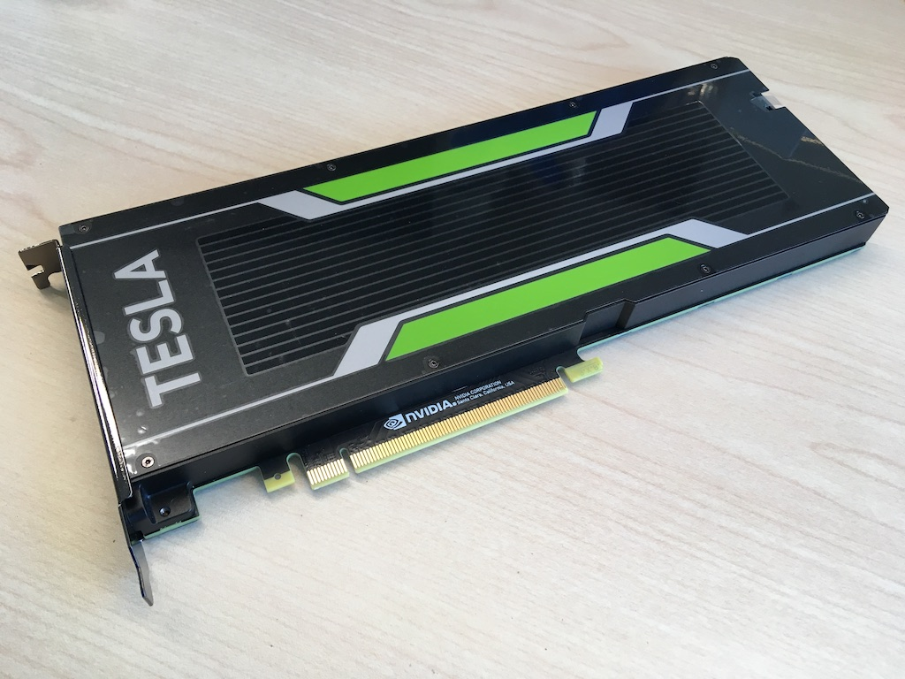

.. _tesla_p10:

===============================
Nvidia Tesla P10 GPU运算卡
===============================

疯狂的 ``挖矿`` 和 ``芯片荒`` 使得显卡已经成为技术工作者 `生命无法承受之重 <https://book.douban.com/subject/1017143/>`_ ，原本消费级别的 ``经济型`` GTX 显卡，已经到了二手现价远超5年前发售上市价格。

我脑海中出现的就是 **未来废土世界** - `疯狂的麦克斯4：狂暴之路 Mad Max: Fury Road (2015) <https://movie.douban.com/subject/3592854/>`_ 

NVIDIA Tesla P10
====================

Telsa P10是NVIDIA于2016年9月13日发布的专业图形卡，采用16 nm技术，基于 GP102 图形处理器。

GP102图形处理器是die面积高达471 mm²，包含了11,800 million (1亿1千8百万) 晶体管。

功能:

- 3840个 着色单元
- 240个 纹理映射单元
- 96个 ROP

硬件配置:

- 24 GB GDDR5X 内存 (384-bit内存接口，运行在1808 MHz，有效带宽 14.5 Gbps)
- GPU主频 1025 MHz，boost频率达到 1493 MHz

Tesla P10是一个单插槽运算卡，长度 267 mm / 宽度 97 mm，使用 PCIe 3.0 x16 接口，这恰好是我购买的二手 :ref:`hpe_dl360_gen9` 能够安装的规格(1U服务器)，这也是我能够找到经济上可以承受同时能够安装到1U服务器的GPU卡。

.. figure:: ../../_static/machine_learning/hardware/tesla_p10_back.jpg
   :scale: 50

神奇之P10
----------

Tesla P10是一块 ``隐形运算卡`` ，你在网上几乎找不到资料，虽然同属 NVIDIA Tesla 系列，但是我们常见的有 ``Tesla P40 24GB`` 和 ``Tesla P199 12GB`` ，同属Pascal 微架构

.. note::

   ``Tesla P10`` 相当于同规格 ``Tesla P40`` 的降频版本，内核完全一致

技术规格
------------

.. csv-table:: Tesla P10 vs. GeForce GTX 1080 Ti
   :file: tesla_p10/tesla_spec.csv
   :widths: 10, 30, 30, 30
   :header-rows: 1

Tesla P10 和 GeForce GTX 1080 Ti 采用了相同的GPU核心 GP102 ，也就是 Pascal 架构，工艺和技术参数几乎相同，主要差异:

- P10 GPU主频降到 1025 MHz (Boost 1493 MHz)，比侧重游戏和图形应用的 1080 Ti 低了 30% ，虽然在渲染、游戏上会差很多，但是也带来了极佳的低温散热，所以 P10 的优势是 ``刀卡`` (只需要1个插槽) 而且是被动散热
- P10 通过提高内存主频(带宽)以及加大内存大小来提升性能，内存带宽比 1080 Ti 高了 32% ，同时 P10 增加了 7~9% 的(着色、纹理映射、ROP)处理单元，这使得两者的性能评分非常接近

.. figure:: ../../_static/machine_learning/hardware/p10_1080_ti.png
   :scale: 80

- 其他差异是 P10 没有显示输出，是纯粹的数据中心运算卡，无法用于3D游戏加速，也不能用于挖矿(算力是个位数)，所以这也是同样性能的 Tesla P10 在当前 ``疯狂时期`` 二手售价仅为 GeForce GTX 1080 Ti 的 1/5 的原因之一(GTX 1080 Ti二手价格被炒高了)

- Tesla P10 和 Tesla P40 的GPU核心以及参数基本相同，差异仅在于主频，P40通过提高主频性能得到少量提升，以 ``Radeon RX 6600 XT`` 为参照，P40的性能比P10提高了3%。不过，P40是双插槽GPU运算卡，散热要好于P10，但是也要求更大的机箱空间

.. figure:: ../../_static/machine_learning/hardware/p10_1080_ti.png
   :scale: 80

.. note::

   我使用的二手 :ref:`hpe_dl360_gen9` 是1U服务器，内部空间狭窄，无法安装双槽GPU卡，所以Tesla P10是少数能够安装且价格较为低廉的运算卡。

   我准备采用这块GPU运算卡实现 :ref:`sr-iov` 虚拟化运行，具体实践后续补充

安装
=======

物理安装见 :ref:`dl360_tesla_p10` ，这是一个 ``一波三折`` 的折腾经历!!!

参考
======

- `techpowerup GPU Database - NVIDIA Tesla P10 <https://www.techpowerup.com/gpu-specs/tesla-p10.c3750>`_
