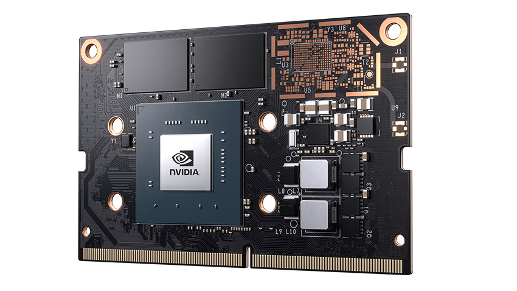

.. _jetson_nano_hardware:

========================
Jetson Nano硬件概览
========================

`NVIDIA Jetson Nano <https://www.nvidia.com/en-us/autonomous-machines/embedded-systems/jetson-nano/>`_ 是面向AI的嵌入式系统，采用ARM Contrex-A57架构结合了NVIDIA的 Maxwel架构GPU:

========== ===========================================================================
组件       规格
========== ===========================================================================
GPU        NVIDIA Maxwell architecture with 128 NVIDIA CUDA cores 0.5 TFLOPs (FP16)
CPU        Quad-core ARM Cortex-A57 MPCore processor @1.43GHz
内存       4 GB 64-bit LPDDR4 1600MHz - 25.6 GB/s
存储       使用microSD卡(需要自行购买TF卡)
网络       10/100/1000 BASE-T Ethernet
显示输出   HDMI and DP
USB        4x USB 3.0, USB 2.0 Micro-B
========== ===========================================================================

.. note::

   Jetson Nano的GPU微内核是Maxwell架构，算力性能参考 :ref:`nvidia_gpu`

.. figure:: ../../../_static/machine_learning/jetson/hardware/nvidia-jetson-nano-dev-kit.png
   :scale: 50

.. note::

   `知乎上Jetson Nano相关问答 <https://www.zhihu.com/search?type=content&q=Jetson%20Nano>`_ 提供了不少参考信息。

   腾讯云社区文档中吉浦迅科技有一个汇总贴 `关于 NVDIA Jetson NANO常见问题汇总 <https://cloud.tencent.com/developer/article/1514453>`_ 提供了很多资料入口。

配件
=====

TF卡(必须)
-----------

请参考 :ref:`sd_tf_card_speed_class` 选择能够承担的高速TF卡，这对系统性能有直接影响，建议采用 容量至少32GB，速度等级U3，视频速度等级V30的高速TF卡(NVIDIA提供的系统镜像已经超过16G)，建议128G或256G。

.. note::

   目前U3级别TF卡(V30)价格比较适中，每秒写入速度达到 30MB/s，差不多每1G1元，可以购买128G或256G规格TF卡。更快速度的V60和V90价格十分惊人，有待技术进步后价格回落再替换较好。（价格案例以SanDisk官方旗舰店为标杆）

电源(推荐)
-----------

Jetson Nano对电源要求较高，特别是安装了外设之后，如果电量供应不足，会导致宕机。所以需要配置一个较好对5V3A电源。

无线模块(可选)
---------------

Jetson Nano开发版没有提供WiFi和蓝牙功能，不过支持通过M.2卡槽安装Intel Wireless-AC8265无线模块，加上无线天线，安装以后特别像无线路由器，确实也是非常Cool的解决方案。

.. figure:: ../../../_static/machine_learning/jetson/hardware/jetson_shell.png
   :scale: 75

.. note::

   为了方便构建一个个人使用的无线网络，我采用Jetson Nano部署 :ref:`create_ap` ，实现 :ref:`jetson_soft_ap`

参考
=======

- `Jetson Nano初步体验 <https://zhuanlan.zhihu.com/p/77994142>`_
