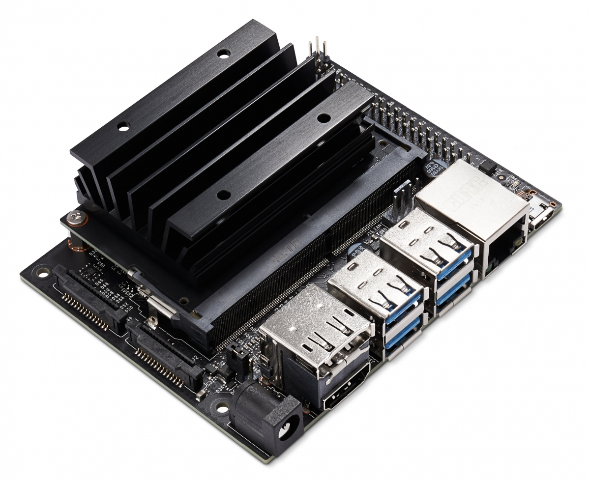

.. _jetson_nano:

========================
Jetson Nano
========================

.. note::

   除了 `NVIDIA Jetson Nano官方网站 <https://www.nvidia.com/en-us/autonomous-machines/embedded-systems/jetson-nano/>`_ 外，也推荐参考第三方例如 `JetsonHacks <https://www.jetsonhacks.com/>`_ 获取使用和开发信息。

NVIDIA Jetson Nano开发者套件是基于ARM架构结合NVIDIA GPU的小型计算机，主要用于图像分类、目标检测、分割和语音处理等应用中运行多个神经网络，并且是一种低功耗低成本机器学习设备。

硬件配置: :ref:`jetson_nano_hardware`

参考
======

- `Jetson Nano 开发者套件 <https://developer.nvidia.com/zh-cn/embedded/jetson-nano-developer-kit>`_
