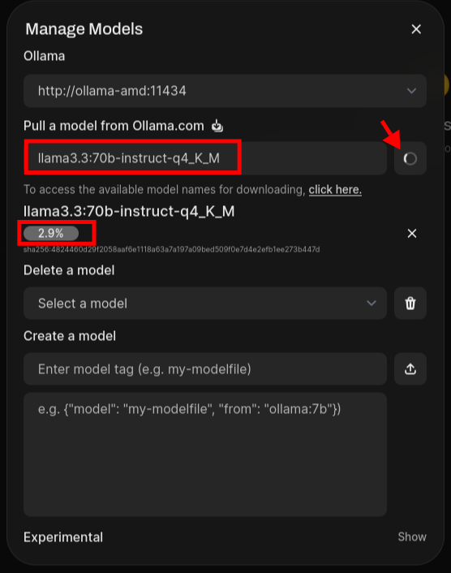

.. _docker_compose_ollama:

=============================
Docker compose组合运行Ollama
=============================

在 :ref:`ollama_amd_gpu_docker` 能够很轻松地运行起Ollama，不过需要手工一一去启动不同用途的容器，例如 :ref:`grafana` :ref:`prometheus` 。所以，选择 :ref:`docker_compose` 来调度和启动容器组合，则会方便很多。

Docker compose运行
====================

- 创建 ``docker-compose.yml`` 组合docker容器:

.. literalinclude:: docker_compose_ollama/docker-compose-final.yml
   :caption: 指定镜像将Ollama容器回退到 ``ROCm 5.7``
   :emphasize-lines: 4

.. note::

   这里的配置是经过反复排查和验证后得到的可行配置，详细排查见下文 :ref:`debue_docker_compose_ollama`

- 上述配置中 :ref:`prometheus` 需要引用一个 ``prometheus.yml`` 配置来抓取GPU数据:

.. literalinclude:: docker_compose_ollama/prometheus.yml
   :caption: prometheus配置

- 启动:

.. literalinclude:: docker_compose_ollama/up
   :caption: 启动容器

此时会看到docker并行拉取容器运行的各个镜像，如果没有报错，则最后同时启动Ollama以及Open WebUI和 :ref:`grafana` :ref:`prometheus` 

配置grafana
================

- 访问 http://服务器IP:3001 (默认账号密码均为 admin)，首次登录会提示修改密码

  - 添加数据源: ``Connections -> Data Sources``
  - 选择 ``Prometheus`` ，在URL中填入 ``http://prometheus:9090`` ，然后点击 ``Save & Test``

- 导入面板:

  - 点击右上角 ``+`` 号 -> ``Import`` ，搜索AMD GPU专用的ID(可以从Grafana官方的dashboard分发网站查找)

配合Open WebUI
====================

访问 http://服务器IP:3000 Open WebUI创建的第一个用户帐号是管理员帐号，请为自己设置一个帐号

验证连接
----------

- 点击页面左下角的 ``个人头像/用户名``
- 选择 ``Settings（设置） -> Connections`` ，应该看到有一个 ``Ollama API`` 的配置，指向的是 ``http://ollama-amd:11434`` 也就是前面 ``docker-compose.yml`` 中配置，点击配置按钮，并点刷新，此时验证正常就说明连接成功

加载模型
---------

在 ``Settings -> Models`` 中可以交互方式加载模型(选择 ``Manage`` )，可以直接输入Ollama官网的模型名称进行下载: ``llama3.3:70b-instruct-q4_K_M`` 举例。这个下载支持断点续传，如果下载意外中断，重试会继续进行(不过如果容器被杀死再下载模型还得重头开始)

   下载指定模型，例如 ``llama3.3:70b-instruct-q4_K_M``

.. _debue_docker_compose_ollama:

docker compose运行Ollama异常排查
==================================

我最初采用的 ``docker-compose.yml`` 使用了默认最新的 ``ollama`` 镜像， ``docker-compose.yml`` 配置如下:

.. literalinclude:: docker_compose_ollama/docker-compose.yml
   :caption: 组合了Ollama+WebUI+Grafana的 ``docker-compose.yml``

但是，启动运行后发现运行 ``llama3.3:70b-instruct-q4_K_m`` 模型时发现 AMD MI50 两块GPU完全没有负载，而CPU疯狂运算。gemini提示虽然设置了正确的 ``HSA_OVERRIDE_GFX_VERSION`` ，但是对于70B大模型需要防范几个问题:

- 70B 模型在 Q4 量化下约占 42GB。Ollama 默认可能认为单块 MI50（32GB）装不下，或者因为你没有设置 并行显卡参数，导致它放弃 GPU 直接回退到 CPU

修订 ``docker-compose.yml`` 的环境变量，在 ``ollama-amd`` 的 ``environment`` 中添加以下关键项:

.. literalinclude:: docker_compose_ollama/docker-compose_parallel_amd.yml
   :caption: 设置并行
   :emphasize-lines: 6-8

- 内存锁限（Memlock）配置: 对于 MI50 这种级别的高性能计算卡，容器需要能够锁定内存以进行高效的 DMA 传输。如果 Docker 限制了内存锁定，Ollama 的 ROCm 后端可能会初始化失败

在 ollama-amd 服务下添加 ulimits:

.. literalinclude:: docker_compose_ollama/docker-compose_unlimits.yml
   :caption: 设置不限制内存锁定

- 修改配置以后销毁容器(docker compose提供了down命令):

.. literalinclude:: docker_compose_ollama/down
   :caption: 停止并销毁容器

注意， ``docker compose down`` 会停止并删除当前YAML文件中定义的所有容器、网络。由于模型文件(数据)保存在 ``valumes`` 中，所以不会丢失

- 重新启动:

.. literalinclude:: docker_compose_ollama/up
   :caption: 启动容器

- 检查容器日志:

.. literalinclude:: docker_compose_ollama/log
   :caption: 检查日志查看和GPU相关信息

发现检测GPU失败:

.. literalinclude:: docker_compose_ollama/log_output
   :caption: 检查日志查看和GPU相关信息，发现检测GPU失败
   :emphasize-lines: 6,7

这说明直接设置 ``HIP_VISIBLE_DEVICES:0,1`` 反而导致了Docker 内部，ROCm 有时会因为 PCI ID 的映射问题产生混淆:

- 删除 ``HIP_VISIBLE_DEVICES:0,1``
- 删除 ``ROCR_VISIBLE_DEVICES`` (如果有手动设置)

并添加一个debug参数:

.. literalinclude:: docker_compose_ollama/docker-compose_debug.yml
   :caption: debug
   :emphasize-lines: 20

**神奇啊** 发现居然是 ``privileged: true`` 生效后解决了问题，现在 ``docker logs ollama-amd`` 看到日志似乎正常了:

.. literalinclude:: docker_compose_ollama/log_output_ok
   :caption: 使用了 ``privileged: true`` 之后日志似乎正常了
   :emphasize-lines: 6,7

这说明确实需要 ``privileged: true`` ，那么结合上面所述，配置应该修订为:

.. literalinclude:: docker_compose_ollama/docker-compose_fix.yml
   :caption: 正式修订配置，启用并行

上述修订完成后，再次运行，发现还是无法将模型运行在GPU上

这就需要排查Ollama是如何评估模型加载的: Ollama 有一个“自我保护”机制：如果它计算出 模型权重 + KV Cache（上下文） 超过了可用显存的 90%，它会为了防止 OOM（显存溢出）而直接放弃 GPU，转向 CPU。

70B 模型约 42GB，双卡 64GB。如果你在 WebUI 里的上下文（num_ctx）默认设置得很大（比如默认 32k），KV Cache 会吃掉剩下的所有显存。

解决方法: 强制限制上下文长度

在 Open WebUI 中，不要直接提问。

- 点击模型选择框旁边的 “设置/控制”图标。
- 找到 Advanced Parameters (高级参数)。
- 找到 GPU Layers (num_gpu) ，设置 81 表示将所有层都加入GPU: Llama 3.3-70B (Q4_K_M) 的层数通常是 81 层（80层 Transformer + 1层 Output）
- 找到 Context Length (num_ctx)，手动输入 4096 或 8192。
- 再次尝试提问，观察 rocm-smi。

.. warning::

   问题尚未解决，待继续排查

   目前发现操作系统启动以后，容器启动后系统有大量的  [kworker/22:21+events] 的进程是D状态。怀疑Docker容器没有正确挂载物理服务器设备（/dev/kfd 和 /dev/dri）

排查没有识别AMD GPU
======================

我仔细观察了 ``docker logs ollama-amd`` 输出日志:

.. literalinclude:: docker_compose_ollama/logs_runner_crashed
   :caption: 日志显示 ollama 运行AMD GPU的rocm时候出现crashed
   :emphasize-lines: 8,9,14,17,21

日志的第8，9行显示Ollama尝试使用 ``/usr/lib/ollama/rocm`` 来测试两块GPU卡是否支持；但是很不幸，后续日志显示测试名利出现 ``runner crashed`` (第14，17行日志)。这导致Ollama放弃使用GPU，转而采用CPU架构(第21行日志)

我检查Host主机 ``dmesg`` 日志，发现有关于 ``amdgpu`` 的日志错误:

.. literalinclude:: docker_compose_ollama/host_dmesg
   :caption: Host主机dmesg显示 amdgpu 错误
   :emphasize-lines: 1,2

上述日志是启动 ``ollama-amd`` 容器后出现的(我对比了关闭容器启动后，上述报错不再出现)，那么这里为何会出现 ``[drm:amddrm_sched_entity_push_job [amd_sched]] *ERROR* Trying to push to a killed entity``

Google Gemini提出的改进建议主要有:

- 既然物理主机 ``rocm-smi`` 正常，但是运行容器就触发内核报错 ``Trying to push to a killed entity`` ，这说明 **ROCm驱动与Docker容器在硬件抽象层(Hardware Abstraction Layer)的握手失败**

  - 我以为可能需要安装 :ref:`amd_container_toolkit` ，不过AMD的ROCm容器主要依赖内核驱动(KFD/DRM)的直接透传，和 :ref:`nvidia_container_toolkit` 不同不需要处理复杂的库映射，所以这里并不需要安装 ``amd container toolkit``
  - gemini提示我当前使用的 Ubuntu 24.04 内核 6.8 可能太新，而 MI50(GFX906)属于较老的硬件架构，在处理容器级硬件重置时存在严重的同步问题

- 为了能够兼容旧硬件，添加特定的硬件访问环境变量来规避内核调度错误，修订 ``docker-compose.yml`` :

.. literalinclude:: docker_compose_ollama/docker-compose-gfx9.yml
   :caption: 添加兼容硬件架构的环境参数
   :emphasize-lines: 6,7

不过，我实践下来， **上述修订方法并没有解决，报错依旧**

- gemini另外一个建议我觉得很有可能: 回退ROCm版本，因为 :ref:`amd_radeon_instinct_mi50` 我当时在调研时就发现官方RELEASE说明中最高只有ROCm 5.7.1版本是明确支持MI50的，最新的ROCm 6.x发布文档中已经声明不再支持GCN 5代，也就是 **不再明确支持MI50** ，虽然在Reddit帖子中有人报告在ROCm 6.3.2中依然可以使用MI50（我的实践也验证物理主机上使用似乎没有问题，但是看来容器兼容性存在限制）

但是存在一个问题，就是 Ollama 官方镜像的哪个TAG对应使用的是 ROCM 5.7 呢？

Google了一下，找到一个早期Ollama构建Dockerfile中指定 ``ROCM_VERSION=5.7`` 的案例 `prawilny/ollama-rocm-docker <https://github.com/prawilny/ollama-rocm-docker/blob/master/Dockerfile>`_ ，也就是说，我需要到Ollama官方源代码仓库中搜索找到对应这样的Dockerfile的TAG，来找到合适的官方镜像版本

我在 `GitHub: ollama/ollama/Dockerfile <https://github.com/ollama/ollama/blob/main/Dockerfile>`_ 中查看，发现当前的Dockerfile中已经使用了 ``ROCMVERSION=7.2`` ，所以需要找出早期版本。Gemini提供了一些线索:

- 查找 2024年2月到3月 左右的提交。当时正是 ROCm 从 5.7 迁移到 6.0 的窗口期
- 尝试 ``ollama/ollama:0.1.29-rocm`` ，原因是: 在 0.1.30 之前，Ollama 普遍使用的是 ROCm 5.x 基础镜像。0.1.29 是一个公认的在老旧硬件上比较稳定的版本

.. literalinclude:: docker_compose_ollama/docker-compose-final.yml
   :caption: 指定镜像将Ollama容器回退到 ``ROCm 5.7``
   :emphasize-lines: 4

果然，通过指定 ``ollama:0.1.29-rocm`` 能够避免启动容器启动Ollama进程crash，检查Host主机的 ``dmesg`` 日志可以看到没有再出现异常的 ``*ERROR* Trying to push to a killed entity`` ，系统也没有再出现D住的进程

通过确认 ``docker logs ollama-amd`` 也可以看到容器正常初始化

.. literalinclude:: docker_compose_ollama/docker_logs_init
   :caption: 检查ollama-amd容器日志可以看到正常初始化
   :emphasize-lines: 20,27

使用异常排查
==================

我在实际通过Open WebUI下载 ``llama3.3:70b-instruct-q4_K_M`` 模型运行时出现报错: ``500: exception done_getting_tensors: wrong number of tensors; expected 724, got 723`` ，此时检查 ``docker logs ollama-amd`` 可以看到日志:

.. literalinclude:: docker_compose_ollama/wrong_number_of_tensors
   :caption: 运行日志报错显示错误的tensors数量

检查模型:

.. literalinclude:: docker_compose_ollama/ollama_list
   :caption: 检查模型列表

输出显示

.. literalinclude:: docker_compose_ollama/ollama_list_output
   :caption: 检查模型可以看到列表

上述报错实际上很可能是模型下载过程中由于网络波动导致某个分块(blob)不完整，所以通过以下命令删除掉模型并重新下载:

.. literalinclude:: docker_compose_ollama/pull_model
   :caption: 重新下载模型

但是很不幸，我重新拉取模型之后，再次测试依然是相同的报错。看起来并不是模型下载问题，因为使用 ``ollama pull`` 下载模型最后有校验，显示下载是成功的

另一个怀疑点是 **Ollama 0.1.29 的 GGUF 格式兼容性** : Llama 3.3 及其权重格式在不断更新。这里我使用的 ``0.1.29`` 是较早的版本，而 ``llama3.3:70b`` 默认拉取的可能是使用较新 ``llama.cpp`` 工具链量化的 ``GGUF`` 文件。新版 ``GGUF`` 可能包含旧版 Ollama 无法识别的 ``Metadata`` 层。

gemini建议我尝试:

- 尝试拉取版本更早、兼容性更好的 Llama 3 镜像进行测试: ``ollama pull llama3:70b-instruct-q4_K_M`` ，如果Llama 3能够成功而 3.3 失败的话，就表明是版本不兼容
- 另一个尝试是采用5.x系列中较晚发布的 ``ollama:0.1.32-rocm`` 看看能否在不导致驱动崩溃情况下运行Llama 3.3

我首先调整了镜像，改为采用 ``ollama/ollama:0.1.32-rocm`` ，并且为了能够不重复下载model，我修订了容器挂载的卷目录，即 ``docker-compose.yml`` 如下:

.. literalinclude:: docker_compose_ollama/docker-compose_final_0.1.32-rocm.yml
   :caption: 调整ollama镜像并设置指定的数据目录

但是发现ollama-amd容器的日志同样报错 ``done_getting_tensors: wrong number of tensors; expected 724, got 723`` :

.. literalinclude:: docker_compose_ollama/logs_ollama-amd
   :caption: ``ollama-amd`` 日志显示报错
   :emphasize-lines: 7,11

看来模型文件下载应该是正常的，而且 ``ollama:0.1.32-rocm`` 这样稍微新一点的镜像也没有解决问题，那么是否要尝试llama3的模型看看是否是旧版Ollama不支持Llama3.3的新tensor结构？

.. literalinclude:: docker_compose_ollama/pull_llama3
   :caption: 尝试下载一个较早的 llama3 模型

我在 `I can't run llama3.1 #6048 <https://github.com/ollama/ollama/issues/6048>`_ 找到的解释看起来说明了原因(也是加载模型报tensors数量不一致): 原因是Ollama依赖 :ref:`llama.cpp` ，最新的 llama.cpp 创建的GGUF文件不能被旧版本llama.cpp 处理，如果要使用旧版本llama.cpp需要自己使用旧版本llama.cpp来转换hf到GGUF。

另外Hugging Face上 `Missing Tensors in Q5_K_S + Q5_K_M #8 <https://huggingface.co/bartowski/Meta-Llama-3.1-70B-Instruct-GGUF/discussions/8>`_ 也是同样的报错问题，需要使用较新版本的 :ref:`llama.cpp` 来处理，所以在我这种使用旧版 Ollama 的情况，也同样是因为旧版 :ref:`llama.cpp` 无法处理新版本GGUF导致的

我这里大概率是因为我为了能够在Ollama中使用旧版本ROCm，使用了早期版本的Ollama镜像，这种旧版本Ollama镜像打包的是旧版本 :ref:`llama.cpp` ，无法处理最新的GGUF文件。

解决的方法可能是:

- 采用早期的llama3，那些早期的llama3通常会使用旧版本llama.cpp创建的GGUF。这种方法可能会成功，但是带来的问题是无法体验最新的模型
- 另一种方式我感觉是自己用旧版本 :ref:`llama.cpp` 来转换模型的hf文件到 GGUF，这样理论上能体验最新版本的模型，就是比较麻烦一些 ，我准备参考 `Llama 3.1 GGUF incompatibility using latest release of llama.cpp and text-generation-webui. #6301 <https://github.com/oobabooga/text-generation-webui/issues/6301>`_ 提供的hf转GGUF方法来实现

另外，我想到的一个方法是对于我现在使用的旧硬件 :ref:`amd_radeon_instinct_mi50` ，如果不是用容器直接物理主机运行Olama，那么有可能是可以直接使用最新版本的ROCm (之前我记得尝试用物理主机运行Ollama是成功的，看起来去掉容器化这层是有可能使用最版本ROCm，这样或许会减少很多麻烦)

最终解决
---------

采用 :ref:`convert_hf_guff`

参考
======

- `AMD Device Metrics Exporter 1.4.2 > Docker installation <https://instinct.docs.amd.com/projects/device-metrics-exporter/en/latest/installation/docker.html>`_
