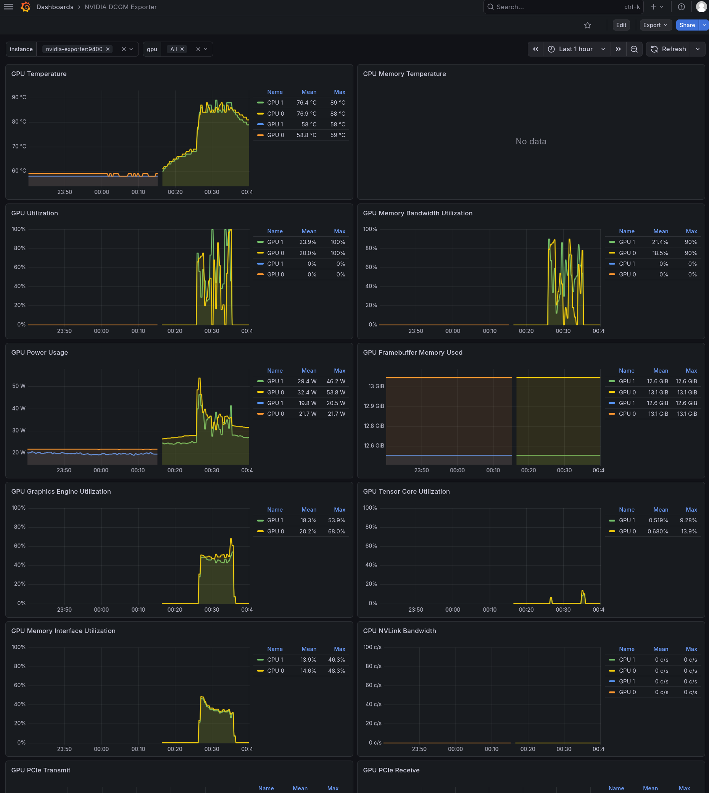

.. _ollama_nvidia_a2_gpu_docker:

=============================================
在Docker中Ollama使用NVIDIA A2 GPU运行大模型
=============================================

安装驱动
==========

.. note::

   在配置使用GPU之前，请先完成 :ref:`gpu_bios`

- :ref:`install_nvidia_linux_driver_ubuntu` : 在Host主机上仅安装NVIDIA驱动来支持安装 :ref:`nvidia_container_toolkit` ，这样就可以容器化运行 :ref:`cuda`

.. literalinclude:: ../../hardware/nvidia_gpu/install_nvidia_linux_driver_ubuntu/devices
   :caption: 使用Ubuntu提供的工具来查找最适合的驱动版本

根据输出显示选择合适的驱动，这里选择 ``590-server`` 版本

.. literalinclude:: ../../hardware/nvidia_gpu/install_nvidia_linux_driver_ubuntu/install
   :caption: 安装 ``590-server`` 驱动

安装NVIDIA Container Toolkit
======================================

- 执行以下步骤完成 :ref:`nvidia_container_toolkit` 安装

.. literalinclude:: ../../../docker/gpu/nvidia_container_toolkit/prepare
   :caption: 安装工具

.. literalinclude:: ../../../docker/gpu/nvidia_container_toolkit/repo
   :caption: 配置仓库

.. literalinclude:: ../../../docker/gpu/nvidia_container_toolkit/update_repo
   :caption: 更新仓库

.. literalinclude:: ../../../docker/gpu/nvidia_container_toolkit/install
   :caption: 安装 ``NVIDIA Container Toolkit``

- :ref:`install_docker-ce` 并使用 ``nvidia-ctk`` 命令来配置容器运行时 

.. literalinclude:: ../../../docker/startup/install_docker-ce/apt_repo
   :caption: 设置Docker apt仓库

.. literalinclude:: ../../../docker/startup/install_docker-ce/apt_install
   :caption: 安装Docker官方软件包

.. literalinclude:: ../../../docker/startup/install_docker_linux/usermod
   :caption: 将当前用户添加到 ``docker`` 用户组

.. literalinclude:: ../../../docker/gpu/nvidia_container_toolkit/nvidia-ctk
   :caption: 配置容器运行时

启动Ollama容器
====================

.. note::

   在中国，需要 :ref:`across_the_great_wall` : 我采用 :ref:`docker_proxy_socks_quickstart` 方法

- 执行以下命令启动Ollama容器以及辅助的监控和web容器

.. literalinclude:: ollama_nvidia_a2_gpu_docker/docker_run
   :caption: 启动容器

.. note::

   其中访问 nvcr.io 镜像仓库需要登录(我已放弃改为使用Docker Hub):

   - 访问 `NVIDIA NGC <https://catalog.ngc.nvidia.com/>`_ 并注册/登录
   - 在右上角点击 ``你的头像 -> Setup -> Generate API Key``
   - 在终端执行登录:

   .. literalinclude:: ollama_nvidia_a2_gpu_docker/nvcr_login
      :caption: 使用docker login登录

注意，Grafana建议导入dashboard:

- 最推荐: ID 15117 (NVIDIA DCGM Exporter) - 目前我使用这个

  - 优点：布局非常现代，专为 dcgm-exporter 设计。它对 instance 和 gpu 的过滤逻辑写得比较规范，不容易出现变量失效的问题
  - 监控重点：除了基础的温度和显存，它能清晰显示 Tensor Core 利用率（这对于运行 Qwen/Llama 这类大模型非常有意义，能看到模型是否真的在压榨 AI 核心）

- 最稳健：ID 12239 (NVIDIA DCGM Exporter Dashboard) - 官方仓库提供的原厂看板

  - 优点：兼容性极强，几乎涵盖了所有 DCGM 导出的基础指标
  - 缺点：UI 略显陈旧，且有时会因为 Prometheus 任务名（job name）不匹配导致需要手动调优变量

- 极简主义/单机优化：ID 24450 (DCGM Exporter Dashboard)

  - 优点：去掉了大量不常用的深层指标（如 PCIe 错误率等），聚焦于：显卡型号、驱动版本、实时利用率、显存、功耗和风扇转速

加载模型
-----------

- 为确保两块 :ref:`tesla_a2` 能够充分利用，采用如下运行命令:

.. literalinclude:: ollama_nvidia_a2_gpu_docker/exec_ollama
   :caption: 执行加载指定模型

在使用 ``qwen2.5-coder:32b-instruct-q4_K_M`` 大约会使用 ``19GB - 20GB`` ，当使用2块A2卡时候，CUDA上下文和系统卡小大约占用 ``1GB - 2GB`` ，这样会有剩余  ``10GB - 12GB`` 显存用于KV Cache，能够支持大约 16,384 到 24,576 tokens 的上下文长度（取决于是否开启了 GQA 优化）

在使用 ``llama3.3:70b-instruct-q2_K`` 大约占用24GB，能预留8GB用于长文本对话(约8K上iawen)，不过由于低比特量化(Q2)会导致模型在逻辑严密度上有5%-10%的衰减；如果使用 ``llama3.3:70b-instruct-q3_K_S`` 则占用31GB，虽然勉强能塞进显存，但是KV Cache空间极小(可能仅支持1k-2k上下文)

在使用 ``mistral-small:24b-instruct-q8_0`` 大约占用26GB，预留6GB用于上下文(8k-12k上下文长度)，能够适合大多数通用对话、代码分析或技术咨询；如果使用 ``mistral-small3.2:24b-instruct-2506-q4_K_M`` 虽然只占用15GB，但是量化过程中会损失大约2-5%的逻辑推理能力，尤其在处理复杂指令或非中文语境下的细微差别是。使用 Q8 精度能在逻辑严密度上接近原始的FP16版本

.. note::

   由于从Ollama下载模型非常缓慢甚至无法完成，我最终采用 :ref:`modelscope` 来下载和导入模型，然后就可以在 open-webui 上选择对应模型进行问答

- 当对模型进行交流时，可以通过 ``nvidia-smi`` 观察到两块 :ref:`tesla_a2` 运行时负载情况以及核心温度，我发现如果没有很好的散热，推理时GPU的问题会接近85度，所以必须通过 :ref:`nvidia_gpu_fan_control` 来实现动态控制

.. literalinclude:: ollama_nvidia_a2_gpu_docker/nvidia-smi_output
   :caption: 推理时nvidia-smi检查负载
   :emphasize-lines: 10,13

监控调整
=============

当使用 ``ID 15117 (NVIDIA DCGM Exporter)`` 看不到 Tensor core 的使用率:

- 检查Tensor Core面板可以看到Query是 ``DCGM_FI_PROF_PIPE_TENSOR_ACTIVE{instance=~"${instance}", gpu=~"${gpu}"}``
- 但是在Prometheus的Query中输入 ``DCGM_FI_PROF_PIPE_TENSOR_ACTIVE`` 查不到任何内容
- 直接检查 ``curl -s http://localhost:9400/metrics | grep -i "TENSOR"`` 和 ``curl -s http://localhost:9400/metrics | grep -i "PROF"`` 可以看到输出是空，这表明默认的 ``dcgm-exporter`` 配置文件屏蔽了这些指标(为了降低采集压力)

实际上在 ``dcgm-exporter`` 容器内部 ``/etc/dcgm-exporter`` 目录下默认使用了 ``default-counters.csv`` 配置，这个配置只有基本计数器，另外还有一个 ``dcp-metrics-included.csv`` 则提供了Tensor Core, FP16, FP32等所有高级特性指标

修订运行命令:

.. literalinclude:: ollama_nvidia_a2_gpu_docker/run_exporter_metrics
   :caption: 启用高级特性指标配置的 dcgm-exporter
   :emphasize-lines: 8

在启用了 ``dcp-metrics-included.csv`` 配置之后，就会看到 ``ID 15117 (NVIDIA DCGM Exporter)`` 几乎所有指标都能显示，除了 ``GPU Memory Temperature`` 是空的。这里无法显示GPU Memory温度不是dcgm-exporter的配置问题，而是因为 :ref:`tesla_a2` 作为精简版本推理卡，部分批次的A2不提供这个数据，即使 ``nvidia-smi -q`` 查询也看不到 ``Memory Current Temp`` (数据是 N/A)

在使用Ollama推理时，可以观察Grafana监控，看到GPU的温度、使用率以及内存带宽使用等情况

   Tesla A2 推理时Grafana监控显示
