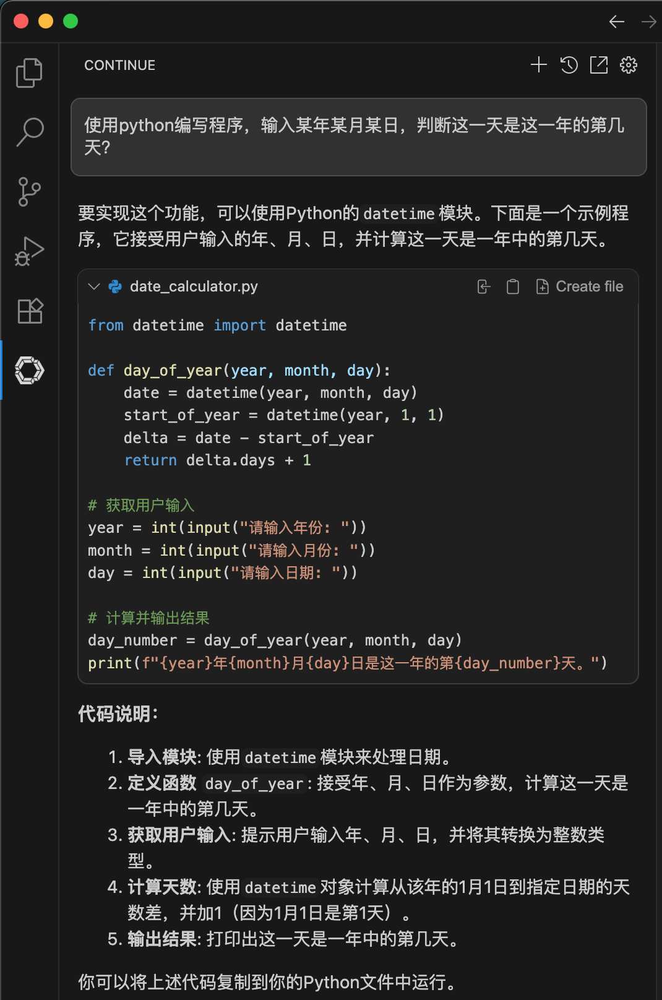

.. _vscode_continue_ollama:

===============================================
VS Code插件Continue连接Ollama实现AI辅助编程
===============================================

``Continue`` 插件为 :ref:`vscode` 提供了直接使用OpenAI作为AI编码后端的能力，同时也可以连接本地部署的大语言模型，实现完全自主控制的LLM大模型编程。

我在 :ref:`ollama_amd_gpu` 验证运行了 :ref:`qwen2.5-coder` 之后，尝试结合到 :ref:`vscode` 进行AI编程:

- ``Continue`` 提供了 chat 模式对话，以及自动补全和代码自动注释等功能，使用方便，无需频繁切换终端

安装和配置
=============

在 VS Code中选择插件市场，搜索 ``continue`` 并安装

- 打开VS Code，按下 ``Ctrl+Shift+P`` ，然后输入 ``Continue: Open Settings``
- 这里有一个界面是登陆 ``Coninue Hub`` ，不过也提供了另外一个选项是 ``Or, configure your own models`` ，我们就选择这个配置自己的模型

  - 选择本地运行模型
  - 跳过导引，选择直接编辑配置，然后参考 `Continue model providers <https://docs.continue.dev/customize/model-providers/overview>`_ 配置文件配置，我这里再次配置选择 :ref:`ollama_amd_gpu` 实践过 :ref:`qwen2.5-coder` ，就不需要重复下载新模型，而且也是目前我的硬件能够运行的最好的编码模型

.. note::

   上述配置其实有点迷糊，可能需要摸索摸索。我自己也是按照导引做的，但是看起来continue的界面迭代变化块，和文档并不相同，所以我也就在这里不再记录了。

使用
========

``Continue`` 提供了一个chat模式，就好像直接和Ollama对话

   对话模式通过提示获取代码片段

- 其实使用chat模式就很方便，通过简单对话就能获取代码片段进行参考，也方便学习编程
- 代码注释比较有用，特别是看到一时无法理解的代码，让 continue 调用 Ollama 帮我解析，可以快速完成代码阅读

其他功能探索中...

参考
========

- `How to Configure Ollama with Continue <https://docs.continue.dev/customize/model-providers/top-level/ollama>`_
- `Continue - open-source AI code assistant <https://marketplace.visualstudio.com/items?itemName=Continue.continue>`_
