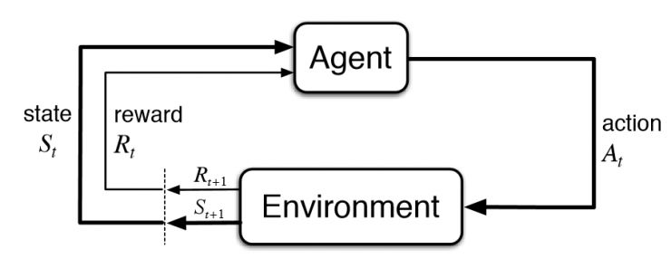
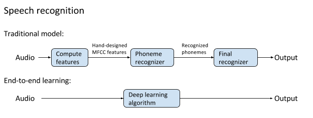

.. _intro_rl:

====================
强化学习简介
====================

.. note::

   网上资料纷繁复杂，这里我借用了一部分ChatGPT 3.5 和 :ref:`gpt` 4.0 Turbo (128K)的回答

原理
========

强化学习(ReInforcement Learning, RL)是机器学习的一个领域，它致力于让 **智能体** ( ``agent`` )通过与环境的交互来学习最优行为策略。在这个过程中，智能体尝试最大化积累奖励。

强化学习的基本组成包括:

- 智能体(Agent): 执行行为，从环境中学习
- 环境(Environment): 智能体所处的尾部世界，可以给予智能体反馈
- 状态(State): 表示环境在某一时刻的情况，通常表示为一个状态向量
- 行为(Action): 智能体在特定状态下可以执行的操作
- 奖励(Reward): 环境对智能体的行为给出的 **即时反馈** ，可以是 正值(鼓励该行为) 或 负值(惩罚该行为)

强化学习的学习过程通常涉及以下几个步骤:

- 探索(Exploration): 智能体尝试执行不同的行为以发现奖励信息
- 利用(Exploitation): 智能体使用亿获得的知识来执行最佳策略，以获得最大奖励
- 策略(Policy): 指定对于每个状态智能体应该采取的行为规则
- 价值函数(Value Function): 预估在给定状态下，遵循特定策略可以得到的未来奖励的总和
- Q学习(Q-Learning): 一种无模型的强化学习方法，可以用来学习最优策略

   强化学习 Reinforcement Learning, RL 示意图

以上概念列举可能不太容易理解，对我个人而言，强化学习的两个可以想像和理解的案例是:

- 游戏
- 自动驾驶

(以我的理解)我是一个不(太)会玩游戏的人，不过我会开车。强化学习的特征就是只给基本规则，但是不告诉你规则的逻辑和原理，然后就让机器 **自动地乱搞一气** : 

机器可以驱使汽车往任何地方去，随便怎么开都行；机器可以驱动游戏操纵杆乱捣鼓

但是我们给另外一个限制，假如汽车偏离我的目标，我就通过方向盘回馈给予纠正(也就是打分、惩罚)，如果正确形式就定时给加分，那么机器通过强化学习应该能够不断积累能力最后自动完成A到B的自动驾驶

同样在游戏中，有一个控制逻辑，例如玩游戏的智能体最后做到了我们人类设定的通关，那么另外一个游戏控制体就给他加分，反之减分，那么玩了一段时间以后，玩游戏的智能体就会自己总结出通关方法(看起来是随机成功，但是随机总有成功的例子，累计一定成功总结通关方法)

**以上是我的瞎想**

优点 vs. 缺点
=============

.. note::

   这段来自 GPT4.0 Turbo (128K)

- 强化学习的优点:

  - 决策能力：强化学习非常适合解决需要连续决策的问题，如棋类游戏、自动驾驶汽车等。
  - 自适应和自我学习：智能体能够根据环境反馈调整其行为。
  - 长期规划：强化学习着眼于长远的奖励，能够在多步决策中寻求最佳策略。
  - 灵活性和通用性：可应用于多种不同类型的问题和环境。
  - 没有监督需求：与监督学习不同，强化学习不需要大量的标注数据。

- 强化学习的缺点:

  - 训练时间长：需要大量的时间和数据来探索和学习有效的策略。
  - 环境建模困难：在复杂的环境中，建立一个准确的环境模型是非常困难的。
  - 奖励设计难度：设计一个能够有效引导智能体学习的奖励函数往往不易。
  - 安全问题：在探索过程中，可能会产生不安全或不希望的行为。
  - 样本效率低：RL算法通常需要大量的交互数据来达到良好的性能，这称为样本效率低。
  - 信用分配问题（Credit Assignment Problem）：当奖励延迟到达时，很难确定哪个行为或动作序列导致了奖励。

强化学习的优点(震惊)
======================

`【Netflix】阿尔法狗 AlphaGo (2017) <https://www.bilibili.com/video/BV1Ct411u71n>`_ 震撼人心的AlphaGo战胜人类顶级围棋高手的故事，主角AlphaGo是通过 ``监督学习`` 和 ``强化学习`` 结合训练出来的，而更为强大的继任者 ``AlphaGo Zero`` 则纯粹采用 ``强化学习`` （智能体从完全没有任何先验知识的情况开始，从奖励信号中学习知识）和自我对弈进行学习。 

紧接着 ``AlphaZero`` 是一个更为普适的版本: 人类第一次用同一个算法攻破 象棋 和 围棋 ，并且没有像它的前辈 「深蓝」 和原始的 「AlphaGo」那样专门为某种游戏对模型进行裁剪。这是具有里程碑意义的进步!

其他的游戏案例是  OpenAI 的 Dota 机器人: 不需要任何人类知识，完全通过自我对弈进行训练 => 成功地在复杂得多的 5v5 版本的游戏中战胜了人类玩家组成的队伍

``强化学习的特点`` :

- 深度学习的经典模型中，智能体一开始只知道那些动作是可以采取的。他对所处的世界中的先验知识一无所知，只能通过与环境交互来学习这种技能，并在每次采用动作之后得到奖励。 (这点很重要，我们不能给智能体编写任何逻辑，而是要智能体通过随机尝试来获得能力)

  - 神奇的概率 ^_^
  - 神奇的能力获得

强化学习的缺点
================

- 强化学习被诟病的也是上述神奇点:

  - 在既 ``没有先验经验`` 又 ``没有更高层次的指导`` 的情况下， **仅仅基于奖励信号就开始学习新的技能** 真的有意义吗？
  - **纯** ``强化学习`` 不太可能实现复杂的成果: 因为它对人工智能体强加了诸多限制

- 强化学习在 **不需要推理和记忆** 的 ``条件反射类`` 游戏中取得良好表现，但是， **没有一种强化学习算法能够攻破需要推理和记忆的游戏** (这些任务上表现优秀的模型要么使用了 ``先验信息指导`` 要么使用了 ``演示`` )

- **纯** 强化学习 **每次需要从头开始** : 对于「范围狭窄」的任务是有效的，但是大多数人工智能需要解决的问题是范围非常开放的任务(真实世界中没有限制的、开放的复杂问题: 例如 驾驶汽车 或 进行对话) 

  - 「从头开始」进行学习的理由:

    - 事先假定的替代品——将人类的直觉硬编码到模型中——可能通过不必要的限定限制了模型的准确率，或者甚至通过错误的直觉降低了模型的性能。
    - 随着深度学习方法的成功，这种观点已经成为了主流，这些方法可以学习具有数以百万计的参数的「端到端」模型，对数量惊人的数据进行训练，而且只用到了很少的先验知识

   传统模式 vs. 端到端学习

**端到端学习性能更好，已经成为了目前最先进的语音识别的基础**

人工智能的困境(也是发展方向)
=============================

- 至今还不清楚纯强化学习是否是从头开始学习的正确方法
- 从头开始学习是许多广泛被认同的 「目前人工智能和深度学习具有的限制」 的主要原因:

  - 目前的人工智能非常缺乏数据（即样本效率低下），在大多数情况下，需要大量的数据才能使最先进的人工智能方法变得有效。这对纯强化学习来说尤其糟糕。(AlphaGo Zero 需要进行数以百万次计的围棋游戏才能得到为 0 的埃洛等级分，这是大多数人稍加努力就可以达到的分数。从定义上说，从头学习可能是样本效率最低的方法。)
  - 目前的人工智能系统是不透明的，在大多数情况下，我们对人工智能算法能学到什么、它将如何工作只有高层次的直觉。对于大多数人工智能问题来说，我们希望算法是可预测、可解释的。一个在只给定低层次的奖励信号的、从头开始学习想要的知识的大的神经网络，或者一个环境模型（就像 AlphaGo Zero 那样工作），可能是解释性和可预测性最差的方法。
  - 目前的人工智能应用的范围很窄，在大多情况下，我们建立的人工智能模型只能完成一个很小的范围内的任务，而且很容易就失效。从头开始学习每一项技能限制了模型学习除了一个特定的任务之外的任意任务的能力。
  - 目前的人工智能是脆弱的，大多数情况下，我们的人工智能模型只是通过大量的数据获得了泛化到不可见的输入上的能力。甚至在以后仍然是很容易失效的。

参考
======

- `论强化学习的根本缺陷 <https://cloud.tencent.com/developer/article/1178433>`_ 这篇文章翻译摘录自 `Reinforcement learning’s foundational flaw <https://thegradient.pub/why-rl-is-flawed/>`_ ，原文是上下两篇的系列文章，下篇是 `How to fix reinforcement learning <https://thegradient.pub/how-to-fix-rl/>`_ ，其中引用了很多论文和视频，值得深入学习
