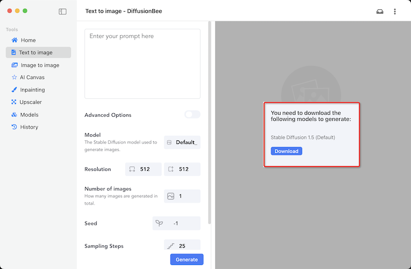

.. _diffusionbee:

==================
Diffusion Bee
==================

`DiffusionBee.com <https://diffusionbee.com/>`_ 开发了一个在 :ref:`macos` 平台运行的 ``Diffusion Bee - Stable Diffusion GUI App for MacOS`` 。这是一个 electron 应用，通过下载预训练好的模型，可以在 macOS 本地主机运行模型，利用本地GPU来推理生成有趣的图片:

- 数据隐私: 除非选择上传图片，否则任何内容不会发送到云端
- 干净易用的用户界面以及一键安装
- 支持多种 Diffusion : ``文本到图像`` ``图像到图像``
- 支持模型: SD 1.x、SD 2.x、SD XL、Inpainting、ControlNet、LoRA
- 提供了在应用程序中直接下载模型功能(使用友好，无需技术)
- In-painting
- Out-painting
- 生成历史
- 放大图像
- 多种图像尺寸
- 针对 M1/M2 芯片进行优化

使用
=======

- 首次使用 ``Text to image`` 会提示下载 

.. note::

   这里有一个难点是下载模型会被GFW阻塞，看来得另外找梯子来实践了

类似 Diffusion Bee 这样的包装工具，实际上就是在 :ref:`macos` 平台运行 ``stable diffusion`` 模型，技术上不是关键，关键点是后端训练微调 ``stable diffusion`` 。

``Diffusion Bee`` 推荐的 `Liner.ai <https://liner.ai/>`_ 提供了私有化部署模型训练的平台:

- 简单易用，用户通过导入标记过的图片来进一步微调训练(这个工程量可能巨大)
- 支持在Windows和macOS平台使用，免费使用(不开源)

参考
======

- `GitHub: Diffusion Bee - Stable Diffusion GUI App for MacOS <https://github.com/divamgupta/diffusionbee-stable-diffusion-ui>`_
