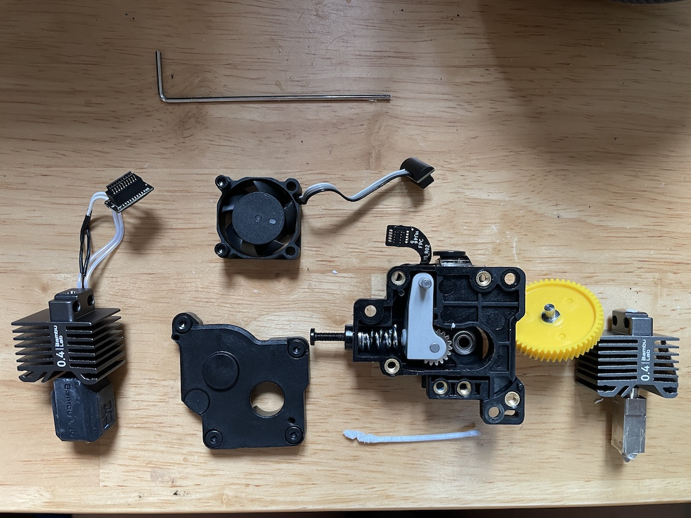
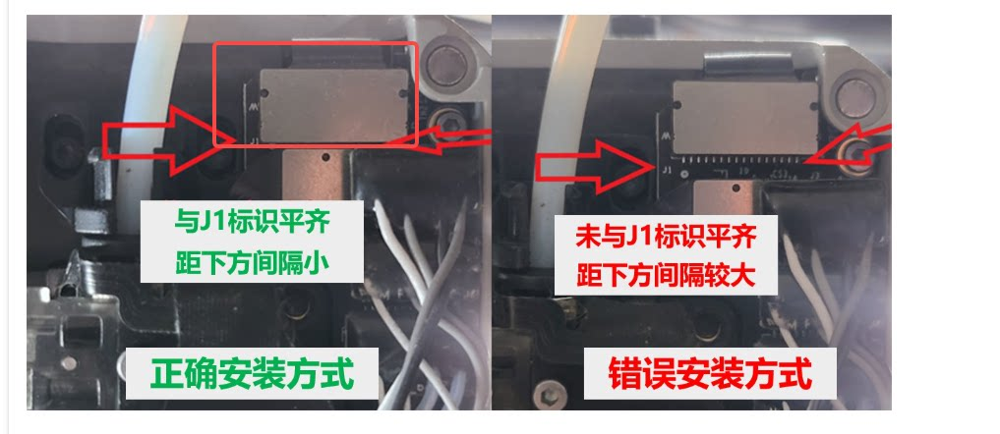

.. _3d_printer_experience:

============================
3D打印机使用经验
============================

挤出机和喷嘴维护是3D打印机的基本操作，只有亲手拆装一次，才能理解3D打印机的组成原理，并为后续更换 ``0.4mm 淬火钢喷嘴`` (打印 **PETG-CF** 碳纤维增强 PETG)做好准备:

   经过一番折腾拆卸好的挤出机和喷嘴零件，组装起来还是很有成就感的

挤出机维护
==============

我在使用3D打印大理石耗材时就遇到了挤出机堵塞的问题，所以我感觉打印耗材的质量非常重要，可能多投入一些钱能够降低堵塞的概率。

根据 `Bambu Lab Wiki: 打印机堵塞排查 <https://wiki.bambulab.com/zh/x1/troubleshooting/how-to-check-which-part-is-clogged>`_ 参考可以自行排查打印机堵塞的原因。

:ref:`bambu_p1s` 的挤出机被堵塞时，出现的现象就是打印头在不断移动似乎正在打印，但是没有耗材挤出。我尝试退料，却发现打印头发出咔咔的响声，并且提示切刀卡住。

参考 `Bambu Lab Wiki: 挤出机维护指南：X1 系列挤出机维护 <https://wiki.bambulab.com/zh/x1/troubleshooting/extruder-clog>`_ 提供了拆卸挤出机的方法

喷嘴更换
===========
 
参考 `【Bambulab P1S 救機教學】出料唔順？塞頭？手把手教你更換噴咀！新手必學保養技巧 <https://www.youtube.com/watch?v=aPKTW6KQCnc>`_ 拆装喷嘴非常详细的视频，不过是粤语，得有点广东话基础看起来才有趣方便。

完整参考见 `更换 P1 热端组件及其相关组件 <https://wiki.bambulab.com/zh/p1/maintenance/complete-hot-end-assembly>`_ 

我更换了喷嘴以后，出现一个非常奇怪的现象，在Bamboo Studio和P1S打印机的面板上都始终显示"打印喷嘴"温度是0度，这是不可能的事，因为现在是夏天，室温都差不多30度了。

咨询了客服，重新安装了一边喷嘴发现还是解决不了。此时客服提供了一个截图:

果然这个排线不怎么"防呆"，非常容易插错，按照客服提示重新插好连接器，就能够正常检测喷嘴温度并正确加热喷嘴。
