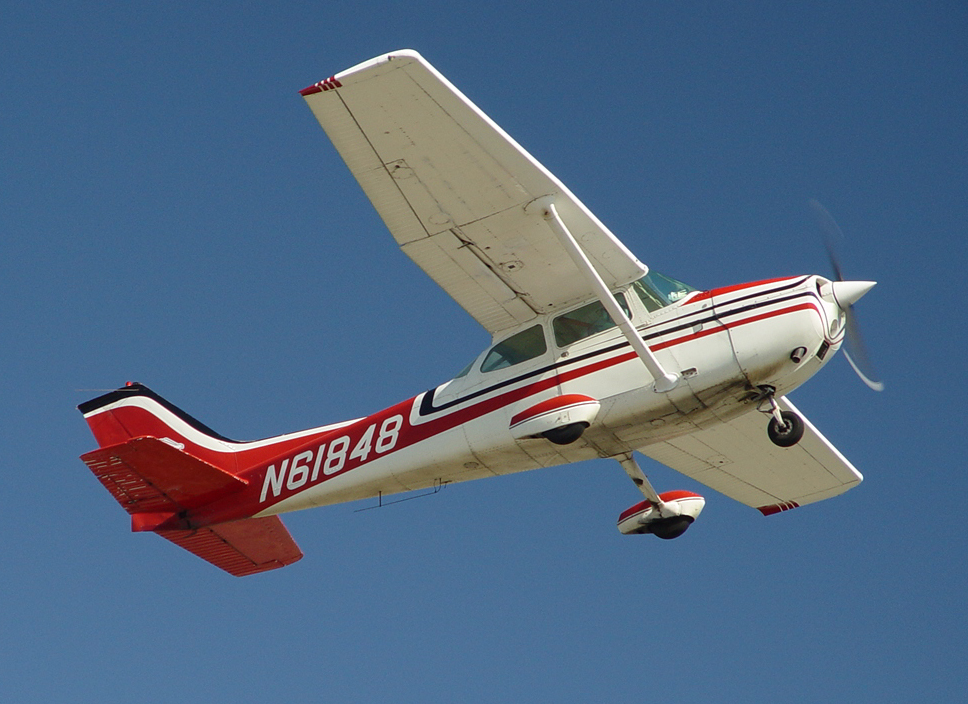
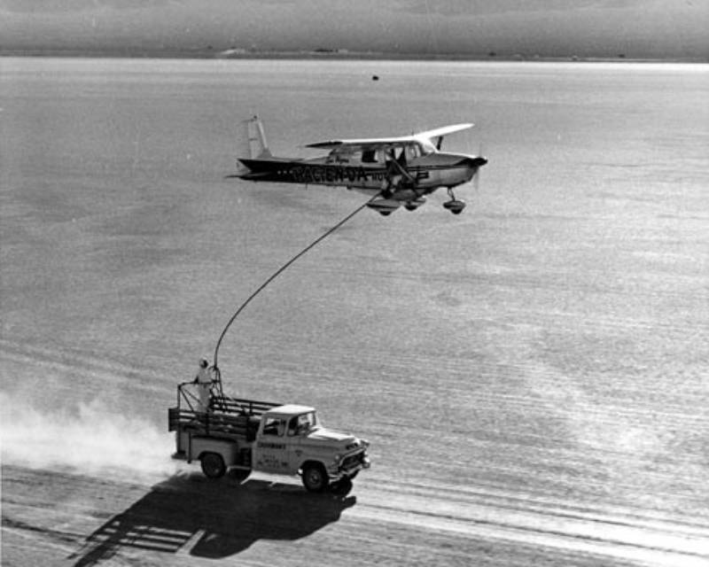
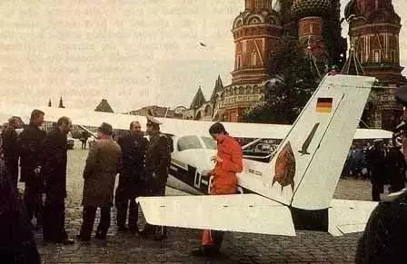
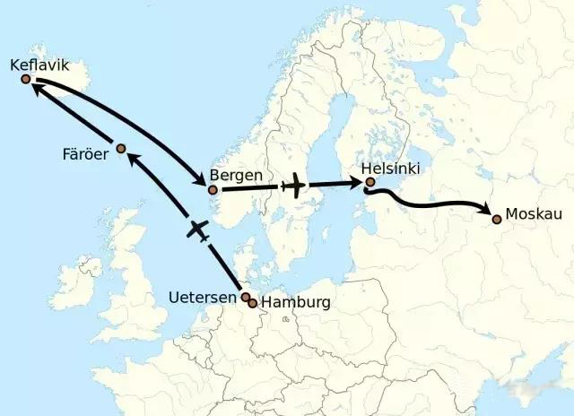
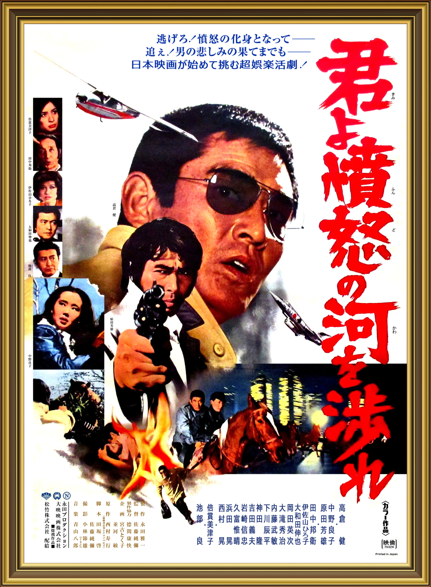

.. _cessna_172_skyhawk:

======================================
塞斯纳172型天鹰(Cessna 172 Skyhawk)
======================================

塞斯纳172型天鹰（Cessna 172 Skyhawk）是一个单引擎四座位的小型飞机，是历史上最成功生产量最多的小型飞机: 首架飞机于1956年交付，到2024年生产已超过45,000架。

.. youtube:: cWr_YoIXLSM

塞斯纳172天鹰凭借极高的安全性、稳定性和经济性，成为了全球飞行员培训（航校）的绝对主力机型:

.. csv-table:: 塞斯纳172型天鹰核心技术参数
   :file: cessna_172_skyhawk/cessna_172.csv
   :widths: 20,80
   :header-rows: 1

塞斯纳172型天鹰特点:

- 极致的安全性： 上单翼设计提供了极佳的低速稳定性和抗失速特性，即使关掉发动机，它也能像滑翔机一样平稳滑翔寻找着陆点。

  - 由于其独特的上单翼设计和气动布局，它非常难以进入危险的“失速”或“尾旋”状态。即使发动机在空中完全熄火，它也拥有出色的滑翔比（约 9:1），能让飞行员有充足的时间在方圆几公里内寻找空地滑翔降落。
  - 结构简单、皮实耐用。它搭载的莱康明（Lycoming）发动机是航空界最成熟的活塞发动机之一。它的前三点式固定起落架也极其坚固，能承受学员无数次粗暴的“拍”在跑道上的降落。

- 完美的教练机： 它的操控容错率极高，能原谅新手的许多粗暴操作，全球绝大多数民航飞行员的初级执照（PPL）都是用它考取的。

  - 新手飞行员在手忙脚乱中容易犯错，而塞斯纳 172 具有极强的自我稳定倾向。如果飞行员放开操纵杆，飞机在大多数情况下会自动恢复平飞。

- 现代化的升级： 新一代的塞斯纳 172（如 172S）摒弃了传统的机械仪表，全面换装了佳明 G1000（Garmin G1000）玻璃座舱航电系统，让轻型机的导航和安全性能直逼大型商用客机。

公认极其安全可靠
=====================

- 远低于平均水平的致命事故率: 根据航空数据统计，塞斯纳 172 的每 10 万飞行小时致命事故率约为 0.56 次。相比之下，整个通用航空（私人飞行及训练）的平均致命事故率在 1.2 至 1.4 次之间。它的安全表现比行业平均水平好了一倍以上。
- 高存活率:  美国航空器拥有者及驾驶员协会（AOPA） 的安全研究表明，涉及塞斯纳 172 的事故多数为轻微受损或无人员伤亡。这主要得益于其极其坚固的机身结构和温和的坠落冲击特性。

在航空界，塞斯纳 172 的名字就代表了“稳健”。它虽然不快，也不够酷炫，但它的安全名声是靠全球 45,000 多架飞机、数十亿小时的教飞和私人飞行时间一步步扎实积累起来的。

事件和文化
===========

- 从1958年12月到1959年2月的三个月间，有两个吃饱了撑的美国男青年(罗伯特蒂姆（Robert Timm）和约翰库克（John Cook）)以64天22小时19分5秒创造了动力飞机史上最长留空纪录。后来，FAI（国际航空联合会）出于安全考虑将不再承认任何留空纪录了，所以这项纪录将无人可破。

   现在这架飞机挂在拉斯维加斯机场1号航站楼的行李领取处

- 红场事件发生于美苏冷战时期的1980年代: 当时只有19岁的西德汉堡市业余驾驶员马蒂亚斯·鲁斯特于1987年5月28日（星期四）驾驶塞斯纳C-172-P飞机，突破芬兰和华约防空网，当晚莫斯科时间19点30分降落在苏联首都莫斯科红场。此人仅有约40小时飞行记录却能“突破”当时世界上顶尖大国的防空网。

- 1976年上映的日本电影《 `追捕 <https://movie.douban.com/subject/1291863/>`_ 》(日语：君よ憤怒の河を渉れ，直译："你要涉过愤怒的河") 中，杜丘冬人（高仓健饰）驾驶C-172R从北海道飞回本州。

   《追捕》成为文革结束后首部在中国大陆热映的外国电影，使得高仓健和其饰演的“杜丘”成为中国一代人的偶像

模拟飞行
==========

:ref:`x-plane` 自带高精度 **塞斯纳 172 (Cessna 172 Skyhawk)** ，其仪表反应和操纵杆反馈非常适合用来训练 PPL 科目。

参考
======

- `wikipedia: 塞斯纳172 <https://zh.wikipedia.org/zh-cn/%E5%A1%9E%E6%96%AF%E7%B4%8D172>`_
- `塞斯纳172 / Cessna 172 - 中英文维基百科词条融合，由辽观搬运、翻译、整合 <https://zhuanlan.zhihu.com/p/719405209/>`_ 详细翻译了维基百科英文版内容，其中包含了Cessna 172各机型的细分说明
- `Cessna 172 - a plane for everyone <https://www.youtube.com/watch?v=cWr_YoIXLSM>`_ 通过简单培训普通人能够驾驶塞斯纳172
- `整理一下塞斯纳172这款飞机的故事 <http://www.skl-aviation.com/news/1009.html>`_
- `世界上最长的载人飞行是64天22小时19分钟，用的就是这架赛斯纳172 <https://www.reddit.com/r/aviation/comments/vg27q2/the_worlds_longest_manned_flight_was_64_days_22/?tl=zh-hans>`_
- gemini

