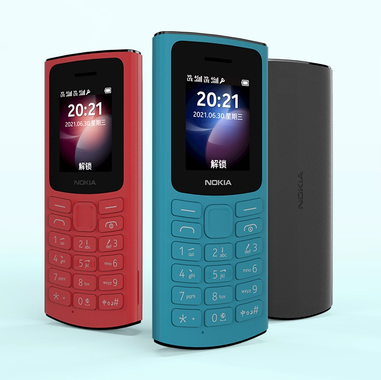

.. _featurephone_less_is_more:

==================================
功能手机之断舍离
==================================

我在 :ref:`tm_less_is_more` 的思考中，觉得智能手机使自己分心并且时间管理效率低下。所以，我 ``幻想`` 能够使用 ``非智能`` 手机来迫使自己少浪费时间。

这个想法实际上每隔一段时间就会从心底泛起，我尝试过很多断舍掉苹果手机或者Android手机的方法，但是因为对生活造成极大不便，以及无法克制的需要资讯的欲望，使得之前的 ``断舍离`` 都没有进行到底:

- 我尝试使用 :ref:`blackberry_q10` ，但是我不自觉去尝试安装各种应用来补齐缺失的智能手机功能，但这只是 ``缘木求鱼``

功能手机构想
==============

最近诺基亚发布了 Nokia 105 4G 首款通过紫光展锐RTOS，支持支付宝的功能手机。

再次触发我心底寄希望于依靠传统手机摆脱智能手机困扰的念头。因为也想尝试一下 :ref:`kaios` 所谓的半智能经典手机，我下单购买了 :ref:`nokia_6300_4g` 。

:ref:`nokia_6300_4g` 够提供:：

- 支持4G VoLTE，终于能够解决 :ref:`blackberry_q10` 只能使用中国移动2G网络无法正常通话的问题。这是目前少数提供4G VoLTE的经典手机。
- 后期通过更新应该能够提供基本的支付宝 ``支付码`` 功能，至少在很多超市购物可以畅通无阻。不过，我日常佩戴Apple Watch已经提供了支付宝离线刷码支付，所以只是锦上添花。
- 虽然很多时候，我们还依赖地图导航、大众点评、共享单车，但是使用频率比电子支付要低不少，并且也是能够克服的(大多数也就是2点一线上下班，公共交通加两腿基本能够畅通无阻)

我想结合功能手机和Kindle来实现生活的 ``断舍离`` :

- 日常只看书和听音乐，既然没法使用社交软件，索性就 ``基本断绝`` 网络社交，一周仅打开一次社交软件
- 运动健身完全依靠Apple Watch，通过Apple Watch独立记录和缓存数据，每天定时连接一次iPhone观察数据
- 随身通过腰包携带iPhone，仅在不得不使用衣食住行应用时应急
- 尽可能将iPhone隐藏起来，脱离视线，使自己专注于工作学习

经典手机实践
=============

在急切等待了两天之后，终于拿到了 :ref:`nokia_6300_4g` ，试用了半天。但是，真的非常失望：

传统经典手机真的已经脱离了这个时代，即使曾经留下过美好的回忆!!!

受限于成本和销售量，Nokia的经典手机工艺非常落后，实际上接近400元的售价完全比不上二手的 :ref:`pixel_3` :

经典手机最大的缺陷是交互模式，停留在十几年前的技术，没有触摸交互也不提供全键盘输入和快捷键。这导致经典手机操作异常反人性，几乎无法输入信息。

浏览器功能居然是需要依赖导航键缓慢挪动鼠标，这个 ``恐龙级`` 交互方式在移动设备上是一种精神折磨。

在耗费了整整半天之后，我不得不放弃最初的 ``幻想`` ， :ref:`kaios` 并没有实现一种精简的智能生活，而是一种特定环境下的妥协(在得不到质优价廉的智能手机和廉价无线通讯的环境下)。它让你分心于蹩脚的设备操作，费劲心思去获取智能手机最基本的阅读和音乐体验，实际上反而浪费了你的时间和精力。

小众经典手机需求构想
========================

作为技术爱好和自诩为特立独行的我，相信这个世界上一定有一小撮和我一样：

- 追求精简的技术，内心抵触 ``资本极力鼓吹的消费主义`` 和 ``喧嚣的无意义信息``
- 保持适当的社交，期望更专注于书籍阅读和简单的音乐、电影欣赏
- 不玩游戏
- 只想通过智能设备获得自由的信息交流

那么理想的经典手机应该是:

- 和智能手机一致的触摸屏，并且具备等同于智能手机的交互操作
- 提供 ``音乐`` 和 ``阅读`` 功能，并且支持基本的健身跟踪(GPS提供跑步记录)
- 采用主流的USB typec接口和蓝牙5.0支持，提供和电脑设备的数据同步
- 操作系统是否智能不是关键，关键是精简

很遗憾，市场上没有这样的设备，但是，我在这次 ``断舍离`` 的失败中突然有所感悟：

- 其实将智能手机的应用精简到极致，是可以实现控制欲望、屏蔽烦扰、集中精力并达到内心平静(我将在 :ref:`smartphone_less_is_more` 中构想基于iPhone和Andorid的方案)
- 关键是通过反复训练让自己能够专注 (这确实很艰难和痛苦，例如我现在在电脑前撰写这篇文章时，思路枯竭时手机就在我手边，要克制住自己拿起手机放松一下的念头，会让人有一种不由自主挠头的不适感)

最终的感悟
==========

理想很丰满，现实很骨感:

虽然想象中使用传统的经典手机可以帮助自己远离智能设备的困扰，但是实际上传统手机限于技术和成本、工艺，交互操作极为不便，反而带来使用上的低效、影响思考和工作。

所以，借用禅宗的理念::

   菩提本无树，明镜亦非台。
   本来无一物，何处惹尘埃。

真正困扰你的不是智能手机，而是你自己的内心无法控制的欲望。
