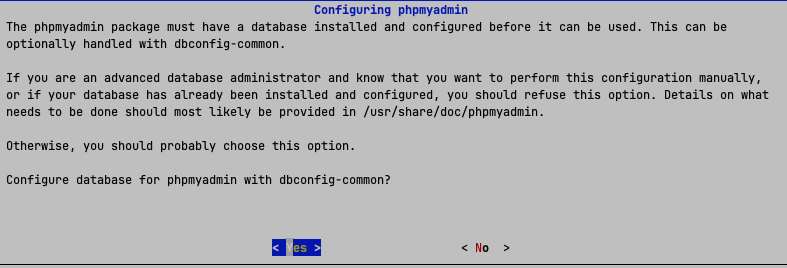
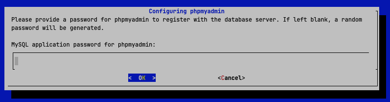
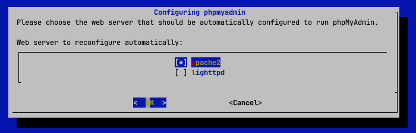
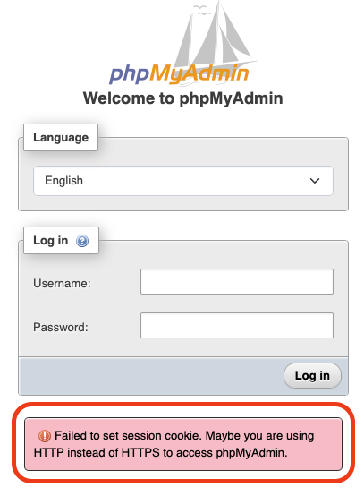
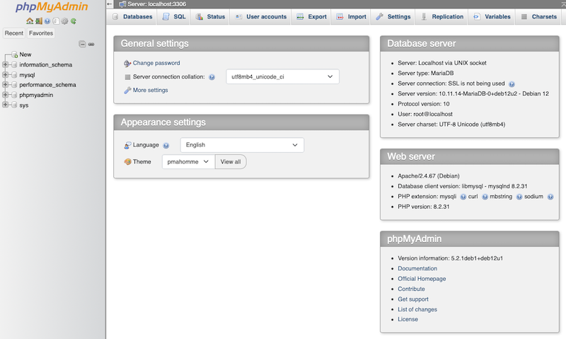

.. _install_phpmyadmin:

============================
安装phpMyAdmin(发行版方式)
============================

很多发行版已经包含了phpMyAdmin，如果可能建议直接使用发行版提供的phpMyAdmin，这样不仅方便安装，而且能够随着发行版升级而自动完成phpMyAdmin升级。

准备工作
=========

首先在 :ref:`debian` 系统中完成数据库安装和初始化 (详见 :ref:`debian12_install_mariadb` ):

.. literalinclude:: ../../mysql/installation/debian12_install_mariadb/install
   :caption: 在debian中安装MariaDB

.. literalinclude:: ../../mysql/installation/debian12_install_mariadb/secure
   :caption: 数据库安全设置交互

安装
========

- debian内置包含了 ``phpMyAdmin`` 软件包，并且能够依赖安装所需的 :ref:`apache` 和 ``PHP`` 运行软件包

.. literalinclude:: install_phpmyadmin/install
   :caption: 安装 ``phpMyAdmin``

.. note::

   如果通过 :ref:`apt` 安装 ``phpMyAdmin`` ，则会依赖安装 :ref:`apache` 2软件包，因为debian为 ``phpMyAdmin`` 准备了针对Apache的配置文件，能够自动软链接到Apache的配置目录中，这样开箱即用。

   如果你希望 :ref:`install_phpmyadmin_lnmp` ，那么就只安装 :ref:`nginx` 和 PHP运行环境，然后从 ``phpMyAdmin`` 官方下载最新的发布包，通过手工解压缩和配置来完成。

安装过程有一个交互配置过程

- 提示phpmyadmin需要系统已经安装了数据库并配置好等待使用(该步骤我已经在 :ref:`debian12_install_mariadb` 完成)

这里提示中 ``dbconfig-common`` 是Debian自带的自动化建库脚本，可以在MariaDB中建立一个名为 ``phpmyadmin`` 来存放 ``phpMyAdmin`` 的元数据，这样就能够提供一些高级功能(例如保存用户的历史SQL记录，ER图标签页，书签功能等)。

这里建议选 ``<yes>`` 让系统自动完成底层表的创建，省去手工导入 ``create_tables.sql`` 的麻烦

- 提示为 ``phpmyadmin`` 提供一个密码注册到数据库服务器，如果保留空白则会生成一个随机密码:

**这里直接保留空白，确认ok让系统生成一个随机密码**

.. note::

   **这里的密码不是登录网页用的管理密码!!!**

   实际上这是phpMyAdmin在后台链接MariaDB以读取刚才说的"元数据专属库"使用的内部密码。这个密码实际上用户用不上，所以建议让Debian自动生成一个高强度的随机密码并记录在 ``/etc/phpmyadmin/config-db.php`` 中。

- 选择web服务器:

这里选择 :ref:`apache` 2，是为了方便采用了 :ref:`debian` 发行版提供的Apache2，也是安装 ``phpMyAdmin`` 依赖安装的软件包。

.. note::

   如果想要使用 :ref:`nginx` 作为WEB服务器，即 :ref:`install_phpmyadmin_lnmp` ，那么这里不要选择任何一个WEB服务器，保留空白，避免脚本自动生成无用配置。NGINX需要手工配置!!!

完成这一步以后，就会看到

登录
=======

访问 http://127.0.0.1/phpmyadmin/ 可以看到登录页面

注意， ``phpMyAdmin`` 是将所有请求直接转发给数据库，所以实际上就相当于数据库登录，这也就意味着 ``phpMyAdmin`` 并没有一个WEB页面的登录账号，在页面上看到的账号输入实际上是输入的数据库账号!!!

请在这里输入 ``Username`` 是 ``root`` ，并 :ref:`debian12_install_mariadb` 时为数据库 ``root`` 用户创建的密码

登录安全cookie问题
---------------------

如果在测试验证环境中没有使用HTTPS方式访问，此时输入用户名和密码后会发现无法登录系统，并且页面提示:

.. literalinclude:: install_phpmyadmin/cookie_fail
   :caption: 由于HTTP访问没有加密，phpMyAdmin拒绝存储session cookie

上述报错是phpMyAdmin 自 5.x 版本之后引入的一项默认高安全设置: 默认开启了 ``session.cookie_secure`` 开关。这就意味着：如果浏览器和服务器之间不是安全的 HTTPS 加密连接，phpMyAdmin 就会强行拒绝向浏览器写入 Session Cookie。

解决的方法当然是为Apache配置 :ref:`apache_ssl` ，更简单的方式是 :ref:`apache_self-signed_ssl` 。

不过，对于实验环境，或者个人使用，可以将 :ref:`apache` 监听端口改到 ``127.0.0.1`` 回环地址，防止外部访问，并通过 :ref:`ssh_tunneling` 这样的技术来实现安全访问。

- 最简单的方式: 关闭 ``session.cookie_secure`` 

.. literalinclude:: install_phpmyadmin/config.inc.php
   :caption: 修改 ``/etc/phpmyadmin/config.inc.php``

这里的配置 ``$cfg['Servers'][$i]['auth_type'] = 'cookie';`` 是 phpMyAdmin默认的认证方式，虽然这个配置注释掉，但底层策略依然是 ``cookie`` 模式。

此时就可以通过之前设置的数据库root密码连接管理数据库，

后续改进计划
================

目前配置还存在不足，或者说适合安全性较高的个人实验环境:

- 还没有配置 :ref:`apache_ssl` ，所以目前还是HTTP并且关闭了 ``session.cookie_secure``
- 默认配置是允许直接房分 http://127.0.0.1/ 根目录，也就是外部能够直接看到WEB服务器的状态信息，如果要更为安全需要关闭这个访问
- 如果要兼顾其他应用，或许采用 :ref:`nginx` 统一的WEB服务器更为常用，则需要 :ref:`install_phpmyadmin_lnmp` 单独手动设置配置而不是依赖发行版的配置
- 默认配置访问路径是 http://127.0.0.1/phpmyadmin/ 这个路径如果在互联网上暴露可能会有大量的扫描，最好的方式是修订Apache/Nginx配置，将该访问URL修改成一个更为隐秘的路径，例如 http://x.x.x.x/pma-secure-2026 或其他自己的特定目录。

参考
=======

- `phpMyAdmin Installation <https://docs.phpmyadmin.net/en/latest/setup.html>`_
- `phpMyAdmin wiki: DebianUbuntu <https://github.com/phpmyadmin/phpmyadmin/wiki/DebianUbuntu>`_ 使用了 ``ppa:phpmyadmin/ppa`` 源
- `Install phpMyAdmin on Ubuntu and Debian Easily <https://operavps.com/docs/install-phpmyadmin-on-ubuntu-debian/>`_ 使用发行版自带的软件包，比较简单易用
- `How to Install phpMyAdmin with Nginx on Debian 13, 12 and 11 <https://linuxcapable.com/how-to-install-phpmyadmin-with-nginx-on-debian-linux/>`_ 采用了发行版的Nginx+PHP堆栈，并使用官方下载的tgz包安装，如果不想使用phpMyAdmin的发行版打包的apache2+PHP/lighttpd+PHP组合，而是想主要使用 :ref:`nginx` 作为WEB服务器，则可以采用此方法
