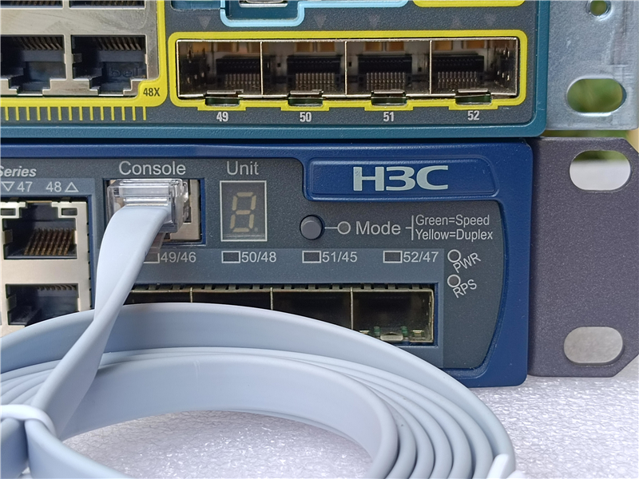

.. _switch_console:

===========================
Cisco交换设备Console连接
===========================

网络设备，包括Cisco的交换机、路由器，都提供了一个串口控制台(RJ45)，这个控制台是最基本的系统访问入口，提供设备的最初始访问以及配置异常时debug入口。

现代计算机通常使用USB接口，所以串口控制线现在也是一头RJ45、一头USB接口，在淘宝上购买只需要15元:

.. figure:: ../../../../_static/network/cisco/switch/switch_4500_config/serial_usb.jpg
   :scale: 50

上述USB接口的串口线内置了 FTDI 芯片，操作系统需要能够识别USB设备才能驱动，例如 :ref:`macos_ftdi_serial` 。

需要配置主机和设备的通许波特率一致，以下是Cisco设备默认控制台波特率参数:

- 9600 baud
- 8 data bits
- 1 stop bit
- No parity

在Linux/macOS上，使用 ``screen`` 程序非常容易连接使用(以下命令为Linux)::

   screen -S ws-c4948-s /dev/ttyUSB0 9600

如果是Windows系统，则可以参考 `Access the CLI via PuTTY using a Console Connection on 300 and 500 Series Managed Switches <https://www.cisco.com/c/en/us/support/docs/smb/switches/cisco-small-business-300-series-managed-switches/smb4984-access-the-cli-via-putty-using-a-console-connection-on-300-a.html>`_ 使用开源免费的PuTTY工具来访问控制台。

参考
=======

- `Connecting a Terminal to the Console Port on Catalyst Switches <https://www.cisco.com/c/en/us/support/docs/switches/catalyst-6000-series-switches/10600-9.html>`_
