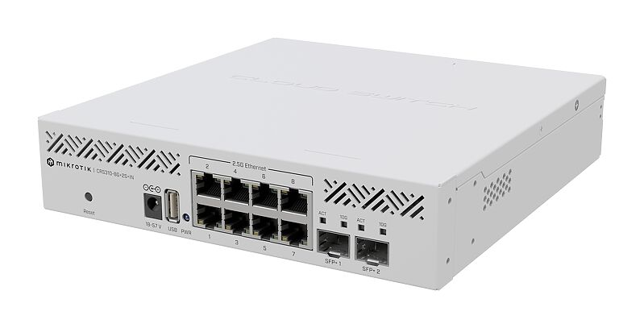

.. _mikrotik_crs310-8g_2s_in:

===============================
mikrotik CRS310-8G+2S+IN交换机
===============================

**CRS310-8G+2S+IN** 技术规格:

- 8个2.5Gb以太网口
- 2个10Gb SFP+接口
- ``Marvell 98DX226S`` 交换机芯片
- RouterOS v7

配置
=======

**默认交换机管理地址是 192.168.88.1**

- 将连接网线的网卡配置IP地址 ``192.168.88.2/24`` 然后访问 http://192.168.88.1 就可以看到管理界面，默认用户是 ``admin`` ，默认密码在交换机设备底部的贴纸上

.. note::

   快速配置非常简单，选择默认的switch就可以，但是实际上该交换机设备能够提供强大的配置定制，详细参考 `MikroTik docs <https://manual.mikrotik.com/>`_

ssh
========

在上述初始配置中设置好 ``admin`` 用户密码之后，也可以通过 ``ssh`` 登录管理界面进行操作。

注意， ``ssh`` 提供的是一个定制管理界面，你可以将它理解成类似 :ref:`cisco` 路由器交换机的操作界面，通过分级菜单来完成配置。

在每一级都可以通过 ``TAB`` 键来获得当前层级提供的命令

ssh密钥认证
-------------

- 首先通过Web管理界面 ``Files >> Upload...`` 上传 ``id_rsa.pub`` 公钥文件
- 然后在ssh命令行执行

.. literalinclude:: mikrotik_crs310-8g_2s_in/import_public-key-file
   :caption: 导入ssh公钥

执行完成后，刚才在 ``Files`` 中上传的公钥文件就被导入系统，并且该文件被删除。现在就可以通过ssh无需密码登录Mikrotik交换机了

参考
======

- `CRS310-8G+2S+IN <https://mikrotik.com/product/crs310_8g_2s_in>`_
- `CRS310-8G+2S+IN User manual <https://manual.mikrotik.com/hardware/crs310-8g-plus-2s-plus-in/>`_
