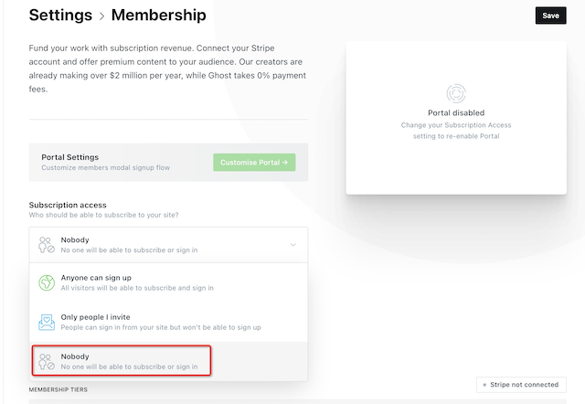

.. _ghost_startup:

==================
Ghost起步
==================

:ref:`deploy_ghost_cms` 完成后，访问 https://blog.huatai.me/ghost/ 可以开始注册自己的账号

第一个注册的账号就是 owner ，可以完全掌控整个网站。

关闭注册
===========

如果是个人网站或者并非面向公众公开注册网站，建议首先关闭开放式注册，或者至少改为邀请式注册，否则会导致网站充斥着大量的垃圾。

