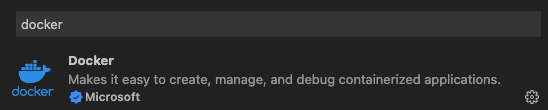
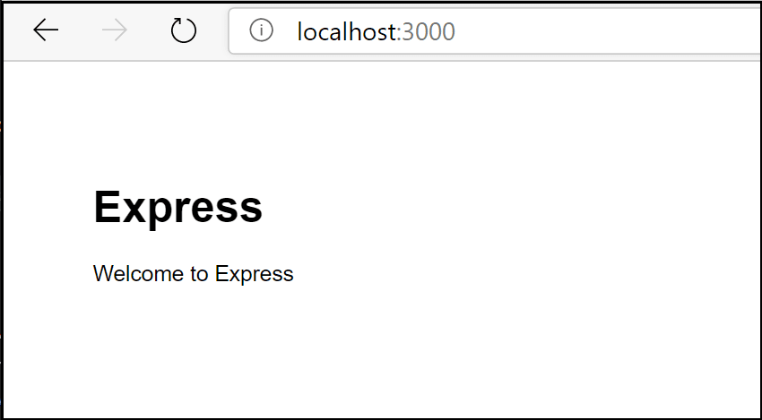
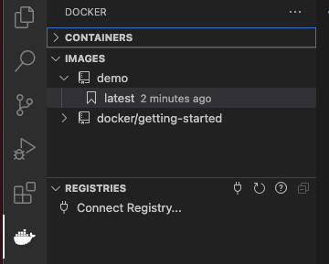
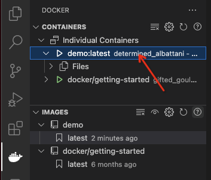
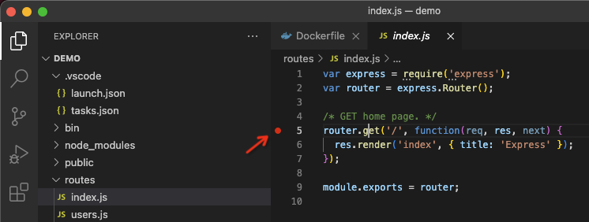

.. _nodejs_dev_docker:

==================================
使用Docker设置本地Node.js开发环境
==================================

:ref:`vscode` 提供了 :ref:`docker` 扩展可以方便build,管理和部署容器化应用。由于VSC可以跨平台，在 :ref:`macos` / :ref:`windows` 和 :ref:`linux` 都能一致性地使用，非常适合开发轻量级应用，特别是 :ref:`javascript` ( :ref:`nodejs` ) 

.. note::

   我的开发环境在 :ref:`apple_silicon_m1_pro` 处理器的MacBook Pro上，所以安装 Docker Desktop 来运行容器环境。在 :ref:`linux` 平台可以直接运行 :ref:`docker` 或 :ref:`kubernetes` 来构建 :ref:`mobile_cloud_infra`

安装
========

- :ref:`install_docker_macos` ，如果是在 :ref:`linux` 中安装 :ref:`docker` ，需要配置 :ref:`run_docker_without_sudo` 
- 安装 :ref:`vscode` 扩展: 按下 ``⇧⌘X`` 搜索 ``docker`` 并安装由微软开发的Docker extension:

- (推荐)按下 ``⇧⌘X`` 搜索 ``python`` / ``go`` / ``rust-analyzer`` / ``c/c++`` 扩展，获得 ``IntelliSense`` 能力( 可以从 `Extensions for Visual Studio Code <https://marketplace.visualstudio.com/vscode>`_ 查找)

- 在macOS本地系统 :ref:`install_nvm` ，然后 :ref:`nvm_install_nodejs`

创建Express Node.js应用
==========================

- 创建一个 :ref:`express` Node.js 应用::

   mkdir demo
   cd demo

   npx express-generator
   npm install

在项目中添加Docker文件
=======================

- 在 :ref:`vscode` 中打开 ``demo`` 项目目录

- 打开命令面板 ( ``⇧⌘P`` ) ，然后使用 ``Docker: Add Docker Files to Workspace...`` 命令，根据提示依次回车(默认值)

  - 对于application platform，选择 ``Node.js``
  - 对于是否包括 ``Docker Compose`` 文件(类似 :ref:`kubernetes` 的pod，可以同时运行多个容器)
  - 应用端口保持默认 ``3000``

此时 :ref:`vscode` 会自动创建如下 ``Dockerfile`` 以及一个 ``.dockerignore`` 文件:

.. literalinclude:: nodejs_dev_docker/Dockerfile
   :language: dockerfile

如果选择了包含 ``Docker Compose`` 文件，则会同时生成 ``docker-compose.yml`` 和 ``docker-compose.debug.yml`` 。最后， :ref:`vscode` 的 Docker扩展还会在 ``.vscode/tasks.json`` 中创建一系列VS Code任务用来build和run容器

在镜像中添加环境变量
======================

:ref:`vscode` 的Docker扩展是通过IntelliSense来首先自动完成和上下问帮助的，要激活这个功能，需要在服务镜像中添加一个环境变量:

- 打开 ``Dockerfile`` 文件

- 在服务镜像中添加 ``ENV`` 变量，例如 ``ENV VAR1=1`` (现在没有什么意义，后面再根据实际需要传递的环境变量配置，例如配置数据库连接账号等等)

- 保存 ``Dockerfile`` 文件

在本地运行服务
================

- 在 :ref:`vscode` 中打开一个终端

- 执行 ``npm run start`` 命令

- 使用浏览器访问 http://localhost:3000 就能够看到一个简单Express欢迎页面

验证成功后，在终端中按下 ``ctrl-c`` 终止node.js服务，此时在浏览器中已经无法访问页面

构建服务镜像
===============

- 在 :ref:`vscode` 中打开命令行面板( ``⇧⌘P`` )，然后选择 ``Docker Images: Build Image...`` 命令，此时 :ref:`vscode` 就会根据前面的 ``Dockerfile`` 构建镜像
- 在 :ref:`vscode` 左方的 ``Docker Explorer`` 中(点击那个著名的 ``鲸鱼背负集装箱`` 图标)，验证是否正确生成镜像:

运行服务镜像
============

- 右击build好的镜像，然后选择 ``Run`` (也可以选择 ``Run Interactive`` ) 此时可以看到终端运行命令::

   docker run --rm -d  -p 3000:3000/tcp demo:latest

- 现在再次打开浏览器访问 http://localhost:3000 又可以看到Express欢迎页面了，只不过这次不是在主机本地运行的node.js服务，而是在容器内部运行的服务

- 验证成功后，在vscode的Container导航树中，右击正在运行的容器 ``demo`` ，点击 ``Stop`` 停止容器

在服务容器中Debug
====================

当Docker扩展向应用程序添加文件时，会同时在 ``.vscode/launch.json`` 添加一个VS Code调试器配置，用于在容器内运行时调试服务。扩展检测服务使用的协议和端口，并将浏览器指向服务:

.. literalinclude:: nodejs_dev_docker/launch.json
   :language: json
   :emphasize-lines: 7

- 在Express应用 ``routes/index.js`` 文件中找到 处理 ``'/''`` 的 ``get()`` ，在这行代码行号左方点一下，增加一个断点 (breakpoint)

- 确保 ``launch.json`` 中已经配置了 ``debug`` ，见上文::

   ...
               "preLaunchTask": "docker-run: debug",
   ...

- 按下 ``F5`` 开始debugging

此时在 ``Terminal`` 终端会看到运行了如下 ``Docker`` 命令::

   docker run -dt -P --name "demo-dev" -e "DEBUG=*" -e "NODE_ENV=development" --label "com.microsoft.created-by=visual-studio-code" -p "9229:9229" "demo:latest" node --inspect=0.0.0.0:9229 ./bin/www

整个过程分为如下几步:

  - 服务构建了Docker镜像
  - Docker容器中运行服务
  - 浏览器打开了映射到服务容器的(随机的)端口
  - debugger停止在 ``index.js`` 的断点位置

.. note::

   由于debugger是在应用启动以后附加上去的，这个断点有可能错过了首次运行，可能需要刷新浏览器才能在第二次重试中看到调试器中断。

观察应用日志
==============

在 :ref:`vscode` 中可以使用容器的 ``View Logs`` 命令观察日志:

- 在 ``Docker Explorer`` 中，选中正在运行的debugging容器，右击选择菜单 ``View Logs`` ，就能在 ``TERMINAL`` 中看到容器输入日志(其实就是 ``docker attach`` 到容器控制台观察日志)

.. figure:: ../../_static/nodejs/startup/vscode_nodejs_debug_logs.png
   :scale: 80

参考
=======

- `Node.js in a container <https://code.visualstudio.com/docs/containers/quickstart-node>`_ :ref:`vscode` 官方指南，如何将node.js运行到docker容器中并且通过VSC进行开发(本文主要参考)
- `Docker in Visual Studio Code <https://code.visualstudio.com/docs/containers/overview#_installation>`_ :ref:`vscode` 官方指南，首先参考这个文档完成VSC配置Docker

  - 微软提供了一个教程 `Tutorial: Create and share a Docker app with Visual Studio Code <https://learn.microsoft.com/en-us/visualstudio/docker/tutorials/docker-tutorial>`_ 可以辅助参考，文档比较清晰

- `Docker in development (with Node.js) <https://dev.to/akshaydotsh/docker-in-development-with-node-js-454k>`_ 通用的设置docker开发环境方法，包括设置Docker Volumes一级如何在开发过程中使用Volumes
- `How to Set Up Your Local Node.js Development Environment Using Docker <https://www.docker.com/blog/how-to-setup-your-local-node-js-development-environment-using-docker/>`_ Docker官方blog介绍如何用docker运行起容器中的nodes.js
